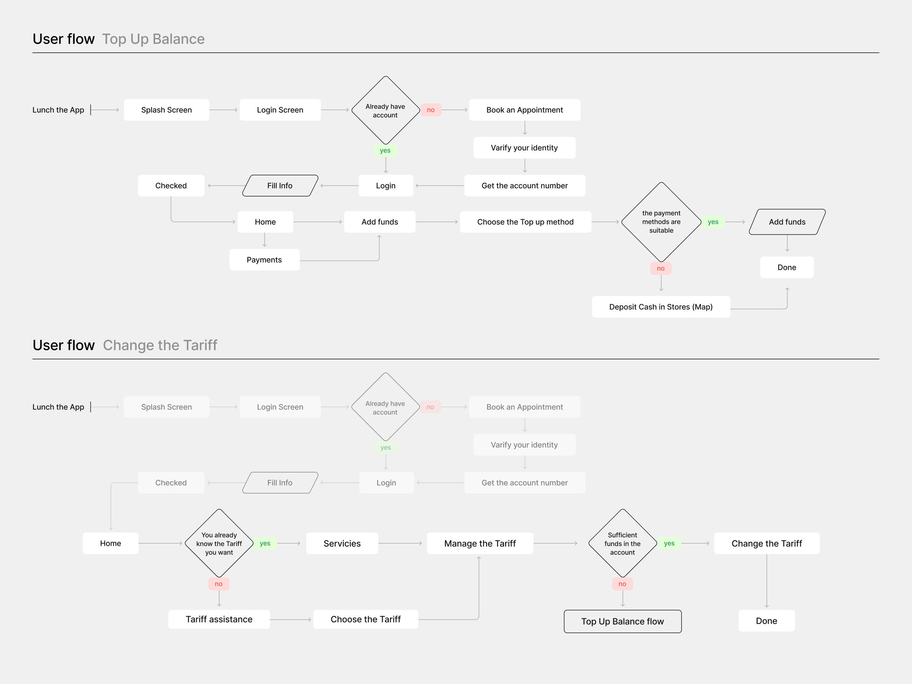
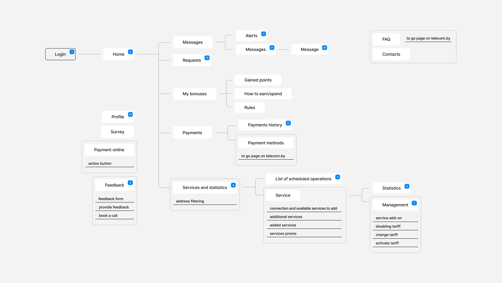
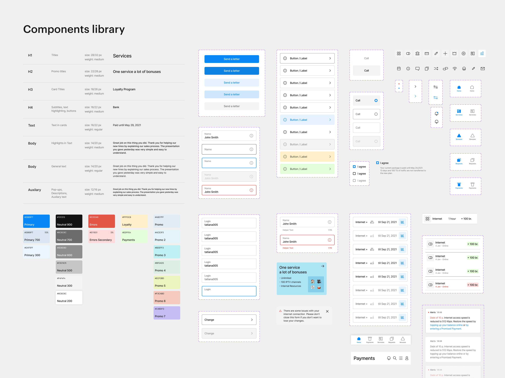
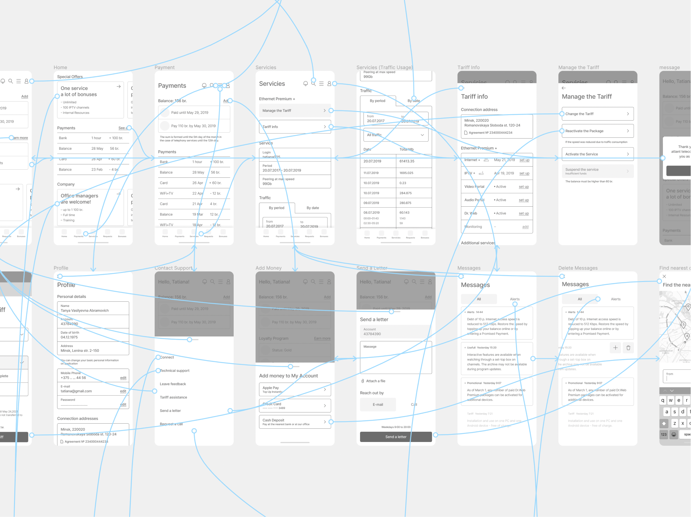

# Визуальные эталоны артефактов кейса

04.10.2026. Уточнение владельца к плану перестройки: переносим из референсов конкретную визуальную логику и композицию, затем заполняем их собственным материалом. Формулировка «добавить user flow / дизайн-систему» без выбранного изображения, состава и раскладки недостаточна.

Это спецификация следующей реализации. Она фиксирует будущую подачу; существующий `Diagram` ещё не проверен на соответствие каждому пункту. Выбор нужных артефактов остаётся индивидуальным: [матрица кейсов](case-plan.md).

## 1. Закреплённые изображения

Основной визуальный донор карты, flow и библиотеки — [HA Interactive, Atlant Telecom](https://hainteractive.com/cases/atlant-telecom/). Четыре изображения ниже скопированы из уже сохранённого локального архива без изменения пикселей. Повторная съёмка конкурентов не проводилась. [Происхождение и контрольные суммы](references/README.md) позволяют перенести эталоны вместе с планом в будущие checkout.

| ID | Что именно сверяем | Изображение |
|---|---|---|
| `HA-FLOW-01` | Формы, старт, ветвление, ответы на связях, повторённый префикс | [User flow](references/ha-user-flow.png) |
| `HA-MAP-01` | Дерево экранов, номера, функции и внешние переходы | [Карта экранов](references/ha-screen-map.png) |
| `HA-DS-01` | Колонки, типографическая таблица, палитра, матрицы состояний | [Components library](references/ha-component-library.png) |
| `HA-PROTO-01` | Фреймы, настоящая точка нажатия, кривые переходов | [Карта прототипа](references/ha-prototype-map.png) |

Anton и Victor остаются донорами художественного разнообразия и масштаба визуалов; Dounar — логики Diagnosis → Direction → Proposal → Impact. Эти роли описаны в [анализе](competitive_analysis_final.md). Для нотации схем выбираем один конкретный донор HA, чтобы разные чаты не рисовали четыре разных языка.

## 2. User flow: формы несут смысл



### Что сохраняем из изображения

| Смысл | Форма и размещение | Что подставляем из своего проекта |
|---|---|---|
| Заголовок | «User flow» тёмным, имя сценария серым того же размера; ниже тонкая линия на ширину листа | Короткое имя одного пользовательского сценария |
| Начало | Обычная подпись, за ней вертикальная черта; первая связь выходит от черты | Конкретное действие, с которого начинается показ: например, «Загрузить XLS» |
| Экран / обычный шаг | Белый прямоугольник с небольшим скруглением, без рамки и тени; текст по центру | Реальный экран или действие, короткая подпись |
| Решение | Контурный ромб, фон поля; внутри вопрос, максимум несколько коротких строк | Проверяемое условие, действительно меняющее маршрут |
| Ответ на решение | Небольшая зелёная / красная плашка **на исходящей связи**, рядом с ромбом | Локализованные «да / нет»; иной ответ — только когда этого требует реальная логика |
| Ввод данных | Контурный параллелограмм со скошенными боками | Действие ввода / исправления; обычный экран не становится вводом только потому, что на нём есть поле |
| Вызов другого сценария | Прямоугольник с тёмной обводкой | Имя самостоятельного подпроцесса, если он действительно нужен |
| Завершение | Обычный белый прямоугольник с явным результатом | Например, «Заказ создан» / «Выписка опубликована» |
| Переход | Тонкая серая линия, прямые горизонтальные/вертикальные участки, мягкие углы, маленький открытый наконечник | Направление перехода и возврат после исправления |
| Повторяемое начало | Общая часть второго сценария приглушена; новая часть имеет полный контраст | Только реальный общий префикс двух показанных сценариев |

Нотацию не заменяем произвольными одинаковыми карточками. Начало и конец не превращаем в овалы «потому что так принято в блок-схемах»: у выбранного эталона другая подача. Вопросы остаются ромбами, ввод — параллелограммами, результаты — прямоугольниками. Ошибки и опечатки подписей донора не воспроизводим.

### Будущий лист

- Один сценарий на основной лист. Плановый объём — 6–10 смысловых узлов и 1–2 развилки; это редакционный ориентир, а не разрешение удалять существенную ветвь.
- Главный путь читается слева направо; альтернативная ветка уходит ниже и возвращается явно. Линии не пересекают текст, плашки ответов не плавают отдельно от стрелок.
- Лист включает начало, условие, действие и наблюдаемый конец. Цепочка из названий экранов без пользовательской задачи не считается flow.
- На mobile — отдельная вертикальная геометрия с теми же существенными условиями и исходами. Её фиксирует общий контракт; текущая единая EN/RU-геометрия сама по себе не даёт отдельной mobile-раскладки. Если остаётся полный граф с горизонтальным чтением, обзор сопровождается читаемым фрагментом и summary.
- Если нужен второй сценарий, повторённый префикс приглушаем по HA. Не дублируем общую схему ради заполнения высоты.

**Portal:** импорт файла → анализ строк → вопрос о наличии нерешённых строк → ручное разрешение → готовые позиции → создание заказа. Это черновая рамка листа; точные условия и возвраты берём из актуального `xls-to-order` и UI, прежде чем подписать узлы.

**Vet:** тот же язык форм, но роли задаются отдельными подписанными зонами: врач / регистратура / владелец. Зоны — наше дополнение для передачи записи, а не деталь, якобы присутствующая в HA. Вопросы о сохранении и публикации берём из принятого сценария; отделяем действие роли от состояния записи.

## 3. Карта экранов: структура отличается от сценария



| Деталь эталона | Правило нашей подачи |
|---|---|
| Белые экранные плашки на ровном светло-сером поле | Без сетки, теней и декоративных карточек под каждым узлом |
| Вход выделен тёмным контуром, заливка близка к полю | Одна явная точка входа, если она есть в выбранном фрагменте |
| Маленькие синие квадраты с белыми номерами | Маркер находится **внутри правого верхнего угла** плашки, с небольшим отступом; номер соотнесён с реальным экраном |
| Светлые ортогональные связи «гребёнкой» | Без стрелок: раскладка показывает иерархию, а не хронологию |
| Пунктир вокруг экрана с функциями | Внутри плашка; ниже короткие действия с тонким подчёркиванием на ширину группы |
| Внешний переход подписан отдельно | Явно называем внешний ресурс; не изображаем его частью реализованного интерфейса |
| Глобальные экраны вынесены в отдельную область | Профиль, помощь и подобные страницы не подвешиваем к случайной ветке ради соединения всех узлов |

**Исправление прежней трактовки:** при повторном просмотре оригинала номера у HA стоят внутри плашек, а не наполовину над ними. Нынешний образец `Diagram` описан иначе и использует ink. На общем этапе A возвращаем для выбранного map-паттерна положение и синий маркер эталона через семантический токен; не вставляем hex в компонент. Код в этой редакции плана не изменён.

**Portal:** один обзор рабочего scope, примерно 6–8 основных экранов/групп; выбранные номера должны связываться с собственными кадрами. Если узел объединяет несколько экранов, называем его группой и не выдаём цифру за ID одного экрана. Полный sitemap остаётся источником.

**Learn:** два подписанных входа сходятся к общему материалу; это карта контентной модели. Сохраняем спокойное поле, ясную иерархию и связи, но не расставляем фиктивные номера экранов на сущностях «программа / материал». У сущности и у экрана разные значения.

## 4. Дизайн-система: состав и композиция листа



### Что видно у донора

Слева расположен foundation, справа — более широкая область компонентов. Это один рабочий лист с общим фоном. Группы имеют разную высоту, занимают колонки и выровнены по опорным линиям; всё не превращено в одинаковую сетку промокарточек.

- **Типографика:** четыре колонки — имя стиля, применение, размер/межстрочный интервал/начертание, живой образец. В исходном листе восемь строк, от H1 до Auxiliary; тонкие горизонтальные разделители.
- **Палитра ниже:** пять вертикальных групп, всего 20 видимых свотчей. Основной цвет и его оттенки стоят друг под другом; hex сверху слева, назначение снизу слева, прозрачность подписана. Это наблюдение о доноре, не обязательное число цветов нашего продукта.
- **Компоненты справа:** вертикальные наборы состояний в тонких пунктирных рамках. Видны, например, пять состояний основной кнопки, пять вариантов поля, отдельная пара поля с helper/error, выбор, строки, навигация и уведомления.
- **Деталь внутри системы:** иконки, навигация и доменные строки показаны вместе с базовыми контролами. По одному листу понятно, что система используется в продукте.
- **Иерархия:** крупный заголовок, тише подписи параметров, полноконтрастные настоящие компоненты. Фон, расстояния и разделители объединяют лист; дополнительные подиумы не нужны.

### Что будет на нашем основном листе Portal

| Область | Состав до начала capture | Раскладка |
|---|---|---|
| Заголовок | Название системы продукта и короткая версия/область | Сверху на весь лист; не повторять длинное объяснение кейса |
| Типографика | 5–6 действующих ролей: заголовок страницы, секция, строка/карточка, основной текст, подпись/статус, числовые данные, если у них отдельная роль | Те же четыре колонки; реальные параметры и примеры продукта |
| Палитра | 8–12 действительно используемых свотчей: действие, поверхности/текст, доступность, предупреждение/ошибка, прочие нужные роли | Под типографикой, вертикальные группы по назначению; тональность не выдумывать ради красивой сетки |
| Компоненты | 4–6 реальных доменных семейств; кандидаты: ResolutionRow, ProductRow, Availability, FulfillmentPlan, FileUpload, QuantityStepper | Правая область, 2–3 колонки; каждое семейство отдельным набором, состояния вертикально |
| Состояния | Обычно 2–4 значимых состояния на семейство: обычное, выбранное/разрешённое, ошибка/нехватка, недоступное — только когда они есть | Одинаковые fixture и масштаб внутри одного набора; подписи объясняют различия |
| Применение | Один соседний крупный фрагмент реального UI, где видны выбранные семейства | В последовательности рассказа рядом с листом, не ещё одна миниатюра внутри палитры |

На desktop исходная пропорция — примерно треть ширины foundation и две трети компонентов; стартовый ориентир нашей композиции **35:65**. Пропорция уточняется на реальном доменном UI: крупную ProductRow не сжимать до ширины кнопки. Пунктир обозначает набор состояний, а не каждый отдельный контрол.

Количество — редакционный выбор. Если существенных состояний пять, пятое нельзя убрать только из-за лимита «2–4»: переносим семейство в отдельный детальный кадр. Параметры продукта и подписи должны читаться при отображении листа на странице, а не только в исходном PNG. Обзор может показывать масштаб, но сопровождается читаемыми деталями.

### Где формат меняется по смыслу

| Кейс | Отбираемый материал | Как используем эталон |
|---|---|---|
| Portal | Foundation + 4–6 доменных матриц | Полноценная композиция HA-DS-01, свои токены, состояния и тексты |
| Learn | 4 контентные темы + neutral assessment; реальные Card, TrustHeader, ProgressMeter | Вместо общей палитры — семантика темы; рядом применение в материале и landing. Табличность и группировка сохраняются, состав другой |
| Pawly | 3 существующие матрицы: PhotoProof, TimelineRow, InfoNote — окончательная сверка по accepted каталогу | Компактная выборка компонентов; видимые состояния и фото. Большой foundation-лист не требуется |
| Vet | Один набор draft / saved / published | Крупная последовательность состояний одной записи, а не полная библиотека |
| Agent Ops | Текущая история достаточна | Отдельный системный лист остаётся резервом |

На mobile основной Portal-лист разбивается на три читаемых материала: foundation; импорт/разрешение; строка/доступность/заказ. Learn показывает тему рядом с её применением, Pawly — по одной матрице. Не уменьшаем весь desktop-лист в колонку 360 px.

**Точность продукта обязательна:** actual specimens берём из принятого каталога или настоящего DOM; показываем шрифт, размеры, цвета, иконки и состояния продукта. Fallback Manrope из условного `kit/library.ts` не является финальным показом другой системы. Строки, которые не описывают существующий вариант, не рисуем. Рамки компонентов у HA фиолетовые пунктирные; в нашей оболочке допускается существующий служебный синий пунктир. Эта адаптация касается рамки листа, не цветов самих компонентов.

## 5. Карта прототипа — только при отдельной пользе



У донора видны серые вайрфреймы, названия над фреймами, голубые кривые и кружки на точках нажатия. Часть соседних экранов и связей выходит за край: показан фрагмент большой рабочей карты. Это **другой артефакт**, не flow с картинками вместо прямоугольников.

Если включаем: 3–5 выбранных собственных экранов, название над каждым, hotspot на действительном контроле, кривая до экрана результата. Важный путь виден целиком; обрезать можно только второстепенные связи. Реальные wireframes предпочтительнее универсального набора серых блоков; обобщённая схема маркируется редакционной.

Сейчас ни один кейс не обязан получить такую карту. Её добавляем, если она объясняет связь экранов лучше уже выбранного flow и крупных UI-кадров. Существование эталона само по себе не причина увеличивать кейс.

## 6. Что сохраняем, что заменяем

| Слой | Решение |
|---|---|
| Формы, типы связей, различие карты/flow/prototype | Сохраняем визуальную грамматику выбранного эталона |
| Колонки, группировка, порядок состояний и визуальная иерархия ДС | Сохраняем приём; фиксируем точный состав нашего листа до сборки |
| Узлы, условия, роли, компоненты, примеры текста | Берём из конкретного собственного проекта |
| Шрифт, палитра, размеры и состояния показываемого продукта | Воспроизводим актуальную продуктовую систему |
| Внешняя оболочка кейса, подписи, поля и движение | Используем ДС портфолио; её существующая тёмная адаптация не перекрашивает продуктовый specimen |
| Объём и mobile-композиция | Выбираем под смысл и читаемость; изменения явно записываем |

Смена содержимого не означает, что число узлов и их координаты обязаны буквально совпасть с чужим сценарием. Сохраняем способ объяснения. Отступление от него имеет конкретную причину в паспорте, а не объясняется задним числом после произвольного capture.

## 7. Паспорт каждого будущего визуала

До capture или отрисовки заполнить `tasks/portfolio-rebuild/<slug>/artifact-plan.md`. Для уже созданного подходящего материала записать тот же паспорт и переиспользовать его.

```text
ID / кейс / место в истории:
Тезис: что зритель поймёт по этому листу без абзаца текста:
Эталон: HA-FLOW-01 / HA-MAP-01 / HA-DS-01 / HA-PROTO-01:
Источник своих данных: путь, версия, раздел/route/story:
Происхождение: исходная работа / текущая пересборка / редакционная схема:
Точный состав: все узлы и условия ИЛИ семейства и состояния:
Раскладка: колонки, зоны, направление, начало, конец, главный фокус:
Типографика / палитра: выбранные реальные роли и токены продукта:
Кадр desktop: видимые элементы, размер, масштаб, поля:
Кадр mobile: отдельная композиция / последовательность деталей:
Сохраняемые детали эталона:
Обоснованные адаптации и запросы общего слоя:
Подпись EN/RU и доступное summary:
Статика и конечный кадр движения:
Переиспользуемый файл ИЛИ недостающий capture:
```

Паспорт хранится локально и входит в передачу интегратору; он не является новым согласованием с владельцем. Case-чат самостоятельно делает выбор в рамках плана. Если общего компонента не хватает, оформляет пример в `common-requests.md`; независимая работа продолжается.

## 8. Проверка перед передачей

1. Открыть конкретный исходный эталон и нашу композицию рядом, в сопоставимом масштабе. Сверить **детали**, не только впечатление «похоже».
2. У flow проверить форму каждого типа, видимый старт/конец, вопросы, положение ответов и направления возврата. У map — иерархию, отсутствие стрелок, номера и функциональные группы. У prototype — реальные hotspots.
3. У ДС проверить четыре колонки типографики, реальные параметры, группы палитры, матрицы состояний, настоящий доменный UI и фрагмент применения. Отличия состава объясняются тезисом кейса.
4. Посмотреть EN/RU на desktop и 360/390: текст читается, важные условия и состояния не потеряны. Screenshot с красивым уменьшенным постером не заменяет проверку чтения.
5. Проверить целую страницу: артефакт добавляет новый довод и меняет ритм. Если повторяет соседний материал, сократить или исключить.
6. В `report.md` оставить соответствие «ID визуала → эталон → сохраняемые детали → адаптации → кадры». Наличие файла без этой визуальной сверки не считается завершённым артефактом.

Движение появляется после принятой статики: раскрывает связь или смену состояния и оставляет понятный конечный кадр. Геометрия flow, таблица и компоненты не должны появляться только после удачного проигрывания анимации.
