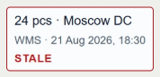

# Финальные кадры · G

Кадры сняты после декодирования настоящих изображений и возврата carousel к первому native stop. Исходные кадры — G-final до F01 на 4390/4391. После F01 все case/media кадры побайтово актуальны; Home promise изменён в двух локалях. Текущий сайт — [4392 EN](http://127.0.0.1:4392/) / [RU](http://127.0.0.1:4392/ru/); corrected Portal Home кадры заменяют прежний текст. Desktop 1440, mobile 390. Полные страницы включают контакт и footer. Это локальный Chromium, не физические устройства.

## Обложки и первые два экрана

| Кейс | Обложка desktop / mobile | Первые два экрана desktop | Первые два экрана mobile |
|---|---|---|---|
| Agent Ops | [1440](shots/en-home-cover-1-1440.png) / [390](shots/en-home-cover-1-390.png) | [Вход](shots/en-agent-ops-console-1440-opening.png) / [второй](shots/en-agent-ops-console-1440-second.png) | [Вход](shots/en-agent-ops-console-390-opening.png) / [второй](shots/en-agent-ops-console-390-second.png) |
| Portal | [1440](correction-f01/shots/en-portal-home-1440.png) / [390](correction-f01/shots/en-portal-home-390.png) | [Вход](shots/en-partner-portal-1440-opening.png) / [второй](shots/en-partner-portal-1440-second.png) | [Вход](shots/en-partner-portal-390-opening.png) / [второй](shots/en-partner-portal-390-second.png) |
| Learn | [1440](shots/en-home-cover-3-1440.png) / [390](shots/en-home-cover-3-390.png) | [Вход](shots/en-learn-1440-opening.png) / [второй](shots/en-learn-1440-second.png) | [Вход](shots/en-learn-390-opening.png) / [второй](shots/en-learn-390-second.png) |
| Vet | [1440](shots/en-home-cover-4-1440.png) / [390](shots/en-home-cover-4-390.png) | [Вход](shots/en-vet-clinic-1440-opening.png) / [второй](shots/en-vet-clinic-1440-second.png) | [Вход](shots/en-vet-clinic-390-opening.png) / [второй](shots/en-vet-clinic-390-second.png) |
| Pawly | [1440](shots/en-home-cover-5-1440.png) / [390](shots/en-home-cover-5-390.png) | [Вход](shots/en-pawly-1440-opening.png) / [второй](shots/en-pawly-1440-second.png) | [Вход](shots/en-pawly-390-opening.png) / [второй](shots/en-pawly-390-second.png) |

Причины порядка и возможная альтернатива: [order-review.md](order-review.md).

## Полные EN/RU страницы

| Страница | EN desktop / mobile | RU desktop / mobile |
|---|---|---|
| Home до F01 · история | [1440](shots/en-home-1440-full.png) / [390](shots/en-home-390-full.png) | [1440](shots/ru-home-1440-full.png) / [390](shots/ru-home-390-full.png) |
| About | [1440](shots/en-about-1440-full.png) / [390](shots/en-about-390-full.png) | [1440](shots/ru-about-1440-full.png) / [390](shots/ru-about-390-full.png) |
| Agent Ops | [1440](shots/en-agent-ops-console-1440-full.png) / [390](shots/en-agent-ops-console-390-full.png) | [1440](shots/ru-agent-ops-console-1440-full.png) / [390](shots/ru-agent-ops-console-390-full.png) |
| Portal | [1440](shots/en-partner-portal-1440-full.png) / [390](shots/en-partner-portal-390-full.png) | [1440](shots/ru-partner-portal-1440-full.png) / [390](shots/ru-partner-portal-390-full.png) |
| Learn | [1440](shots/en-learn-1440-full.png) / [390](shots/en-learn-390-full.png) | [1440](shots/ru-learn-1440-full.png) / [390](shots/ru-learn-390-full.png) |
| Vet | [1440](shots/en-vet-clinic-1440-full.png) / [390](shots/en-vet-clinic-390-full.png) | [1440](shots/ru-vet-clinic-1440-full.png) / [390](shots/ru-vet-clinic-390-full.png) |
| Pawly | [1440](shots/en-pawly-1440-full.png) / [390](shots/en-pawly-390-full.png) | [1440](shots/ru-pawly-1440-full.png) / [390](shots/ru-pawly-390-full.png) |

## Исправления общего слоя

G-01, родной красный контур без белого внешнего поля:

[Три состояния в общей композиции](shots/availability-clean.png). D-G-01: [зоны ролей EN desktop](shots/en-vet-role-flow-1440.png), [EN mobile](shots/en-vet-role-flow-390.png), [RU desktop](shots/ru-vet-role-flow-1440.png), [RU mobile](shots/ru-vet-role-flow-390.png).

Актуальная RU Home карточка Portal: [desktop](correction-f01/shots/ru-portal-home-1440.png) / [mobile](correction-f01/shots/ru-portal-home-390.png). Полные старые Home кадры выше сохранены как история, а не окончательное обещание.
