# Upwork · карточка 1 — Agent Ops Console

Проект в форме Upwork: **Add a new portfolio project**.
Источник фактуры — `src/copy/cases/agent-ops-console.ts` и `upwork/profile.md` §5.1.

**Как читать этот файл.** Разделы 1–3 — рабочие: идёшь сверху вниз и копируешь
каждый блок в кода-рамке как есть. Ничего искать в других местах документа не
нужно: у каждого кадра рядом стоит и сам кадр, и его имя файла, и его подпись.
Разделы 4–8 — справка: обложка, лимиты, логика порядка, проверка, открытые
вопросы. В работе они не нужны.

> **Ревизия 3 файла, 2026-09-01.** Содержание не изменилось — изменился порядок
> подачи: правая колонка выложена линейно, блок за блоком, вместо таблицы
> раскладки и отдельных списков текстов и подписей.
>
> Ревизия 2 (2026-08-31) внесла три решения, они в силе: ссылка на прототип —
> первый блок карточки, а не последний; правая колонка не правится, а
> пересобирается целиком; описание слева переписано по формуле пяти блоков и
> сжато под лимит поля.

Граница, которую нельзя двигать (правила кейса, `agent-ops-console.ts`):
ни одной post-launch метрики; оценки идут как оценки (~25 FTE, ~4%, ~71 карточка);
заказчик, AI-вендор и участники исследования не названы; всё на кадрах — мок-данные.

**Что добавил формат `Task / Solution / Result / Duration` (2026-09-01).**
Строка `Duration` — **оценка объёма работы, а не таймшит**: точного учёта часов
по этому проекту нет, цифра восстановлена по составу отгруженного и сроку.
Названа она часами потому, что на бирже это единица, в которой клиент считает
бюджет. Граница выше от этого не сдвинулась: ни одной новой бизнес-метрики в
описании не появилось — в строке `Result` стоят те же цифры, что уже были в
кейсе, и в том же статусе.

---

## 1. Три шага, строго в этом порядке

**Сначала левые поля, потом снос, потом сборка** — пока лимит 25 выбран, форма
не даст добавить ни одного блока.

**Шаг 1 — левые поля.** Раздел 2. `Project description` заменить целиком,
два тега в скиллах перебрать, `Project title` и `Your role` не трогать.

**Шаг 2 — снести правую колонку.** Корзиной справа удалить **все 25 блоков** —
и тексты, и изображения. Счётчик должен показать `0 / 25`. Ничего не теряется:
все тексты и подписи лежат в разделе 3, PNG — в этой папке. Обложку в диалоге
`Thumbnail preview` **не удалять**.

**Шаг 3 — собрать 25 блоков заново.** Раздел 3, сверху вниз, без пропусков.

**Цена этого хода — тринадцать перезаливок PNG.** Удаление блока изображения
удаляет и файл, вернуть его можно только загрузкой заново. Файлы лежат в этой
папке и грузятся по именам подряд, так что это механическая работа минут на
пятнадцать. Точечная правка была бы дешевле по кликам, но она не даёт поставить
ссылку первой: лимит 25 выбран, и пока не удалено — не добавляется ничего.

---

## 2. Поля слева

### Project title *  (лимит 70) — не меняется

```
B2B SaaS Dashboard Design + Live React Build - AI Oversight Console
```

67 из 70.

### Your role  (лимит 100) — не меняется

```
Sole Product Designer - research, IA, UX/UI, design system, React prototype, user testing
```

89 из 100. Единственное место карточки, где сказано, что рядом никого не было.

### Project description *  (лимит 600) — **заменить целиком**

```
Task: an internal oversight console for a 24-person support team supervising an AI agent that closed 61% of contacts alone, ~1,770 a day, and sometimes promised money nobody authorised.

Solution: research, IA, UX/UI, a design system and a live React prototype - 19 screens, 20 routes, 3 roles. I changed the reviewable object: not conversations, but the commitments the agent makes.

Result: user-tested, accepted by the client. Reading it all needs ~25 full-time reviewers; commitments are ~4% of traffic, ~71 a day.

Duration: ~240 working hours.

Client under NDA. All data on screen is invented.
```

600 из 600. **Формат сменён 2026-09-01 решением владельца** —
описание разложено на `Task / Solution / Result / Duration`. Причина: карточку на бирже читают как
смету, а не как эссе. Клиент должен увидеть четыре вещи подряд — что было
задачей, из чего состояла работа, чем она кончилась и сколько заняла, — и
увидеть их до того, как решит читать дальше. Формат единый для всех восьми
карточек. Первая строка `Task:` обязана пережить обрезку в плитке — она и
несёт то, что раньше несла первая фраза нарратива.

**Три расхождения с `profile.md` §5.1, и все три сознательные.**

| Что | Почему здесь иначе |
|---|---|
| Текст короче: 596 против 996 знаков | Формула кейса рассчитана на 1000–1200, но поле формы отдаёт 600 **[факт, замер 2026-08-31]**. Резать пришлось связки, не факты: ни одна цифра и ни одна оговорка не потеряны |
| Нет строки `Open it yourself: <URL>` | В §5.1 она стоит потому, что была единственным местом ссылки. Здесь ссылка — первый блок правой колонки, кликабельный; строка в описании дублировала бы её и стоила 53 знака из 600, которых нет |
| Нет блока `Role:` | У формы для этого отдельное поле `Your role`, и оно уже заполнено. Внутри 600 знаков повтор непозволителен |

Если правка когда-нибудь пойдёт обратно в `profile.md` — идти должны вторая и
третья строки таблицы, но не первая: 996-знаковая версия остаётся канонической
для мест, где лимит другой.

**Прежняя редакция описания — снята 2026-09-01.** Нарративная версия и её
обоснование сохранены здесь: у неё другая работа — она годится там, где лимит
поля не 600, и по ней восстанавливается формулировка, если формат когда-нибудь
откатят.

<details>
<summary>Нарративная версия</summary>

```
An internal oversight console for a support team supervising an AI agent. 19 screens, 20 routes, 3 roles, a design system and a live React prototype - user-tested, accepted by the client.

The agent closed 61% of contacts alone, ~1,770 a day, and occasionally promised money nobody had authorised. Reading them all needs ~25 full-time reviewers. The team was 24.

So I changed the reviewable object: not conversations, but the commitments the agent makes - refunds, credits, plan changes, promised dates. By my estimate 4% of traffic, ~71 a day.

Client under NDA. All data on screen is invented.
```

596 из 600. Первый абзац обязан пережить обрезку в карточке.

</details>

### Skills and deliverables *  (5 слотов)

```
Product Design · UX & UI Design · Dashboard · Web Application Design · Design System
```

**Сверка формы 2026-08-31: два тега разошлись с планом.** В форме стоят
`Product Design · UX & UI Design · Dashboard · App Design · Figma`.

- `App Design` → `Web Application Design`. Читается как мобильное приложение, а
  карточка про дашборд; и `Mobile App Design` в плане закреплён за карточкой
  Pawly (`profile.md` §4), так что здесь этот сигнал лишний. Начать печатать
  `Web Application` и взять подсказку. Если справочник Upwork такого термина не
  отдаёт — оставить `App Design`, но тогда пятый слот тем более обязан быть
  `Design System`.
- `Figma` → `Design System`. Figma уже стоит в скиллах профиля (§4 плана,
  позиция 6), и второй раз этот слот ничего не добавляет к поиску. А
  `Design System` — ровно то, что карточка доказывает кадром `13.png` и текстом
  блока 20, и то, чем клиент называет вакансию.

**🔴 Итог по факту, 2026-09-01: обе замены выше невозможны.** Справочник формы
не отдаёт ни `Web Application Design`, ни `Design System` — первого нет под этим
именем (есть только `App Design`), второго нет вовсе. В форме стоит:

```
Product Design · UX & UI Design · Dashboard · App Design · Figma
```

То есть `App Design` остался, а освободившийся слот ушёл под `Figma`. Решение
владельца, и для карточки 1 оно рабочее. **Для остальных семи карточек Figma в
этот слот больше не идёт**: тег уже стоит в профильных скиллах, и повторять его
на каждой карточке значит тратить слот на то, что не отличает карточку от
соседней. Правило замены и разбор на карточке 2 —
`upwork/projects/b2b-partner-portal/README.md` §2.

**Если слотов окажется больше пяти** — шестым `Prototyping`, седьмым
`Responsive Design`.

---

## 3. Правая колонка — 25 блоков подряд

Порядок операций внутри блока: тип блока → содержимое → следующий.
Текстовый блок: тумблер **Plain text**, не Markdown.
Блок изображения: файл из этой папки, `Description` — в поле подписи (лимит 140).

---

### Блок 1 · Ссылка — прототип

```
https://agent-ops-console.vercel.app
```

Поле подписи заполнить, если оно у блока есть.

---

### Блок 2 · Текст

Heading:

```
$18,430 of exposure for one day. $0 of it reviewed.
```

Тело:

```
The review queue, ordered by money at risk rather than by arrival time. Four repeating causes sit above ninety-one single conversations, because one review of an expired article protects seventeen conversations at once.
```

---

### Блок 3 · Изображение

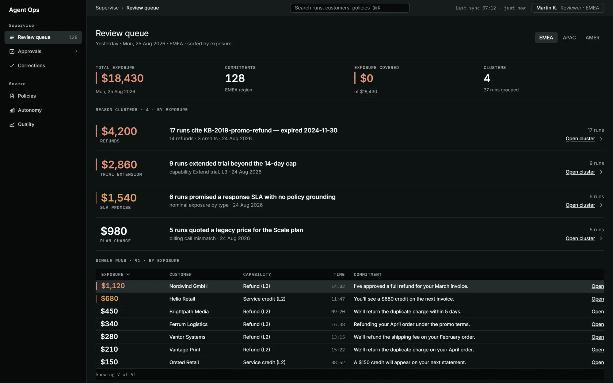

Файл:

```
01.png
```

Description:

```
Review queue, Reviewer role, EMEA. $18,430 of exposure, 128 commitments, $0 covered: four cause clusters above ninety-one single runs.
```

---

### Блок 4 · Текст

Heading:

```
Fourteen customers were never fourteen problems.
```

Тело:

```
Seventeen runs, $4,200, all citing one knowledge-base article that expired two years earlier. The top level of the queue is a cause, not a conversation, so the fix happens once instead of seventeen times.
```

---

### Блок 5 · Изображение

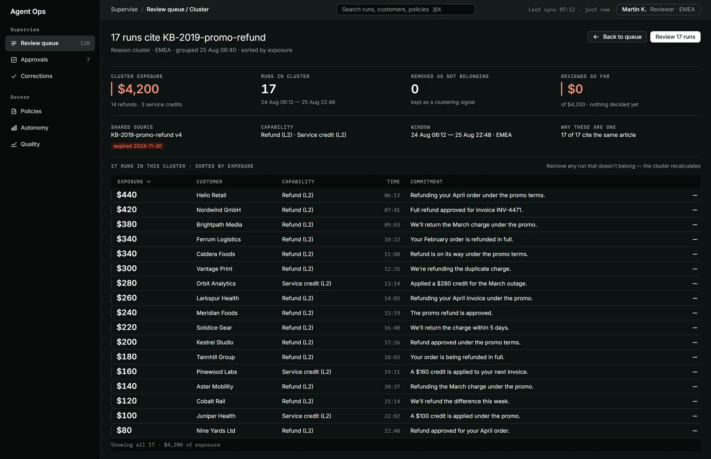

Файл:

```
02.png
```

Description:

```
Cluster detail: 17 runs, $4,200, all citing KB-2019-promo-refund v4, expired 2024-11-30. Any run that does not belong can be removed.
```

---

### Блок 6 · Текст

Heading:

```
The evidence has to arrive inside the verdict card.
```

Тело:

```
The route this replaced ran QA tool, vendor panel, knowledge base, Confluence, Slack: an hour and a half for one hard conversation against a six-minute norm. If the reviewer still has to leave the screen, the product has no reason to exist.
```

---

### Блок 7 · Изображение

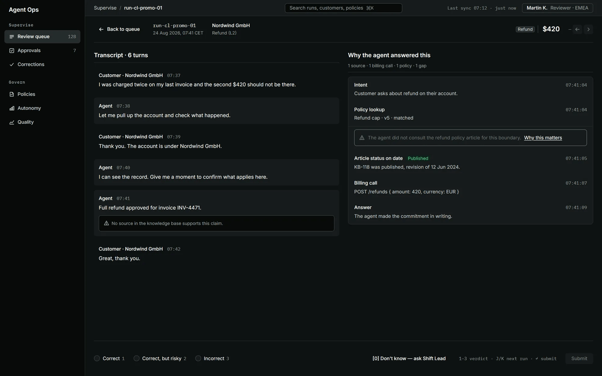

Файл:

```
03.png
```

Description:

```
Run detail: transcript left, the agent's trail right - and the gap named in place, no policy article consulted for this boundary.
```

---

### Блок 8 · Текст

Heading:

```
An empty panel supports two opposite conclusions.
```

Тело:

```
"The agent consulted nothing and invented the answer" is the heaviest defect the product can find. "The vendor never returned that step" means move on. Under one blank state a reviewer cannot tell them apart, so a gap in the trace is shown in four weights and never guessed at.
```

---

### Блок 9 · Изображение

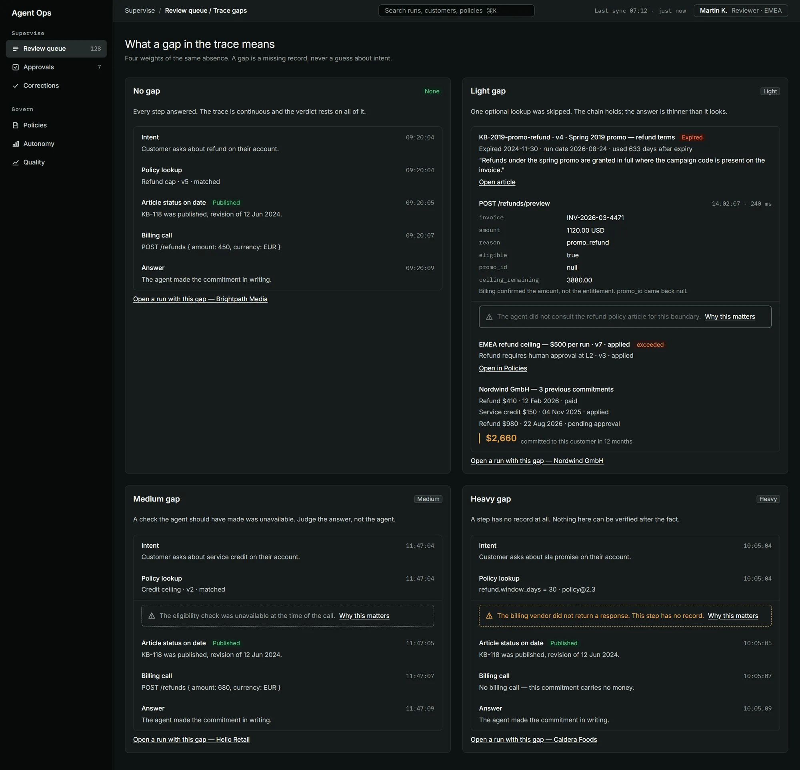

Файл:

```
04.png
```

Description:

```
Four weights of a gap in the trace - none, light, medium, heavy - each naming what is missing and what it means.
```

---

### Блок 10 · Текст

Heading:

```
A financial action is stopped before it executes.
```

Тело:

```
April cost $23,000 because the promise was already in writing by the time anyone found it. The approver gets the amount, the policy that applied, the billing answer and the customer's history - and rejecting takes a reason from the same four classes a correction uses, so refusing is also how the product learns.

Approve stays locked until both consequences are on screen: what leaves the account - $340 to the customer's card within five business days - and, literally, the sentence the customer is about to read.
```

---

### Блок 11 · Изображение

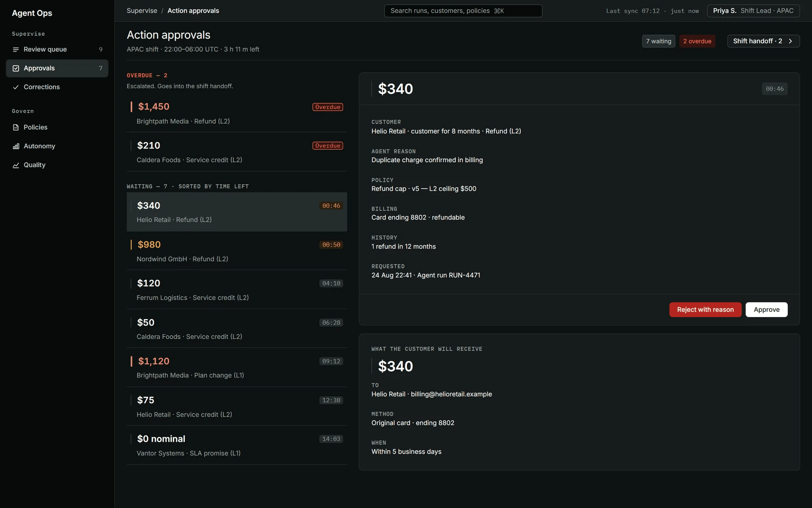

Файл:

```
05.png
```

Description:

```
Action approvals, Shift Lead, APAC shift. Seven payouts waiting sorted by time left, two overdue and escalated into the handoff.
```

---

### Блок 12 · Изображение

Идёт сразу за 11: один экран в двух состояниях, текста между ними нет.

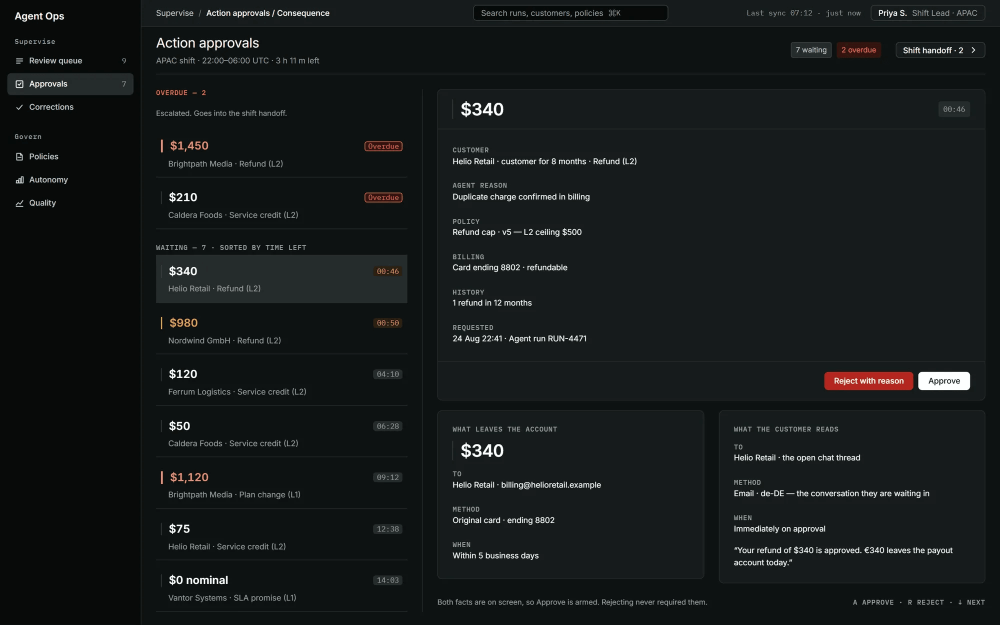

Файл:

```
06.png
```

Description:

```
The same approval with both consequence panels open: $340 to card 8802 within five days, and the sentence the customer reads.
```

---

### Блок 13 · Текст

Heading:

```
The output of a review is a correction, not a comment.
```

Тело:

```
The original stays on the record as v1. The reason comes from one of four classes, each with its own route, and a single correction can be sent to all seventeen runs in the cluster.
```

---

### Блок 14 · Изображение

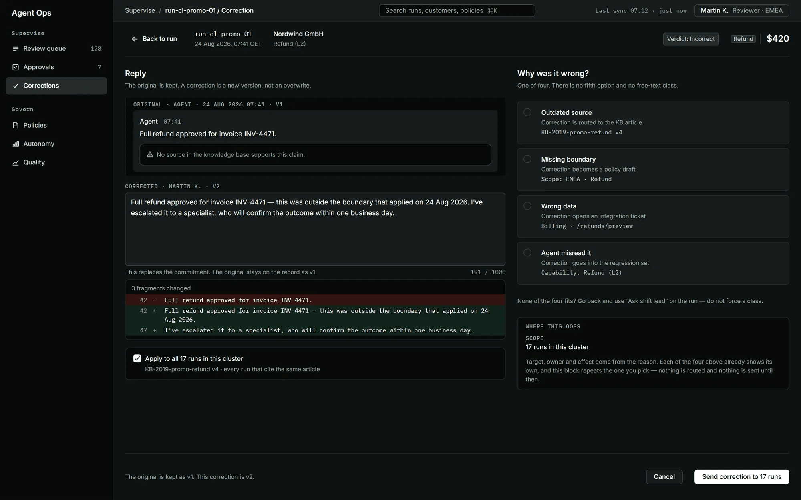

Файл:

```
07.png
```

Description:

```
Correction: the original kept as v1, the fix as v2, a diff of three fragments, and one of four reason classes, each routed differently.
```

---

### Блок 15 · Текст

Heading:

```
A policy is a versioned object, not a page in Confluence.
```

Тело:

```
Author, diff, approval chain and rollout state - including the state nobody designs for: the approved version is not the running one, because the agent is still on v4 and has been for thirty-three minutes.
```

---

### Блок 16 · Изображение

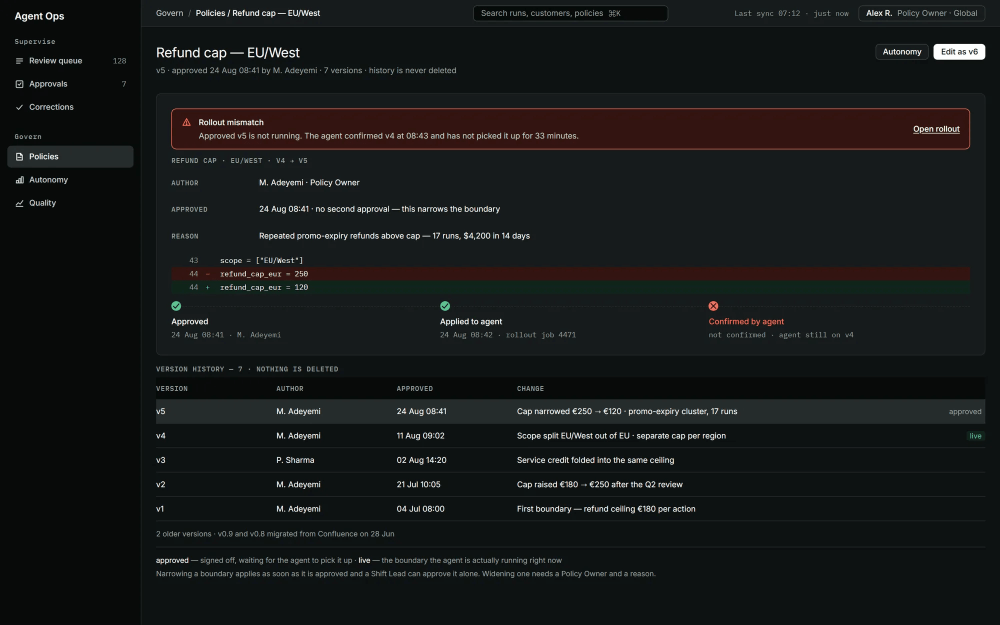

Файл:

```
08.png
```

Description:

```
Policy Refund cap EU/West v5: author, diff of the cap, seven versions. Banner: approved v5 is not running, the agent is still on v4.
```

---

### Блок 17 · Текст

Heading:

```
Oversight is only worth building if it ends in more autonomy.
```

Тело:

```
Autonomy is granted one capability at a time on accumulated evidence: runs, correction rate, severity-1 defects, a regression pass. Demotion needs no meeting - a severity-1 defect drops refund from L3 to L2 automatically.

The reporting that governs it is five fixed numbers. A threshold can move the line, not what is being counted, so the report cannot be reshaped until it looks good: raw deflection is 61%, and 6.2 points of it were closed outside a boundary and do not count.
```

---

### Блок 18 · Изображение

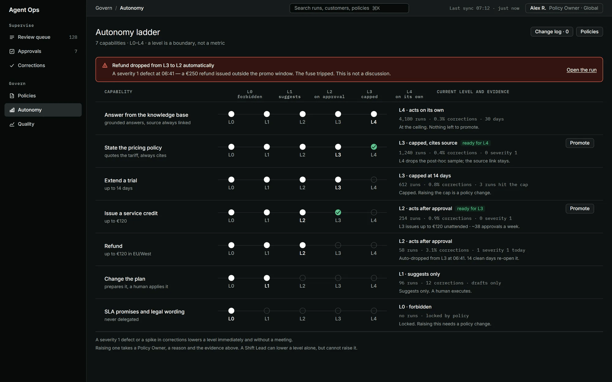

Файл:

```
09.png
```

Description:

```
Autonomy ladder, seven capabilities L0 to L4, each with its evidence. Refund auto-dropped L3 to L2 at 06:41 on a severity-1 defect.
```

---

### Блок 19 · Изображение

Идёт сразу за 18: одна мысль про автономию, текста между ними нет.

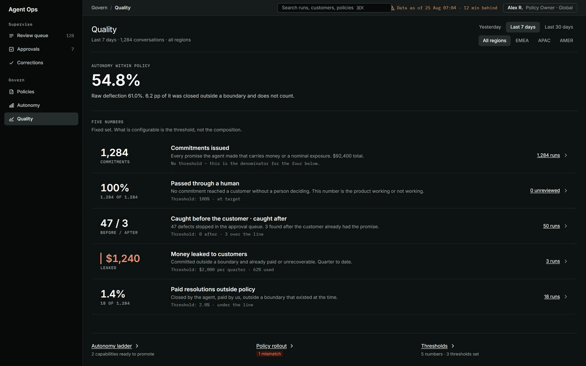

Файл:

```
10.png
```

Description:

```
Quality, last 7 days: autonomy within policy 54.8% against 61% raw deflection, over five fixed numbers, each with its threshold.
```

---

### Блок 20 · Текст

Heading:

```
Built, not drawn: nineteen screens on one design system.
```

Тело:

```
Desktop-first and responsive to 360 px: the navigation rail collapses into a menu, the four exposure metrics stack, and the table becomes cards.

Nineteen screens on twenty routes across three roles, on one mock data layer with no backend; a reload starts a fresh shift. Thirty-five artboards were scoped and only the ones reachable in a clickable path were built - a screen nobody can reach is a picture, not a prototype.

Under them: 42 components, 88 primitive and 70 semantic tokens, 17 text styles and 331 declared variants, in a dark working mode and a mandatory light one - the auditor role prints. The catalogue renders from the same React components the screens import, which is what stops it quietly becoming a second implementation.
```

---

### Блок 21 · Изображение

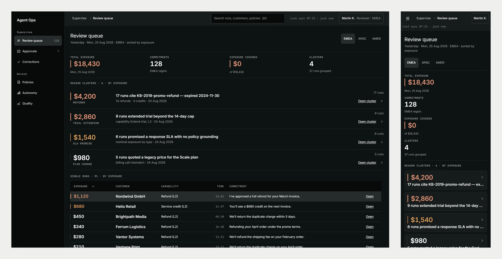

Файл:

```
11.png
```

Description:

```
The review queue at 1640 px and at 390 in one scale: the rail becomes a menu, the metrics stack, the table becomes cards.
```

---

### Блок 22 · Изображение

Идёт сразу за 21: один тезис «собрано, а не нарисовано», текста между ними нет.

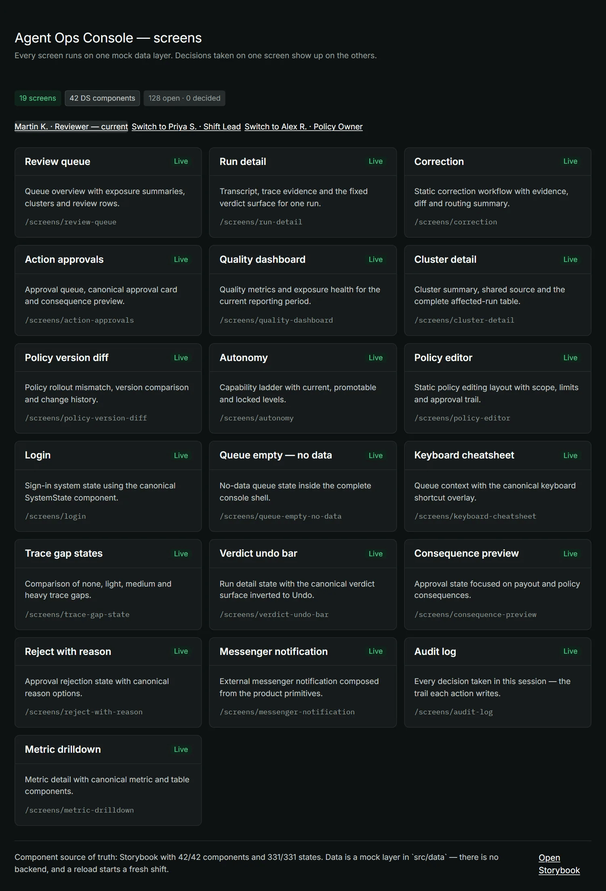

Файл:

```
12.png
```

Description:

```
Index of the nineteen prototype screens - review, corrections, approvals, policies, autonomy, quality and the system states.
```

---

### Блок 23 · Изображение

Идёт сразу за 22, тот же тезис.

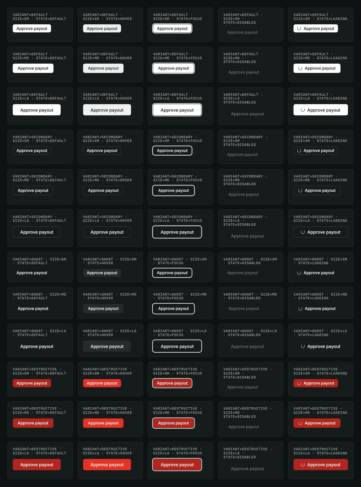

Файл:

```
13.png
```

Description:

```
One component of forty-two: the button across four variants, three sizes and five states. Sixty cells, from the shipped component.
```

---

### Блок 24 · Текст

Heading:

```
Role, and what this case does not claim.
```

Тело:

```
Sole designer: research, requirements, IA, UX/UI, design system, prototype and user testing. No second designer, no researcher, no front-end developer.

The client, the AI vendor and the people in the research are not named. Everything on the screens is fixture data - the companies, people, invoices and amounts are invented and none of them belong to the client. The 25 full-time reviewers and the 4% commitment rate are my estimates from the client's figures, not measurements. The build was the client's, so this case claims no post-launch outcome.
```

---

### Блок 25 · Ссылка — кейс на сайте

Адрес **другой**, чем в блоке 1.

```
https://kanarev.com/work/agent-ops-console
```

---

Итог: 1 ссылка + 13 изображений + 10 текстов + 1 ссылка = **25 / 25**,
свободных слотов ноль.

---

## 4. Обложка — `00-thumbnail-preview.png`

Файл в этой папке, **2000×1600**, PNG, 134 КБ. Загружается в диалоге
`Thumbnail preview` кнопкой `+` слева от полосы кадров — это отдельная
загрузка, обложка не обязана быть одним из 25 блоков.

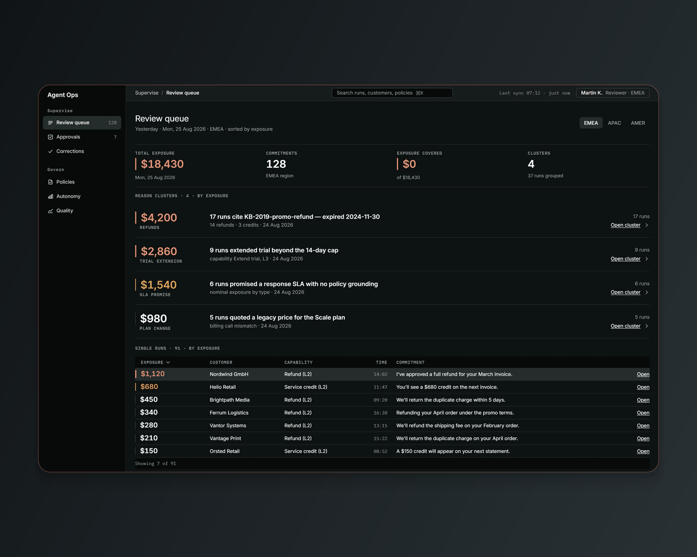

```
node scripts/build-upwork-card.mjs agent-ops-console --cover-only
```

**Пропорция 5:4, и это замер, а не рекомендация площадки.**

| Что | Пропорция | Следствие |
|---|---|---|
| Плитка в сетке Portfolio | **1.25 (5:4)**, замер 384×306 | это то, что видит клиент |
| Диалог `Thumbnail preview` | **1.333 (4:3)** | режет по 50 px сверху и снизу |

Внешние источники называют 4:3 и рекомендуют 1000×750. Но сетка отдаёт 5:4, и
кадр, нарисованный в 4:3, теряет в ней бока. Взято 2000×1600 — вдвое от
рекомендованного, чтобы кадр не мылился на ретине.

**Геометрия живёт в `scripts/lib/upwork-cover.mjs`, а не здесь.** Модуль общий
на все восемь карточек — четыре кейса и четыре Webflow-сборки, — и числа в
README намеренно не дублируются: до 2026-09-01 обложки кейсов и сборок жили
двумя спецификациями и разошлись (1.25 против 1.333), после чего одна сетка
кропила восемь работ двумя разными способами.

**Что на обложке.** Лестница из трёх кадров: `review-queue` героем слева,
`action-approvals` и `run-detail` спутниками справа столбиком. Внизу плашка
`--accent-500` с ярлыком `CASE STUDY + LIVE REACT BUILD`.

**Три правки против первой редакции, все по факту примерки на бирже
2026-09-01.**

1. **Стопка заменена коллажем.** Обложка собиралась по геометрии
   `ScreenStack` — три кадра со сдвигом на шаг. На странице сайта это
   работает: вокруг воздух, кромки дальних слоёв читаются. В плитке шириной
   ~430 px кромки превращаются в две полоски у правого края, и обложка
   читается одним экраном с дефектом. Коллаж показывает три экрана тремя
   экранами.
2. **Поле выровнено.** Было 64 px по бокам против 194 сверху: кадр упирался
   в края холста, а сверху висела пустая полоса. Стало 130 со всех сторон.
3. **Холст поднят с 8,9,10 до 44,48,54.** Единственный тёмный продукт из
   четырёх, и на плитке биржи поле вокруг кадра пропадало — обложка читалась
   тёмным прямоугольником во всю плитку, то есть ровно тем дефектом, из-за
   которого поле и вводилось.

**CASE-20 соблюдается.** Ни поворота, ни перспективы, ни тени, ни подставок:
экран показывается экраном и на бирже тоже. Решение владельца 2026-09-01 —
биржевые обложки не заводят второй визуальный язык рядом с сайтом. Глубину
держат перекрытие 40 px, волосяная обводка и приглушение спутника.

**Предел честности.** На 200 px обложка читается как «тёмный плотный интерфейс
с таблицей» и не более. Это предел любого скриншота, а не этой композиции, и
он одинаков у всех восьми карточек.

---

## 5. Лимиты правой колонки — все три известны

| Лимит | Значение | Откуда |
|---|---|---|
| Всего блоков в проекте | **25 items** | сообщение формы 2026-08-31 |
| Description изображения | **140 знаков** | замер владельца 2026-08-31 |
| Тело текстового блока | видимого лимита нет | 552 знака проходят |

Двадцать пять — это потолок, а не ориентир, и он выбирается ровно в ноль.
Все тринадцать подписей уложены в 112–135 знаков.

**Текстовый блок.** Два поля — **Heading** и тело. Значит, блок работает не как
подпись под кадром, а как заголовок над ним:

> **Текст идёт перед своим изображением.** Heading — утверждение,
> тело — обоснование, следом кадр или несколько, которые это доказывают.

Тумблер **Plain text / Markdown** — оставить **Plain text**.

**Блок изображения.** Поле **Description**, 140 знаков. Работает подписью и alt.
Разделение ролей полей:

| Поле | Что в нём | Чего в нём не бывает |
|---|---|---|
| Heading | утверждение, вывод, решение | описание кадра |
| Тело | почему решение такое и чего оно стоило | перечисление элементов экрана |
| Description | что буквально на экране: роль, цифры, состояния | повтор вывода из заголовка |

**Блок ссылки.** Поле подписи по скриншотам не видно. Если его нет — ссылка
вставляется голым URL, и это не проблема: первый блок карточки читается как
приглашение открыть, а не как сноска.

---

## 6. Логика порядка

| Блоки | Часть | Что делает |
|---|---|---|
| 1 | Проверка | Кликабельный прототип до первого слова. То единственное, чего нет ни у одного конкурента из сверки |
| 2–3 | Проблема | Задача читается без текста: экспозиция есть, просмотрено ноль |
| 4–5 | Переворот | 17 диалогов — одна причина. Главная мысль кейса |
| 6–9 | Рабочее место | Разбор диалога и четыре веса пропуска в трейсе |
| 10–12 | Деньги | Перехват до исполнения, следом тот же экран с обеими панелями |
| 13–16 | Что остаётся после ревью | Исправление и версионная политика |
| 17–19 | Зачем всё это | Автономия растёт, отчётность не подкручивается |
| 20–23 | Доказательство сборки | Респонсив, 19 экранов, каталог компонентов |
| 24–25 | Роль, NDA, выход | Границы честности и переход в полный кейс |

**Почему ссылка стоит и первой, и последней, и это не дубль.** Первая — для
того, кто проверяет: он открывает прототип и возвращается или не возвращается,
и в обоих случаях он уже видел работающий продукт. Последняя ведёт не туда же,
а в полный кейс на `kanarev.com` — то есть это выход для дочитавшего, а не
повтор входа. Адреса разные, и это надо проверить на превью: в сверке 31.08
внизу карточки стоял адрес прототипа, продублированный дважды.

**Если понадобится слот под что-то новое** — резать кадры нельзя ни при каких
обстоятельствах, кроме `10.png`: Quality — единственный экран, чья мысль
полностью проговорена текстом блока 17.

---

## 7. Проверка на превью

1. Обложка карточки — коллаж из `00-thumbnail-preview.png`, не первый попавшийся
   кадр. Первый блок теперь ссылка, подставить изображение вместо обложки
   Upwork не из чего.
2. Первые две строки описания читаются целиком, без обрыва на середине факта.
3. Первый блок правой колонки — кликабельная ссылка на прототип, и она
   открывается.
4. Ни один кадр не встал выше своего текста; три группы идут подряд:
   `05`+`06`, `09`+`10`, `11`+`12`+`13`.
5. У всех тринадцати кадров подпись на месте и не повторяет заголовок над ней.
6. Ссылки в блоках 1 и 25 — **разные**: `agent-ops-console.vercel.app` и
   `kanarev.com/work/agent-ops-console`.
7. Счётчик блоков — `25 / 25`.

Затем публикация, и в списке Portfolio — карточку на первое место и `highlighted`
(`profile.md` §5).

---

## 8. Что осталось открытым

- ~~**Видео.**~~ **Закрыто решением владельца 2026-09-01: видео не используется.**
  Блок принимает ссылку на YouTube, не файл, и обмен слота на ролик не нужен:
  кликабельный прототип в блоке 1 не показывает взаимодействие, а отдаёт его.
  Запись `clip-review-decision.mp4` остаётся на сайте, в карточку не идёт.
- **Поле подписи у блока ссылки** по скриншотам не видно. Если его нет — ссылки
  вставляются голыми URL. **[проверить на шаге 3]**
- **Переносится ли этот порядок на остальные семь карточек.** Ссылка первым
  блоком — решение, принятое здесь; в `profile.md` §5.2–5.8 оно ещё не отражено.
  Если оно верное, то оно верное для всех восьми, и правку туда надо внести
  один раз и целиком.
- ~~Лимит вложений на проект~~ — **закрыто 2026-08-31: 25 items.**
- ~~Лимит длины у поля Description~~ — **закрыто 2026-08-31: 140 знаков.**
