# Upwork · карточка 2 — B2B Partner Portal

Проект в форме Upwork: **Add a new portfolio project**.
Источник фактуры — `src/copy/cases/partner-portal.ts` и `upwork/profile.md` §5.2.

**Как читать этот файл.** Разделы 1–3 — рабочие: идёшь сверху вниз и копируешь
каждый блок в кода-рамке как есть. Ничего искать в других местах документа не
нужно: у каждого кадра рядом стоит и сам кадр, и его имя файла, и его подпись.
Разделы 4–8 — справка: обложка, лимиты, логика порядка, проверка, открытые
вопросы. В работе они не нужны.

> **Заведён 2026-09-01** по образцу пакета `agent-ops-console`. Структура
> повторена целиком и сознательно: те же три шага, тот же порядок «ссылка
> первым блоком», те же три поля слева, тот же лимит 25.
>
> Отличие ровно одно и оно жанровое: **это единственный кейс в портфолио, где
> «до» существует и очищено к публикации**. Поэтому карточка открывается парой
> before/after, а не разбором задачи. Приём взят у Kiryl H.
> (`upwork/competitive-analysis.md` §8.2, шаблон A), но наш «до» сильнее его:
> у него обе картинки — собственная реконструкция конфиденциального продукта,
> у нас `01.png` — реально отгруженный старый портал.

Граница, которую нельзя двигать (правила кейса, `partner-portal.ts`):
ни одной бизнес-метрики — результаты под NDA и baseline у проекта нет;
ни одного реального артикула, названия и коммерческого условия; три из трёх —
это агентский прогон, а не внедрение, и это сказано словами.

**Что добавил формат `Task / Solution / Result / Duration` (2026-09-01).**
Строка `Duration` — **оценка объёма работы, а не таймшит**: точного учёта часов
по этому проекту нет, цифра восстановлена по составу отгруженного и сроку.
Названа она часами потому, что на бирже это единица, в которой клиент считает
бюджет. Граница выше от этого не сдвинулась: ни одной новой бизнес-метрики в
описании не появилось — в строке `Result` стоят те же цифры, что уже были в
кейсе, и в том же статусе.

---

## 1. Три шага, строго в этом порядке

**Сначала левые поля, потом снос, потом сборка** — пока лимит 25 выбран, форма
не даст добавить ни одного блока.

**Шаг 1 — левые поля.** Раздел 2. `Project title` **заменить обязательно**:
тот, что стоит в `profile.md` §5.2, длиной 74 знака и в поле не влезет.
`Project description` заменить целиком, скиллы перебрать.

**Шаг 2 — снести правую колонку**, если в ней что-то есть. Счётчик должен
показать `0 / 25`. Обложку в диалоге `Thumbnail preview` **не удалять**.

**Шаг 3 — собрать 25 блоков заново.** Раздел 3, сверху вниз, без пропусков.
Четырнадцать PNG лежат в этой папке и грузятся по именам подряд.

---

## 2. Поля слева

### Project title *  (лимит 70) — **заменить**

```
B2B Partner Portal Redesign | UX for Complex Ordering - Shipped
```

63 из 70.

**🔴 Почему не тот, что в плане.** В `profile.md` §5.2 стоит
`B2B Portal Redesign | UX for Complex Ordering - Distributor Partner Portal` —
**74 знака, форма его отвергнет**. Ошибка найдена при сборке этого пакета
2026-09-01 и исправлена в обе стороны. Что изменилось по смыслу: «Distributor
Partner Portal» ушло, `Shipped` пришло. Обмен выгодный — слово `Distributor`
дублировало то, что и так стоит в первой строке описания, а `Shipped` говорит
то единственное, чего нет ни у одной другой карточки портфолио: этот редизайн
дошёл до прода целиком.

### Your role  (лимит 100)

```
Product Designer at DSSL - audit, research, IA, UX/UI, design system; the React rebuild is mine
```

95 из 100. Формулировка делает две работы сразу: называет штатную роль в
компании и отделяет от неё пересборку, которая по ссылке. Без второй половины
живой прототип читался бы как продакшн заказчика, а это не так.

### Project description *  (лимит 600) — **заменить целиком**

```
Task: rebuild a distributor's partner portal so a partner turns a purchase list into an order without a manager - on a pricing and stock system that could not be replaced.

Solution: audit, research, IA, UX/UI, a design system, a React prototype and a component catalogue - 20 screens. Every line keeps its source row: file, row number, original text, quantity.

Result: the redesign shipped in full - a partner orders from an imported file without a manager. Median 17.9 s on the one step left manual by design.

Duration: ~320 working hours.

Results under NDA. Data on screen is invented.
```

591 из 600. **Формат сменён 2026-09-01 решением владельца** —
описание разложено на `Task / Solution / Result / Duration`. Причина: карточку на бирже читают как
смету, а не как эссе. Клиент должен увидеть четыре вещи подряд — что было
задачей, из чего состояла работа, чем она кончилась и сколько заняла, — и
увидеть их до того, как решит читать дальше. Формат единый для всех восьми
карточек. Первая строка `Task:` обязана пережить обрезку в плитке — она и
несёт то, что раньше несла первая фраза нарратива.

**Три расхождения с `profile.md` §5.2, все три сознательные и все три те же,
что в пакете Agent Ops.**

| Что | Почему здесь иначе |
|---|---|
| Текст короче: 600 против 1180 знаков | Формула кейса рассчитана на 1000–1200, поле формы отдаёт 600 **[факт, замер 2026-08-31]**. Резались связки, не факты |
| Нет строки `Open it yourself: <URL>` | Ссылка — первый блок правой колонки, кликабельный. В описании она стоила бы 60 знаков из 600, которых нет |
| Нет блока `Role:` и нет упоминания агентского прогона | Роль — в отдельном поле формы, прогон — в блоке 22 правой колонки. Внутри 600 знаков повтор непозволителен |

**Прежняя редакция описания — снята 2026-09-01.** Нарративная версия и её
обоснование сохранены здесь: у неё другая работа — она годится там, где лимит
поля не 600, и по ней восстанавливается формулировка, если формат когда-нибудь
откатят.

<details>
<summary>Нарративная версия</summary>

```
A distributor's partner portal, rebuilt so a partner turns a purchase list into an order without a manager in the middle. 20 screens, a design system, a React prototype and a component catalogue. The redesign shipped in full.

The pricing and stock system behind it was never going to be replaced: the redesign had to make an unchangeable data model usable.

So the specification, not the catalogue, became what the system tracks. Every line keeps its source row - file, row number, original text, quantity - from the imported file to the placed order.

Results under NDA. Data on screen is invented.
```

600 из 600, ровно в потолок. Первый абзац — 225 знаков — обязан пережить
обрезку в карточке.

</details>

### Skills and deliverables *  (5 слотов)

```
Product Design · UX & UI Design · App Design · Responsive Design · React
```

**🔴 Справочник Upwork отдаёт не то, что было в плане — [факт, проверено
владельцем в форме 2026-09-01].**

| В плане стояло | Что в форме | Что сделано |
|---|---|---|
| `Design System` | **термина нет вовсе** | заменён, см. ниже |
| `Web Application Design` | есть только `App Design` | взят `App Design` |

**Чем заменён `Design System` и почему не «ещё раз Figma».** На карточке 1
свободный слот ушёл под `Figma`. Второй раз тот же тег не даёт ничего: в
профильных скиллах (`profile.md` §4, позиция 6) он уже стоит, а внутри карточки
не описывает, чем эта карточка отличается от соседней. Слот отдан тому, что
доказано **этим** кейсом:

- **`Responsive Design`** — доказан кадром `05.png` буквально: тот же разбор
  спецификации на 1440 и на 390 рядом. Ни одна другая карточка портфолио
  не показывает этого кадром.
- **`React`** — единственная карточка, где сборка и отгружена у заказчика, и
  открывается по ссылке первым блоком. Тот самый дифференциатор.

**Лестница на случай, если `React` в подсказке не найдётся** — идти до первого
принятого: `React` → `Prototyping` → `User Experience Design`. Все три честны
для этой карточки; порядок — по убыванию того, насколько тег отличает её от
остальных семи.

**Правило, чтобы не решать это заново на каждой карточке.** Теги карточки
описывают карточку; поиском занимаются 20 скиллов профиля (§4). Поэтому
недостающий термин заменяется не ближайшим ключевым словом, а тем, что кейс
доказывает кадром. Гнаться за охватом на уровне карточки бессмысленно — охват
даёт профиль.

**Что выпало и почему.** `User Experience Design` почти дублирует
`UX & UI Design`. `Usability Testing` обещал бы юзабилити-тест с людьми, а
агентский прогон — не он. `Dashboard` отдан карточке 1, где дашборд и есть
продукт; здесь продукт — поток заказа.

---

## 3. Правая колонка — 25 блоков подряд

Порядок операций внутри блока: тип блока → содержимое → следующий.
Текстовый блок: тумблер **Plain text**, не Markdown.
Блок изображения: файл из этой папки, `Description` — в поле подписи (лимит 140).

---

### Блок 1 · Ссылка — прототип

```
https://b2b-partner-portal-five.vercel.app/
```

---

### Блок 2 · Текст

Heading:

```
The old portal answered every question with a manager.
```

Тело:

```
The distributor sells professional video-surveillance equipment to system integrators. Its partners are not shoppers: they buy from a list they already have, for a project that has a date, at prices that belong to their contract. The portal they were given behaved like a shop. I audited its ten screens before touching anything, and the pattern held across all of them.
```

---

### Блок 3 · Изображение

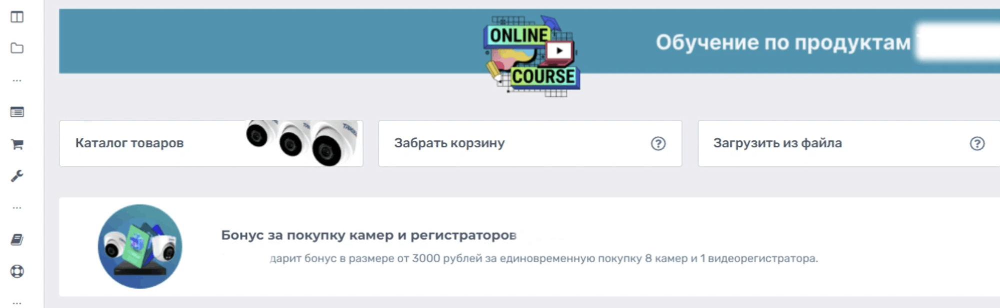

Файл:

```
01.png
```

Description:

```
Before. The buyer's workspace opened with a training banner and a bonus promotion. Russian, as it shipped; the partner's name is masked.
```

---

### Блок 4 · Изображение

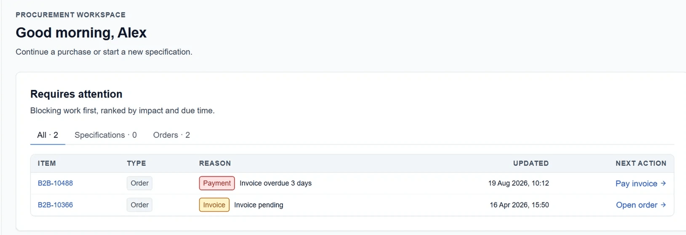

Файл:

```
02.png
```

Description:

```
After. The same question - what does the workspace open with - answered by what is blocking work, ranked by impact and due time.
```

---

### Блок 5 · Текст

Heading:

```
A buyer does not shop. A buyer works from a specification.
```

Тело:

```
Ten to fifty lines for one project, written in a spreadsheet, passed around by email, corrected by hand. By the time it reaches the portal it already exists - and the old flow made the partner key it in again, line by line. The moment a line was ambiguous, the only resolution available was a person. So the object the system holds stopped being the product and became the line: where it came from, what it originally said, and what it was resolved into.
```

---

### Блок 6 · Изображение

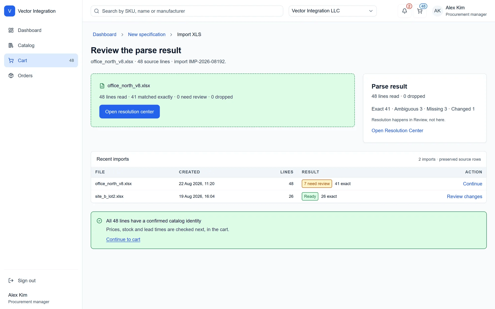

Файл:

```
03.png
```

Description:

```
Quick order: four lines pasted from a spreadsheet. Two matched a catalogue product, one shows eleven candidates, one has no match.
```

---

### Блок 7 · Текст

Heading:

```
An ambiguous line is never resolved on the buyer's behalf, however confident the match.
```

Тело:

```
Compatibility rules for this equipment are not formalised anywhere I could verify. Automating a check that does not exist moves the risk of an incompatible delivery from the system to the buyer, who finds out on site with a crew already there. The cost is measurable: the resolution queue is the slowest screen in the product, a median of 17.9 seconds against 0.9 to 2.8 elsewhere in the agent run. That time is the price of the guarantee, and it is paid in full by the person the guarantee protects.
```

---

### Блок 8 · Изображение

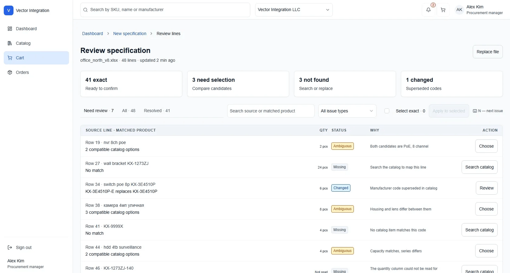

Файл:

```
04.png
```

Description:

```
Both candidates for one imported line - source text, quantity, and why it is ambiguous - compared before the choice is applied.
```

---

### Блок 9 · Изображение

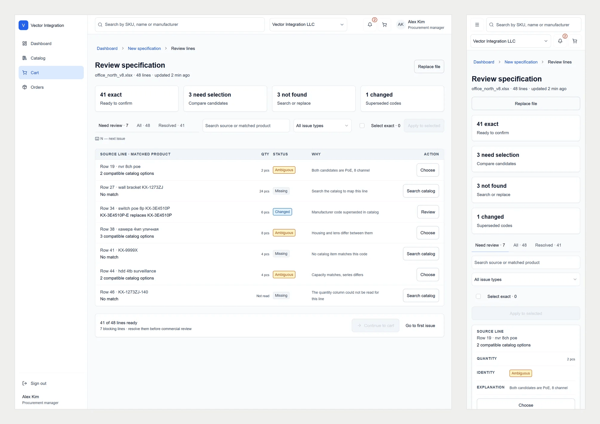

Файл:

```
05.png
```

Description:

```
The same review at 1440 px and at 390: the rail becomes a menu, a table row becomes a labelled card with its own action.
```

---

### Блок 10 · Текст

Heading:

```
A price that moved is still a verified price.
```

Тело:

```
The first build had a single list of four statuses, which made one component both the source of truth about freshness and the record of a movement. Cart change review reads the movement; the buyer's trust reads the freshness. One axis could not answer both, so there are two: verified, stale or not confirmed - and changed or unchanged. "Not confirmed" prints those words, never a zero and never an empty cell, because a blank in a price column reads as free.
```

---

### Блок 11 · Изображение

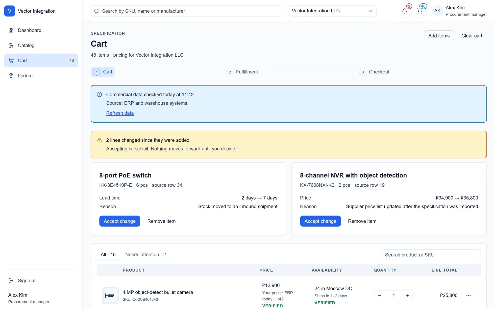

Файл:

```
06.png
```

Description:

```
One changed price in the cart, with the reason it moved and the source row it came from, before the buyer accepts it.
```

---

### Блок 12 · Изображение

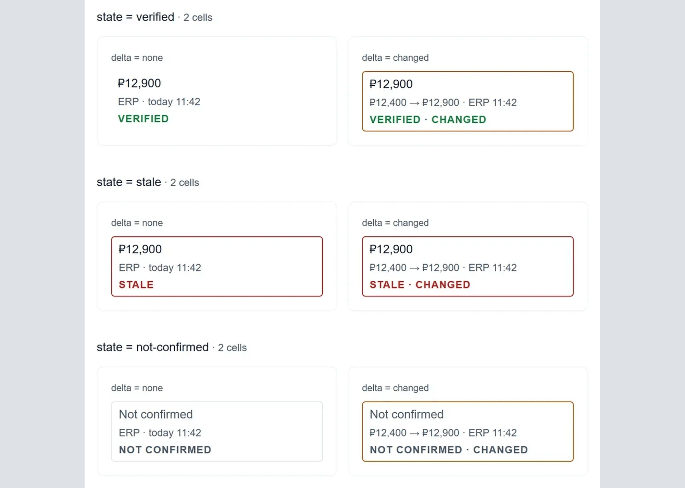

Файл:

```
07.png
```

Description:

```
PriceBlock, every state it is allowed to have: verified, stale, not confirmed, each of them with and without a change.
```

---

### Блок 13 · Изображение

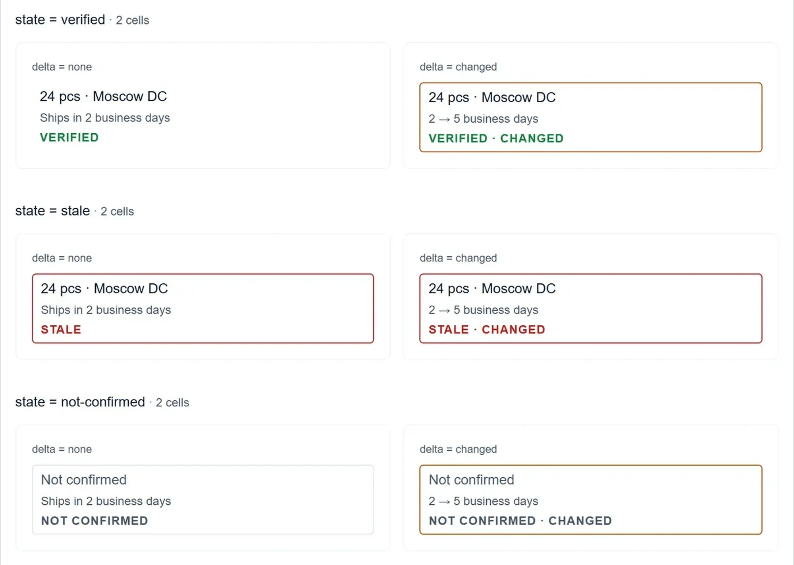

Файл:

```
08.png
```

Description:

```
Availability on the same two axes. These two components carry a promise about data the portal cannot always verify.
```

---

### Блок 14 · Текст

Heading:

```
Forty-eight lines to a placed order, with nobody reading them first.
```

Тело:

```
Three agent runs out of three reached a created order. The warehouse split, the delivery dates and the documents that come out of the order all hang off those same lines, and every one of them still points back at the row of the file it arrived in. That is the point of the source row: six weeks later, an argument about a delivery has something to check itself against.
```

---

### Блок 15 · Изображение

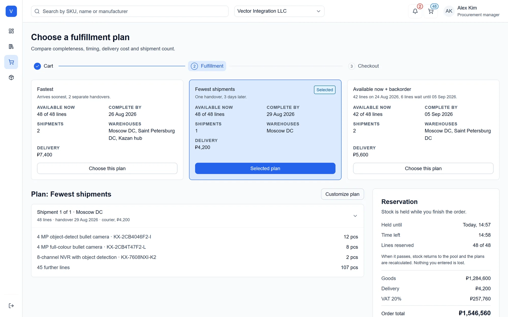

Файл:

```
09.png
```

Description:

```
Fulfilment plans: one specification split across warehouses, each plan carrying the date it can actually promise.
```

---

### Блок 16 · Изображение

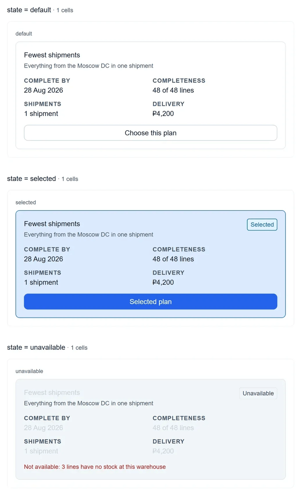

Файл:

```
10.png
```

Description:

```
FulfillmentPlan in its three states: default, selected, unavailable. An unavailable plan still says why it cannot be chosen.
```

---

### Блок 17 · Текст

Heading:

```
Navigation does not advertise screens that do not exist.
```

Тело:

```
Price lists and a global document registry left the rail: neither had a confirmed source of truth or a route behind it. A rail item that leads nowhere teaches that the rail cannot be trusted, and that lesson is more expensive than the missing item, because it is charged against every other item too. The cost: the back-office job - find one invoice without knowing its order - has no address of its own. It comes back the day a document registry has a real source.
```

**У этого блока нет кадра, и это решение, а не пропуск.** Снимок рейла —
`public/media/case-dssl/nav-rail.webp`, 390×528. Чтобы поставить его в
карточку, пришлось бы растянуть впятеро; на сайте его спасает мелкий слот,
здесь спасать нечем. Утверждение проверяется по живому прототипу из блока 1.

---

### Блок 18 · Текст

Heading:

```
Forty-five components, and one row I refused to fork.
```

Тело:

```
Twenty-four generic families and twenty-one domain components. The most reused element is the product row, and it appears in three places doing two different jobs: choosing, in the catalogue, and reviewing, in the cart. Forking it was the obvious move and the wrong one. It carries a context property instead, and its matrix is deliberately incomplete - a browse row has no disabled state, and a commercial change cannot happen to something you have not added yet. An incomplete matrix with a reason beats a full one that invents states to fill itself. Coverage is not checked by eye: a script walks the catalogue against the variant matrix, and a smoke run loads every story to catch the ones that compile but do not paint.
```

---

### Блок 19 · Изображение

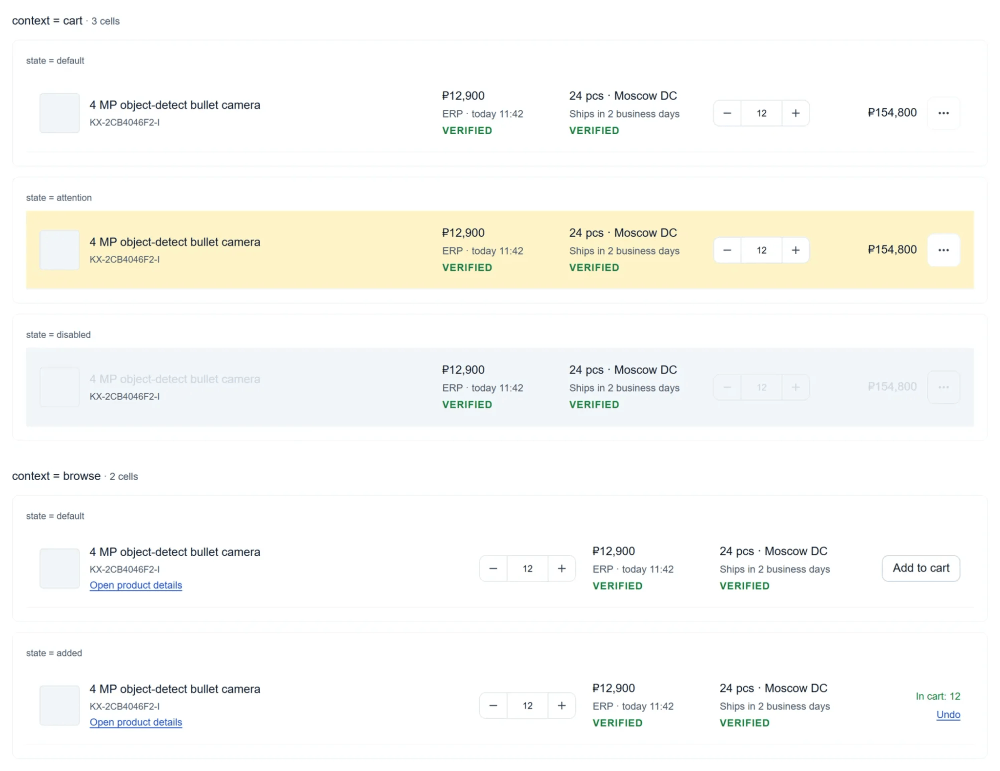

Файл:

```
11.png
```

Description:

```
ProductRow in both contexts and all its states: cart and browse, each default, attention, disabled and added.
```

---

### Блок 20 · Изображение

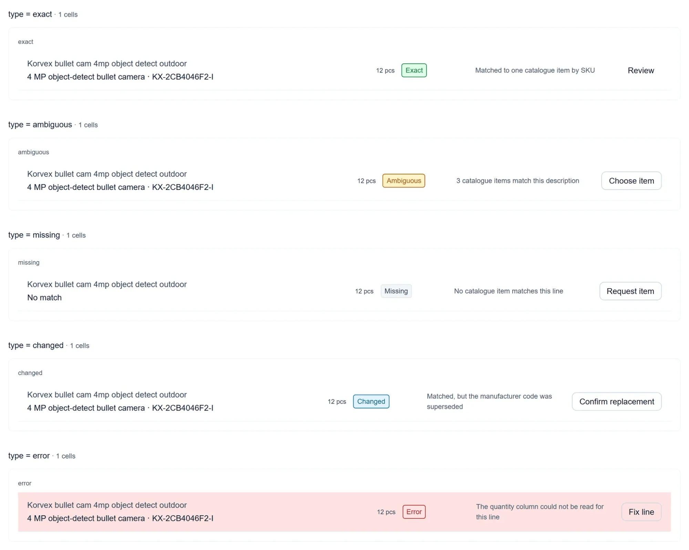

Файл:

```
12.png
```

Description:

```
ResolutionRow: exact, ambiguous, missing, changed - and a parse error, which is a different problem and looks like one.
```

---

### Блок 21 · Изображение

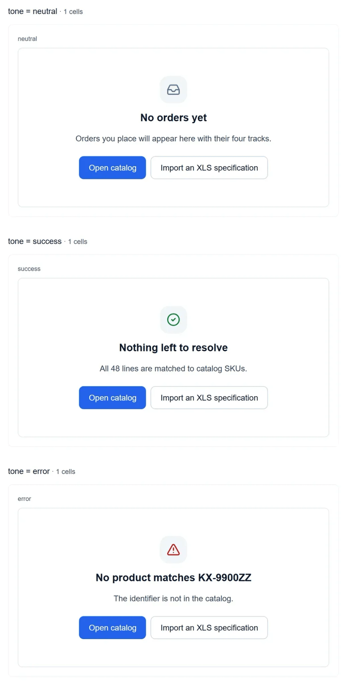

Файл:

```
13.png
```

Description:

```
EmptyState in three variants: no results, nothing yet, could not load. Three situations, so three different sentences.
```

---

### Блок 22 · Текст

Heading:

```
Six screens were finished before I checked their structure. That order was wrong.
```

Тело:

```
The market pass has two jobs - structure before the screens exist, finish after they do. I ran only the second, and by the time I compared layouts against comparable products, fourteen screens were built and passing their own audit. A structural finding then had nowhere cheap to land: it costs a paragraph in a spec before the screen exists, and a rebuild afterwards. The synthetic agent run - nine scenarios, thirty-five runs, three rounds - found seven defects on screens I considered done, two of them critical. The facet rail rendered and filtered nothing. Quick order had no paste state at all, the state a user lands in first. Two of the seven I wrote up wrong the first time, and fixing either first diagnosis would have fixed nothing. I run the structural check before the screens now.
```

---

### Блок 23 · Изображение

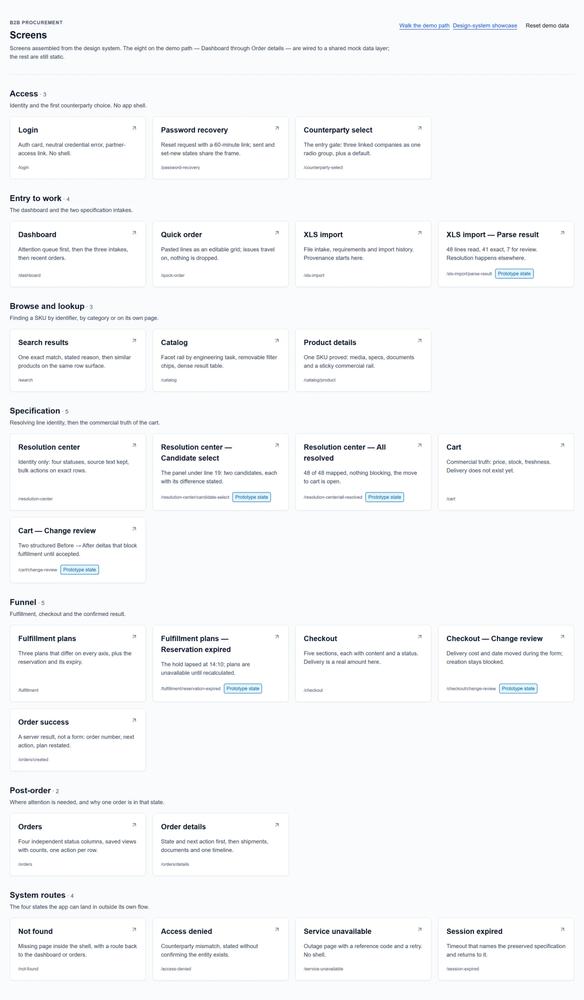

Файл:

```
14.png
```

Description:

```
Twenty screens as one index - every route the product has, grouped by the job it serves.
```

---

### Блок 24 · Текст

Heading:

```
What it cost, and who paid for it.
```

Тело:

```
Speed at the point of ambiguity, and a document registry of its own. Both were traded for guarantees the interface can actually keep: equipment compatibility, and a document source that does not exist yet. A portal that promised either would break on the first real order.

In-house at DSSL, next to frontend, backend, a product manager, QA and the team lead. There was no researcher on the team; the research was mine.

Numbers from this project are covered by an NDA and are not published, and there is no baseline to publish them against - the three-of-three above is an agent run, not adoption. The prototype linked here is my own rebuild on synthetic data: no real client, vendor, article number or commercial term appears on any screen. One archival frame of the original portal is shown for comparison, cropped so that no order, article number or price is in it.
```

---

### Блок 25 · Ссылка — кейс на сайте

```
https://kanarev.com/work/partner-portal
```

---

## 4. Обложка — `00-thumbnail-preview.png`

Файл в этой папке, **2000×1600**, PNG, 175 КБ. Загружается в диалоге
`Thumbnail preview` кнопкой `+` слева от полосы кадров.

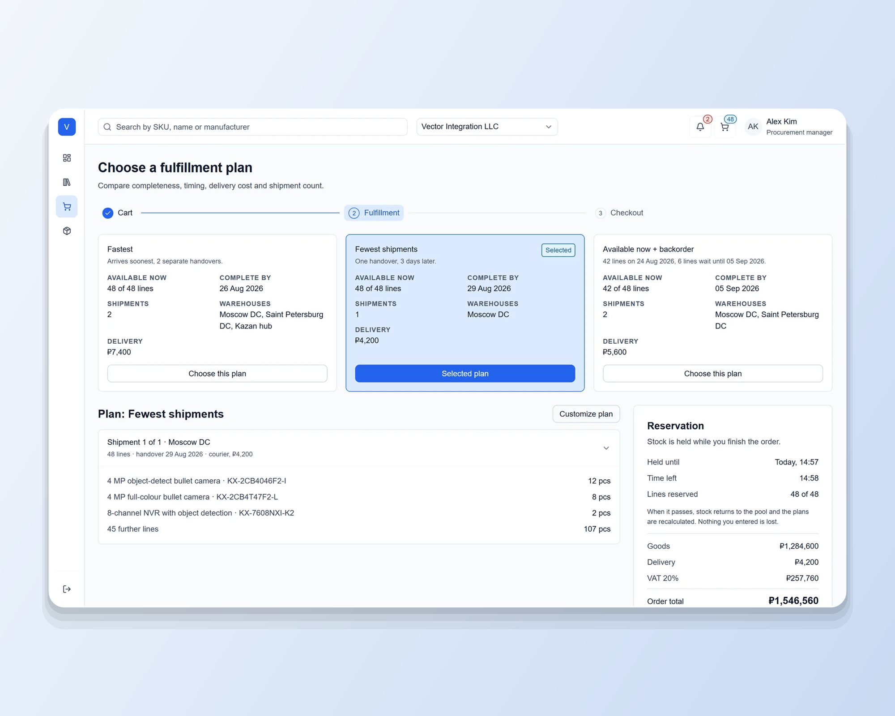

```
node scripts/build-upwork-card.mjs partner-portal --cover-only
```

Без флага тот же прогон пересобирает и все кадры пакета.

**Что на обложке.** Лестница из трёх кадров: `resolution-center` героем слева,
`fulfillment` и `dashboard` спутниками справа столбиком. Тот же состав, что у обложки кейса на
сайте. Внизу плашка `--accent-500` с ярлыком `CASE STUDY · B2B ORDERING UX`.

Передним идёт разбор спецификации: это единственный экран, на котором задача
кейса читается до текста — сорок восемь строк с их статусами и четыре
счётчика над ними.

**Геометрия — в `scripts/lib/upwork-cover.mjs`**, общем модуле на все восемь
карточек. Полная спецификация 5:4 и замеры плитки — в
`upwork/projects/agent-ops-console/README.md` §4, здесь не дублируются.

**Стопка снята 2026-09-01.** Обложка собиралась по геометрии `ScreenStack` —
три кадра со сдвигом на шаг. На странице сайта это работает, в плитке биржи
шириной ~430 px кромки дальних слоёв превращаются в две полоски у правого
края, и обложка читается одним экраном с дефектом. `CASE-20` при этом
соблюдается по-прежнему: ни поворота, ни перспективы, ни тени.

**Предел честности.** На 200 px обложка читается как «плотный интерфейс» и не
более. Это предел любого скриншота, а не этой композиции, и он одинаков у всех
восьми карточек.

---

## 5. Кадры — что откуда и что с ними сделано

Все четырнадцать собраны скриптом из `public/media/case-dssl/`. Правило
размера то же, что в пакете Agent Ops: **длинная сторона не больше 2000**,
PNG с палитрой, 97–252 КБ на кадр, весь пакет 2.8 МБ.

| # | Файл | Размер | Источник | Масштаб |
|---|---|---|---|---|
| — | `00-thumbnail-preview.png` | 2000×1600 | `cover/*` | собрана |
| 1 | `01.png` | 2000×617 | `legacy-dashboard.webp` | ×1.40 |
| 2 | `02.png` | 2000×687 | `new-dashboard.webp` | ×1.23 |
| 3 | `03.png` | 2000×1250 | `xls-parse-result.webp` | ×1.00 |
| 4 | `04.png` | 2000×1071 | `clip-line-identity-poster.webp` | ×1.19 |
| 5 | `05.png` | 2000×1413 | `range-resolution-center.webp` | ×1.00 |
| 6 | `06.png` | 2000×1250 | `cart-change-review.webp` | ×1.00 |
| 7 | `07.png` | 2000×1424 | `system-price-block.webp` | ×1.45 + поле |
| 8 | `08.png` | 2000×1424 | `system-availability.webp` | ×1.45 + поле |
| 9 | `09.png` | 2000×1250 | `fulfillment-plans.webp` | ×1.00 |
| 10 | `10.png` | 1215×2000 | `system-fulfillment-plan.webp` | ×1.17 |
| 11 | `11.png` | 2000×1542 | `system-product-row-v2.webp` | ×1.00 |
| 12 | `12.png` | 2000×1599 | `system-resolution-row-v2.webp` | ×1.00 |
| 13 | `13.png` | 1015×2000 | `system-empty-state.webp` | ×0.98 |
| 14 | `14.png` | 1168×2000 | `screen-index.webp` | ×0.58 |

**Правило растягивания и почему оно есть.** Потолок — ×1.45. Выше скрипт не
растягивает вовсе: недостающая ширина добирается **полем цвета обложки по
бокам**, как у `07` и `08`. Растянутый вдвое снимок компонента врёт о качестве
работы ровно там, где карточка эту работу и доказывает; поле честнее — образец
читается смонтированным на подложку, чем он и является.

**🔴 Дефект исходников, найденный при сборке 2026-09-01.** В плане на месте
`10.png` стоял `storybook-matrix.webp` — каталог компонентов. В карточку он не
пошёл: в `public/media/case-dssl/` этот файл **побайтово совпадает** с
`system-product-row-v2.webp` (один md5). То есть кадра каталога у кейса DSSL
нет вовсе, а на сайте один и тот же снимок стоит в двух секциях с разными
подписями — в `process.artifacts` как «каталог компонентов» и в `system.grid`
как «ProductRow во всех состояниях». Проверено по остальным семи папкам
`public/media/case-*`: там дублей нет, это единичный случай.

Здесь он заменён на `system-fulfillment-plan.webp`, который парой к `09.png`
работает лучше каталога. **Дефект сайта этим не закрыт** — он в
`src/copy/cases/partner-portal.ts` и в медиа кейса, и чинится пересъёмкой
кадра каталога, а не здесь.

**Два кадра в карточку не попали.**

- `cart-change-review-crop.webp`, 790×296 — растянулся бы в 2.5 раза. На сайте
  его спасает зум по клику, на Upwork зума нет. Полный кадр `06.png` показывает
  то же самое.
- `nav-rail.webp`, 390×528 — впятеро. См. блок 16: текст остался, кадра нет.

**Пересборка.** Если кадр в `public/media/case-dssl/` пересняли — прогнать
скрипт заново и перезалить только изменившиеся номера. Порядок и подписи
живут здесь, а не в форме, поэтому пересъёмка не требует переписывать карточку.

---

## 6. Лимиты — те же, что у карточки 1

| Лимит | Значение |
|---|---|
| Всего блоков в проекте | **25 items** |
| `Project title` | **70 знаков** |
| `Your role` | **100 знаков** |
| `Project description` | **600 знаков** |
| `Description` изображения | **140 знаков** |
| Тело текстового блока | видимого лимита нет; здесь максимум 775 знаков |

Двадцать пять выбираются ровно в ноль: 2 ссылки, 9 текстов, 14 изображений.
Все четырнадцать подписей уложены в 88–136 знаков.

Разделение ролей полей — то же, что в карточке 1: **Heading** несёт
утверждение, тело — почему решение такое и чего оно стоило, **Description**
изображения — что буквально на экране. Description никогда не повторяет
заголовок над собой.

---

## 7. Логика порядка

| Блоки | Часть | Что делает |
|---|---|---|
| 1 | Проверка | Кликабельный прототип до первого слова |
| 2–4 | Before / after | Единственная пара в портфолио, где «до» настоящее. Задача читается без текста |
| 5–6 | Переворот | Объект системы — не товар, а строка. Главная мысль кейса |
| 7–9 | Цена гарантии | Отказ решать за покупателя и 17,9 с, которыми он оплачен |
| 10–13 | Две оси | Свежесть и изменение — и два компонента, которые их несут |
| 14–16 | Что доходит до заказа | Три прогона из трёх, склады, даты, состояния плана |
| 17 | Чего в продукте нет | Рейл не обещает несуществующего |
| 18–21 | Система | Строка, которую не разветвил, и её соседи по каталогу |
| 22–23 | Ошибка порядка | Семь дефектов на «готовых» экранах, два критических; двадцать экранов |
| 24–25 | Цена, роль, NDA, выход | Границы честности и переход в полный кейс |

**Почему блок 22 не спрятан.** Раздел про собственную ошибку порядка стоит в
конце, но стоит — и это то же решение, что на сайте. Ни у Kiryl H., ни у
Saad S., ни у Anna P., ни у Artem K. в карточках нет ни одного признания
ошибки: там только то, что получилось. При нулевой истории на Upwork
признание проверяемой ошибки работает как доказательство, что остальному
можно верить, — у нас нет отзывов, которые сделали бы эту работу за нас.

**Почему ссылка стоит и первой, и последней, и это не дубль.** Первая — для
того, кто проверяет: он открывает прототип и возвращается или не возвращается.
Последняя ведёт не туда же, а в полный кейс на `kanarev.com`. Адреса разные, и
это надо проверить на превью.

**Если понадобится слот под что-то новое** — резать можно `13.png` (EmptyState)
или `10.png` (FulfillmentPlan): их мысль проговорена текстами блоков 14 и 18.
Пару `01`+`02` и `05` не резать ни при каких обстоятельствах.

---

## 8. Проверка на превью

1. Обложка карточки — коллаж из `00-thumbnail-preview.png`, не первый
   попавшийся кадр.
2. `Project title` принят формой. Если отвергнут — считать знаки, лимит 70.
3. Первые две строки описания читаются целиком, без обрыва на середине факта.
4. Первый блок правой колонки — кликабельная ссылка на прототип, и она
   открывается.
5. `01.png` и `02.png` идут подряд и в этом порядке: сначала Before, потом
   After. Перевёрнутая пара читается как «было лучше».
6. Ни один кадр не встал выше своего текста. Группы подряд: `01`+`02`,
   `04`+`05`, `07`+`08`, `09`+`10`, `11`+`12`+`13`.
   Блоки 17 и 18 — два текста подряд, это не пропущенный кадр: у блока 17
   кадра нет по решению выше.
7. У всех четырнадцати кадров подпись на месте и не повторяет заголовок.
8. Ссылки в блоках 1 и 25 — **разные**.
9. Счётчик блоков — `25 / 25`.

Затем публикация, и в списке Portfolio — карточку на второе место и
`highlighted` (`profile.md` §5).

---

## 9. Что осталось открытым

- **Видео не используется — решение владельца 2026-09-01.** У кейса есть два
  клипа (`clip-paste-specification`, `clip-line-identity`), но кликабельный
  прототип в блоке 1 делает ту же работу и лучше: он не показывает
  взаимодействие, а отдаёт его. Постер клипа `clip-line-identity` при этом
  используется как обычный кадр (`04.png`) — там он статичный снимок сравнения
  кандидатов, а не заглушка ролика.
- **Поле подписи у блока ссылки** по скриншотам не видно. Если его нет —
  ссылки вставляются голыми URL. **[проверить на шаге 3]**
- **Порядок «ссылка первым блоком»** принят в пакете Agent Ops и повторён
  здесь. В `profile.md` §5.3–5.8 он всё ещё не отражён: если он верный, то
  верный для всех восьми карточек, и правку туда надо внести один раз целиком.
- **Кадр `01.png` вычищен под сайт** — кроп вместо ретуши, карточка заказа с
  номером и суммой вне границы. На Upwork он публикуется тем же файлом и без
  изменений. Остальные девять кадров старого портала не публикуются нигде.
