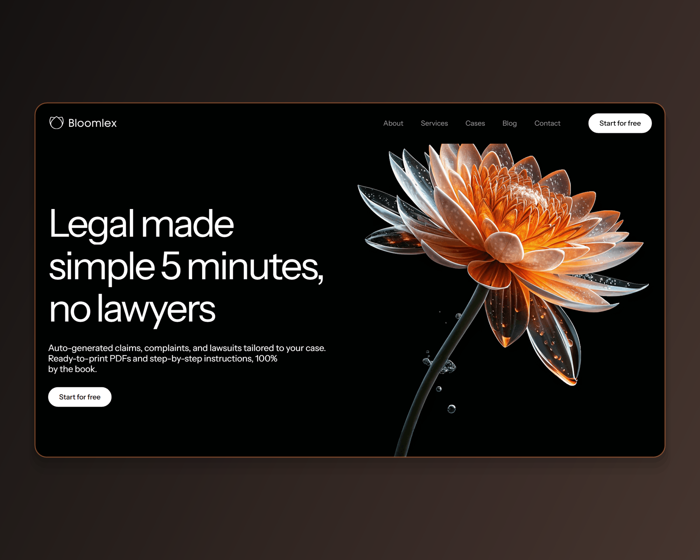

# Bloomlex — лендинг legal-tech на Webflow с CMS-блогом

**Ключевые слова для поиска:** Webflow, Figma to Webflow, Webflow CMS,
CMS collections, Finsweet, GSAP, ScrollTrigger, SplitText, Client-First, forms,
landing page, blog setup, legal tech, responsive.

Пакет карточки №7 по плану `upwork/profile.md` §5.7. Собран 2026-09-01
скриптом `scripts/build-webflow-card.mjs bloomlex`, кадры сняты с живого прода.

**Единственная из четырёх сборок, где CMS действительно есть**: две коллекции
`w-dyn-list` на главной, отдельный шаблон статьи, скрипт Finsweet в сборке —
замерено 2026-09-01. У Common, Synk и Scrib3 коллекций нет, и тег `CMS` стоит
только здесь.

**Живой сайт:** <https://bloomblex-prod.webflow.io/>
**Статья блога:** <https://bloomblex-prod.webflow.io/how-to-challenge-unfair-bank-fees>

---

## 1. Поля слева

### Project title * (лимит 70)

```
Figma to Webflow | CMS | Landing Page with Blog Setup - Bloomlex
```

63 из 70. Взят из плана §5.7 без изменений.

### Your role (лимит 100)

```
Design and Webflow build, end to end - UI design, Client-First, CMS, forms, GSAP motion
```

86 из 100.

### Project description * (лимит 600) — вставить целиком

```
Task: a landing page for a service that generates claims and lawsuits without a lawyer, plus a blog the client can keep running alone.

Solution: Figma to Webflow, end to end - UI design, Client-First structure, responsive build, Webflow CMS with its own article template, forms, GSAP motion.

Result: live in production; a new post is a CMS entry, not a page someone has to build. Estimated inquiry conversion: 2-4%.

Duration: 56 working hours.

I designed this site and built it.
```

482 из 600. **Формат сменён 2026-09-01 решением владельца** —
описание разложено на `Task / Solution / Result / Duration`. Причина: карточку на бирже читают как
смету, а не как эссе. Клиент должен увидеть четыре вещи подряд — что было
задачей, из чего состояла работа, чем она кончилась и сколько заняла, — и
увидеть их до того, как решит читать дальше. Формат единый для всех восьми
карточек. Первая строка `Task:` обязана пережить обрезку в плитке — она и
несёт то, что раньше несла первая фраза нарратива.

**Прежняя редакция описания — снята 2026-09-01.** Нарративная версия и её
обоснование сохранены здесь: у неё другая работа — она годится там, где лимит
поля не 600, и по ней восстанавливается формулировка, если формат когда-нибудь
откатят.

<details>
<summary>Нарративная версия</summary>

```
Design and Webflow build, end to end. A landing page for a service that generates claims and lawsuits without a lawyer, with a Webflow CMS behind the blog.

Every block answers one doubt: can a document made in five minutes hold up. Headlines arrive line by line as you scroll - open the site to see it move.

I designed this site and built it. Live in production.
```

364 из 600. **Лимит не выбирается намеренно** — разбор в пакете Common: за
обрезку в плитке уходит только первый абзац. Про движение сказано одной строкой
с приглашением открыть сайт.

</details>

### Skills and deliverables * (5 слотов)

```
Webflow · CMS Development · Web Design · Animation · Responsive Design
```

Против опубликованной сейчас карточки снят `Figma to Webflow Plugin`: плагин —
инструмент, а не результат, и он же занижает роль до переноса чужого файла,
тогда как дизайн здесь мой. `Animation Design` заменён на `Animation` — термин
из справочника карточек.

`CMS Development` — единственная из четырёх карточек, где этот тег стоит по
праву. Доказывает его кадр 05.

---

## 2. Правая колонка — 10 блоков подряд

| № | Тип | Что |
|---|---|---|
| 1 | Ссылка | `https://bloomblex-prod.webflow.io/` · надпись `Open the live site` |
| 2 | Текст | заголовок и строка ниже |
| 3 | Изображение | `01.png` |
| 4 | Изображение | `02.png` |
| 5 | Изображение | `03.png` |
| 6 | Текст | заголовок и строка ниже |
| 7 | Изображение | `04.png` |
| 8 | Изображение | `05.png` |
| 9 | Изображение | `06.png` |
| 10 | Ссылка | `https://kanarev.com/` · надпись `More work` |

### Блок 2 · Текст

Heading:

```
The page answers one doubt at a time
```

Тело:

```
A service that promises a legal document in five minutes without a lawyer has exactly one problem: nobody believes it. So the page is a sequence of answers rather than a list of features - every block removes one specific objection.
```

### Блок 3 · `01.png` — подпись (лимит 140)

```
Home, first screen: the promise stated plainly - claims, complaints and lawsuits, ready to print - with a single action next to it.
```

### Блок 4 · `02.png` — подпись

```
What the service generates: document types laid out so a visitor can find their own case before reading anything else.
```

### Блок 5 · `03.png` — подпись

```
Why people choose us: the proof block, followed by a real outcome with the amount recovered stated in the heading.
```

### Блок 6 · Текст

Heading:

```
A blog is not eight static pages
```

Тело:

```
The blog runs on Webflow CMS with its own article template, so a new post is an entry in a collection rather than a page someone has to build. That is the difference between a launch and a site the client can still run six months later.
```

### Блок 7 · `04.png` — подпись

```
Frequently asked questions with the first one open: a custom accordion, answering the objections the sales page cannot.
```

### Блок 8 · `05.png` — подпись

```
Insights & Ideas: the blog, driven by a Webflow CMS collection and rendered from one article template.
```

### Блок 9 · `06.png` — подпись

```
390px: the promise, the action and the first proof block within one screen and a half.
```

---

## 3. Обложка — `00-cover.png`

**2000×1600**, ровно 5:4 — пропорция плитки в сетке Portfolio. Собирается тем
же прогоном, что и кадры; пересобрать одну обложку — `--cover-only`.



**Что на ней.** Лестница из трёх первых снятых сцен: `01.png` героем слева,
`02.png` и `03.png` спутниками справа столбиком, перекрытие 40 px. Внизу
плашка `--accent-500` с ярлыком `WEBFLOW · CMS · LANDING + BLOG`. Холст — диагональный градиент
из тона `rgb(50,43,37)`: это фон первого экрана сборки, сдвинутый на тон, и оба
стопа выводятся из него подмешиванием белого и чёрного.

Вся геометрия и её обоснование — в `scripts/lib/upwork-cover.mjs`, общем
модуле с пакетами продуктовых кейсов. Здесь числа не дублируются намеренно:
до 2026-09-01 обложки кейсов и сборок жили двумя разными спецификациями, и
они разошлись — кейсы шли 1.25, сборки 1.333, и в одной сетке восемь работ
кропились двумя разными способами.

**Промо-рендера с монитором на подиуме здесь нет и не будет.** Прежняя обложка
этой сборки на бирже была именно им; это нарушает `CASE-20`
(`src/copy/home.ts` §development) — «ни рамок устройства, ни перспективы, ни
теней; сайт показывается как сайт», — и рядом с обложками продуктовых кейсов
читалась как работа другого автора. Коллаж это правило не ослабляет: глубину
держат перекрытие, волосяная обводка и приглушение спутника, наклона нет.

**Почему не 1448×1086 и не 1733×909.** Первая редакция была 1.91, под LinkedIn
Featured, и на бирже не встала: диалог `Thumbnail preview` заполняет рамку по
высоте, поэтому кадр 1.91 при любом положении ползунка терял бока — у Scrib3
срезало логотип до «CRIB3». Вторая, 4:3, входила в диалог целиком, но
расходилась с плиткой и с пакетами кейсов. Обе сменены владельцем 2026-09-01.

Вес — 196 КБ, палитра в 256 цветов без дизеринга — то же, что у сборщика
продуктовых кейсов.

## 4. Границы честности

- **Клипа движения в пакете нет** — решение владельца 2026-09-01. Анимацию
  показывает сам сайт, ссылка на него стоит первым блоком.
- **Числа узлов CMS в карточке нет.** И план §5.7, и `src/copy/home.ts`
  говорят о пятнадцати узлах; с прода видно две коллекции и одиннадцать
  отрисованных записей на главной. Сходится это или нет — из браузера не
  установить, поэтому в текст карточки число не идёт. Факт, который проверяем
  ссылкой, — что блог на коллекции и у него свой шаблон статьи.
- **Finsweet в тексте карточки не назван.** Скрипт в сборке есть, но короткое
  описание — не место для имени библиотеки: клиенту важно, что блог живёт на
  коллекции, а не чем сделана фильтрация.
- **SEO не заявляется.** План §5.7 обещал «on-page SEO basics»; это не то, что
  видно на кадре, и в пакете из шести кадров такая строка была бы утверждением
  без доказательства.
- **Часы вернулись, дата — нет.** `Duration: 56 working hours` — цифра с
  опубликованной карточки, и она относится к работе, поэтому стоит в описании
  (решение владельца 2026-09-01: объём работы клиент читает как часть сметы).
  «Published on Jul 6, 2026» — дата публикации карточки, а не дата работы, и
  её в тексте нет.
- **`Estimated inquiry conversion: 2-4%` — оценка, а не замер.** Вилка
  отраслевая, аналитики с этой сборки нет. Слово `Estimated` обязательное.
- **Сумма ₽35,200 — со страницы самой сборки**, это её контент, а не метрика
  моей работы. В подписи кадра она названа исходом клиента сервиса.
- Заказчик не назван: на сборке нет ни одного реального реквизита.
