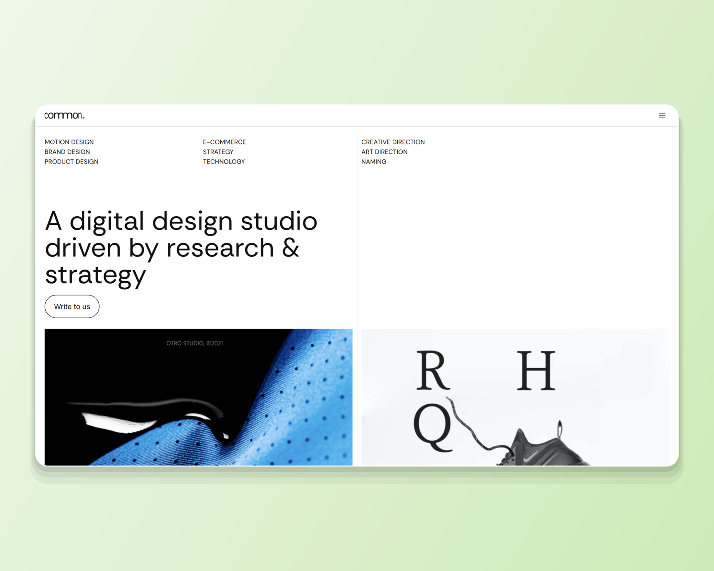

# Common — сайт дизайн-студии на Webflow с GSAP-анимацией

**Ключевые слова для поиска:** Webflow, Figma to Webflow, GSAP, ScrollTrigger,
Lenis, pinned scroll, horizontal scroll, custom code, Client-First, responsive,
design studio website, one-page site, motion design, prefers-reduced-motion.

Пакет карточки №8 по плану `upwork/profile.md` §5.8. Собран 2026-09-01
скриптом `scripts/build-webflow-card.mjs common`, кадры сняты с живого прода.

**Как читать.** Раздел 1 — поля слева, раздел 2 — блоки правой колонки сверху
вниз. Всё, что в кода-рамке, копируется как есть. Разделы 3–4 — справка.

**Живой сайт:** <https://common---digital-design-studio.webflow.io/>

---

## 1. Поля слева

### Project title * (лимит 70)

```
Figma to Webflow | GSAP | Digital Design Studio Website - Common
```

64 из 70. В плане §5.8 стоит вариант без `GSAP`; тег добавлен, потому что
движение — то, чем эта сборка отличается от трёх соседних, и то, по чему её
ищут.

### Your role (лимит 100)

```
Design and Webflow build, end to end - UI design, Client-First, GSAP motion, custom code
```

87 из 100. Роль закрыта владельцем 2026-08-31 (`profile.md` §5.8, раздел «Роль
в Webflow-сборках»): дизайн этой сборки его, это не передача чужого файла.

### Project description * (лимит 600) — вставить целиком

```
Task: a one-page site for a design studio that sells research and strategy - the page has to prove the claim, not assert it.

Solution: Figma to Webflow, end to end - UI design, Client-First structure, responsive build, three pinned GSAP scenes with a horizontal project track, custom code, reduced-motion guard.

Result: live in production, ordered as an argument rather than a stack of sections. Estimated inquiry conversion: 2-4%.

Duration: 64 working hours.

I designed this site and built it.
```

498 из 600. **Формат сменён 2026-09-01 решением владельца** —
описание разложено на `Task / Solution / Result / Duration`. Причина: карточку на бирже читают как
смету, а не как эссе. Клиент должен увидеть четыре вещи подряд — что было
задачей, из чего состояла работа, чем она кончилась и сколько заняла, — и
увидеть их до того, как решит читать дальше. Формат единый для всех восьми
карточек. Первая строка `Task:` обязана пережить обрезку в плитке — она и
несёт то, что раньше несла первая фраза нарратива.

Ссылки `Open it yourself` в описании нет: она стоит первым блоком правой
колонки, кликабельной.

**Прежняя редакция описания — снята 2026-09-01.** Нарративная версия и её
обоснование сохранены здесь: у неё другая работа — она годится там, где лимит
поля не 600, и по ней восстанавливается формулировка, если формат когда-нибудь
откатят.

<details>
<summary>Нарративная версия</summary>

```
Design and Webflow build, end to end. A one-page site for a design studio: what we do, who we are, how we work, what came out of it.

Three scroll scenes are pinned; project cards travel sideways inside one of them. That part is worth seeing move - open the site.

I designed this site and built it. Live in production.
```

319 из 600. **Лимит не выбирается намеренно.** Первый абзац — 132 знака — это
всё, что переживает обрезку в плитке; остальное читает только тот, кто карточку
уже открыл, и длинный текст ему ничего не добавляет. Про движение сказано одной
строкой с приглашением открыть сайт: анимацию показывает сайт, а не абзац о ней.

</details>

### Skills and deliverables * (5 слотов)

```
Webflow · Web Design · GSAP · Animation · Responsive Design
```

Чем каждый доказан **в этой карточке**: `GSAP` и `Animation` — кадры 02, 03 и
05, три закреплённые сцены; `Responsive Design` — кадр 06, отдельная ветка
раскладки ≤1300 px; `Web Design` — кадр 01, дизайн мой, а не заказчика.

`CMS Development` **не брать**: коллекций у этой сборки нет вовсе (проверено
2026-09-01, ноль узлов `w-dyn-list`). Тег стоит только в карточке Bloomlex.

---

## 2. Правая колонка — 10 блоков подряд

| № | Тип | Что |
|---|---|---|
| 1 | Ссылка | `https://common---digital-design-studio.webflow.io/` · надпись `Open the live site` |
| 2 | Текст | заголовок и строка ниже |
| 3 | Изображение | `01.png` |
| 4 | Изображение | `02.png` |
| 5 | Изображение | `03.png` |
| 6 | Изображение | `04.png` |
| 7 | Текст | заголовок и строка ниже |
| 8 | Изображение | `05.png` |
| 9 | Изображение | `06.png` |
| 10 | Ссылка | `https://kanarev.com/` · надпись `More work` |

### Блок 2 · Текст

Heading:

```
One page, one argument
```

Тело:

```
A studio that sells research and strategy needs its site to prove the claim, not assert it. The page is ordered as an argument, and motion carries the order - sections hand off to each other instead of stacking up.
```

### Блок 3 · `01.png` — подпись (лимит 140)

```
Home, first screen: service labels above the headline, two project frames starting underneath - it opens with evidence, not a slogan.
```

### Блок 4 · `02.png` — подпись

```
WHAT WE DO, mid-scene: three services travelling to their places while the section stays pinned. Numbering is the only fixed point.
```

### Блок 5 · `03.png` — подпись

```
AGENCY, second pinned scene: the statement about the studio is assembled on scroll instead of arriving as one finished block.
```

### Блок 6 · `04.png` — подпись

```
APPROACH: the process accordion. Opening one step closes the rest - a custom open/close, not Webflow's default dropdown behaviour.
```

### Блок 7 · Текст

Heading:

```
Where Webflow alone stops
```

Тело:

```
Native interactions do not pin three scenes or move a row sideways while the page holds still, so the motion layer is a custom GSAP bundle - with a separate branch for tablet and phone, and a reduced-motion guard.
```

### Блок 8 · `05.png` — подпись

```
PROJECTS: a horizontal track of case cards inside a pinned viewport. The page holds; the row moves.
```

### Блок 9 · `06.png` — подпись

```
390px: the same order in one column, with the motion branch written for this width rather than inherited from the desktop one.
```

---

## 3. Обложка — `00-cover.png`

**2000×1600**, ровно 5:4 — пропорция плитки в сетке Portfolio. Собирается тем
же прогоном, что и кадры; пересобрать одну обложку — `--cover-only`.



**Что на ней.** Лестница из трёх первых снятых сцен: `01.png` героем слева,
`02.png` и `03.png` спутниками справа столбиком, перекрытие 40 px. Внизу
плашка `--accent-500` с ярлыком `WEBFLOW · GSAP · STUDIO SITE`. Холст — диагональный градиент
из тона `rgb(196,203,209)`: это фон первого экрана сборки, сдвинутый на тон, и оба
стопа выводятся из него подмешиванием белого и чёрного.

Вся геометрия и её обоснование — в `scripts/lib/upwork-cover.mjs`, общем
модуле с пакетами продуктовых кейсов. Здесь числа не дублируются намеренно:
до 2026-09-01 обложки кейсов и сборок жили двумя разными спецификациями, и
они разошлись — кейсы шли 1.25, сборки 1.333, и в одной сетке восемь работ
кропились двумя разными способами.

**Промо-рендера с монитором на подиуме здесь нет и не будет.** Прежняя обложка
этой сборки на бирже была именно им; это нарушает `CASE-20`
(`src/copy/home.ts` §development) — «ни рамок устройства, ни перспективы, ни
теней; сайт показывается как сайт», — и рядом с обложками продуктовых кейсов
читалась как работа другого автора. Коллаж это правило не ослабляет: глубину
держат перекрытие, волосяная обводка и приглушение спутника, наклона нет.

**Почему не 1448×1086 и не 1733×909.** Первая редакция была 1.91, под LinkedIn
Featured, и на бирже не встала: диалог `Thumbnail preview` заполняет рамку по
высоте, поэтому кадр 1.91 при любом положении ползунка терял бока — у Scrib3
срезало логотип до «CRIB3». Вторая, 4:3, входила в диалог целиком, но
расходилась с плиткой и с пакетами кейсов. Обе сменены владельцем 2026-09-01.

Вес — 94 КБ, палитра в 256 цветов без дизеринга — то же, что у сборщика
продуктовых кейсов.

## 4. Границы честности

- **Клипа движения в пакете нет** — решение владельца 2026-09-01. Анимацию
  показывает сам сайт: ссылка на него стоит первым блоком, и в описании про неё
  сказано одной строкой. Ролик про анимацию вместо анимации — лишний слой.
- **CMS не заявляется.** Коллекций нет: ноль `w-dyn-list`, проверено
  2026-09-01. Формы тоже нет.
- **Часы в карточке есть — и только в карточке.** Решение владельца
  2026-09-01: `Duration: 64 working hours` стоит в описании, потому что на
  бирже объём работы — это то, из чего клиент считает бюджет, и карточка без
  него отвечает на половину вопроса. Цифра — с опубликованной карточки
  (`src/copy/home.ts` §development: четыре сборки подписаны в часах, 64 на
  каждую). На сайте часов по-прежнему нет и не будет: там позиционирование
  product-first, и язык часов работает против него. Разные площадки — разные
  аргументы, и это осознанное расхождение, а не рассинхрон.
- **Года нет.** Дата публикации карточки — не дата работы.
- **Одна цифра-оценка — конверсия, и она названа оценкой.**
  `Estimated inquiry conversion: 2-4%` — отраслевая вилка для сайта студии, а
  не замер этой сборки: аналитики у неё нет. Слово `Estimated` не снимается
  никогда, и вилка не выдаётся за факт. Трафика и Lighthouse в карточке
  по-прежнему нет — их не подтвердить даже вилкой.
- Заказчик не назван — на сайте нет ни одного упоминания реального клиента.
