# Upwork · карточка 4 — Pawly

Проект в форме Upwork: **Add a new portfolio project**.
Источник фактуры — `src/copy/cases/pawly.ts` и `upwork/profile.md` §5.4.

**Как читать этот файл.** Разделы 1–3 — рабочие: идёшь сверху вниз и копируешь
каждый блок в кода-рамке как есть. Ничего искать в других местах документа не
нужно: у каждого кадра рядом стоит и сам кадр, и его имя файла, и его подпись.
Разделы 4–9 — справка: обложка, кадры, лимиты, логика порядка, проверка,
открытые вопросы. В работе они не нужны.

> **Заведён 2026-09-01** по образцу пакетов `agent-ops-console`,
> `b2b-partner-portal` и `vet-clinic-os`. Структура повторена целиком: те же
> три шага, тот же порядок «ссылка первым блоком», те же поля слева, тот же
> лимит 25. Жанр 0→1, как у карточки 3: открывается задачей, а не парой
> before/after.
>
> Отличие ровно одно и оно техническое: **это единственная мобильная карточка
> портфолио**. Кадры сняты с телефона 375 px, и правило сборки под них
> заведено отдельное — один масштаб на весь пакет и общая подложка, раздел 5.

Границы, которые нельзя двигать (правила кейса, `pawly.ts`):

1. Это интерактивный концепт, а не работающий маркетплейс: бронирований,
   выручки, конверсии и пользовательской валидации нет.
2. Интервью primary-персоны было **симуляцией**. Оно названо симуляцией
   везде, где упоминается, и не доказывает спрос.
3. **🔴 Прямой речи пользователя в этой карточке нет и быть не может** —
   ресёрч вторичный, живых респондентов не было. Цитата, за которой нет
   человека, это выдуманная метрика в другой форме.
4. Цифры QA — качество прототипа, не adoption: 73 находки рассмотрены, 71
   закрыта, две сняты как ложные; 91 скриншот, девять отчётов, ноль ошибок
   консоли на финальной приёмке.

**Что добавил формат `Task / Solution / Result / Duration` (2026-09-01).**
Строка `Duration` — **оценка объёма работы, а не таймшит**: точного учёта часов
по этому проекту нет, цифра восстановлена по составу отгруженного и сроку.
Названа она часами потому, что на бирже это единица, в которой клиент считает
бюджет. Граница выше от этого не сдвинулась: ни одной новой бизнес-метрики в
описании не появилось — в строке `Result` стоят те же цифры, что уже были в
кейсе, и в том же статусе.

---

## 1. Три шага, строго в этом порядке

**Сначала левые поля, потом снос, потом сборка** — пока лимит 25 выбран, форма
не даст добавить ни одного блока.

**Шаг 1 — левые поля.** Раздел 2. Карточки в портфолио ещё нет, поэтому все
четыре поля заполняются с нуля.

**Шаг 2 — правая колонка пустая**, сносить нечего. Счётчик показывает `0 / 25`.
Обложка грузится отдельно, в диалоге `Thumbnail preview` — раздел 4.

**Шаг 3 — собрать 25 блоков.** Раздел 3, сверху вниз, без пропусков.
Тринадцать PNG лежат в этой папке и грузятся по именам подряд: номер файла
совпадает с порядком, в котором кадры идут в карточке.

---

## 2. Поля слева

### Project title *  (лимит 70)

```
Mobile App Design + Design System | Dog-Care Marketplace - 16 Days
```

66 из 70. Взят из `profile.md` §5.4 без изменений — в лимит проходит.

### Your role  (лимит 100)

```
Sole Product Designer - research synthesis, IA, UX/UI, design system, React prototype, QA
```

89 из 100. Единственная карточка портфолио, где в роли стоит QA: прогоны,
находки и приёмка здесь тоже мои, и цифры блока 18 держатся на этом.

### Project description *  (лимит 600) — **вставить целиком**

```
Task: a dog-care marketplace concept where the design problem is trust, not booking - an owner hands a live animal to a stranger and gets nothing back to inspect.

Solution: research synthesis, IA, UX/UI, a design system and an audited React prototype - 93 tokens, 33 components, 17 routed frames. Verification read stage by stage, handover that produces proof, recovery when it fails.

Result: brief to audited prototype in 16 days. 73 QA findings reviewed, 71 closed, zero console errors at acceptance.

Duration: ~130 working hours.

Independent concept. Nothing can be booked; data is invented.
```

598 из 600. **Формат сменён 2026-09-01 решением владельца** —
описание разложено на `Task / Solution / Result / Duration`. Причина: карточку на бирже читают как
смету, а не как эссе. Клиент должен увидеть четыре вещи подряд — что было
задачей, из чего состояла работа, чем она кончилась и сколько заняла, — и
увидеть их до того, как решит читать дальше. Формат единый для всех восьми
карточек. Первая строка `Task:` обязана пережить обрезку в плитке — она и
несёт то, что раньше несла первая фраза нарратива.

**Расхождения с `profile.md` §5.4 — те же три, что в пакетах 1–3, плюс одно
своё.**

| Что | Почему здесь иначе |
|---|---|
| Текст короче: 597 против 1300 знаков | Поле формы отдаёт 600 **[факт, замер 2026-08-31]**. Резались связки, не факты |
| Нет строки `Open it yourself: <URL>` | Ссылка — первый блок правой колонки, кликабельный |
| Нет блока `Role:` | У формы для этого отдельное поле |
| «63 primitive and 30 semantic tokens, 14 text styles» сжато до «93 design tokens» | Внутри 600 знаков разбивка не помещается, а 33 компонента и 17 маршрутов доказывают ту же дисциплину дешевле. Полная разбивка стоит в блоке 19, где место есть |

**Что сознательно осталось в первом абзаце.** Формула §5 требует, чтобы первый
блок пережил обрезку и нёс счётные результаты. Здесь это 16 дней и 71 закрытая
находка — единственная карточка портфолио, где отдельной строкой сказано, что
находки закрыты **до того**, как их пришлось бы искать кому-то другому.

**Прежняя редакция описания — снята 2026-09-01.** Нарративная версия и её
обоснование сохранены здесь: у неё другая работа — она годится там, где лимит
поля не 600, и по ней восстанавливается формулировка, если формат когда-нибудь
откатят.

<details>
<summary>Нарративная версия</summary>

```
A dog-care marketplace concept, brief to an audited interactive prototype in 16 days: 93 design tokens, 33 React components, 17 routed frames, 71 audit findings closed before anyone else had to find them.

The design problem was trust, not booking. An owner hands a live animal to a stranger and gets nothing back that can be inspected - before the walk, during it, or after the dog is home.

So the deliverable was a testable service model: verification read stage by stage, handover that produces proof, recovery when it goes wrong.

Independent concept. Nothing can be booked; data is invented.
```

597 из 600. Первый абзац — 205 знаков — обязан пережить обрезку в карточке.

</details>

### Skills and deliverables *  (5 слотов)

```
Product Design · UX & UI Design · Mobile App Design · Prototyping · React
```

В `profile.md` §5.4 стоят семь тегов, слотов пять. Что выпало и почему:

| Тег из плана | Решение |
|---|---|
| `Design System` | **термина в справочнике карточек нет вовсе** — установлено на карточке 1, 2026-09-01 |
| `Figma` | не берётся с карточки 2: тег уже стоит в профильных скиллах и внутри карточки ничего не отличает |
| `User Experience Design` | почти дублирует `UX & UI Design`, который взят |

Что доказывает каждый оставшийся тег **в этой карточке**:

- **`Mobile App Design`** — единственная мобильная карточка портфолио, и
  единственная, где это видно кадром: тринадцать снимков с телефона 375 px.
  Тег закреплён за ней ещё на карточке 1 (`agent-ops-console/README.md` §2).
- **`Prototyping`** — блок 1 открывает живой прототип, `08.png` показывает все
  семнадцать маршрутов индексом.
- **`React`** — 33 компонента, из которых собраны и экраны, и каталог. Второй
  раз в портфолио после карточки 2, и здесь это честно: сборка своя.

**🔴 Лестница на случай, если `Mobile App Design` в справочнике карточек не
найдётся.** Термин проверен в профильных скиллах (`profile.md` §4), но не в
справочнике карточек — а он, как выяснилось на карточке 1, другой. Идти до
первого принятого: `Mobile App Design` → `Mobile UI Design` → `App Design`.
**[проверить на шаге 1]**

**`Usability Testing` не брать ни при каких обстоятельствах.** Живых сессий не
было вообще: интервью — симуляция, прогоны — синтетические. Тег обещал бы
респондентов, которых нет, и это ровно та граница, которую держит правило 3
шапки.

---

## 3. Правая колонка — 25 блоков подряд

Порядок операций внутри блока: тип блока → содержимое → следующий.
Текстовый блок: тумблер **Plain text**, не Markdown.
Блок изображения: файл из этой папки, `Description` — в поле подписи (лимит 140).

---

### Блок 1 · Ссылка — прототип

```
https://pawly-fawn.vercel.app/app
```

---

### Блок 2 · Текст

Heading:

```
The owner is not buying a walk. They are handing over a dog, and sometimes the keys.
```

Тело:

```
The starting brief was "Uber for dogs": open the app, find somebody nearby, book, follow the route. The situation behind it was concrete - an owner is at work, needs help during the day, and has about fifteen minutes to decide whether a stranger can be trusted with the dog and with access to the home. A list of profiles answers only the easiest part of that. The market split the same way: self-service products made the transaction fast and kept verification shallow, while services with institutional trust relied on a manager, a phone call and manual assignment. The economics narrowed the story further. Twenty weekday walks at researched prices come to eighteen to twenty-two thousand roubles a month, so the realistic starting behaviour is one to three bookings a week, not a daily habit - which moves the product away from a convenience promise and towards reliability on the occasions that matter.
```

---

### Блок 3 · Изображение

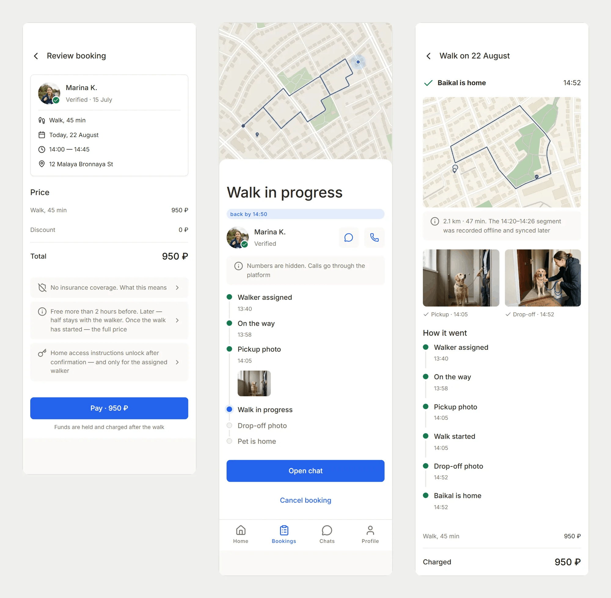

Файл:

```
01.png
```

Description:

```
One booking at three moments: the price and its disclosures before paying, the walk with its pickup photo, and both handover photos after.
```

---

### Блок 4 · Текст

Heading:

```
Trust could not be a badge. It had to be a chain of evidence.
```

Тело:

```
A green check next to a portrait compresses seven different claims into one word: identity, legal status, training, interview, practical skill, references, and the date on which any of them was last checked. It asks the owner to trust the interface instead of letting them inspect what the interface knows. The same problem repeats during the service: a live dot on a map looks precise, but a lost connection can make a safe walk look like a missing dog, and a completed route does not prove who was handed the dog at the door. So the product object became the whole chain - compatible person, visible verification, handover, route, return, recovery - and the evidence has to survive failure: last signal instead of a blank map, route and photos buffered locally, and an explicit final state that says the pet is home.
```

---

### Блок 5 · Изображение

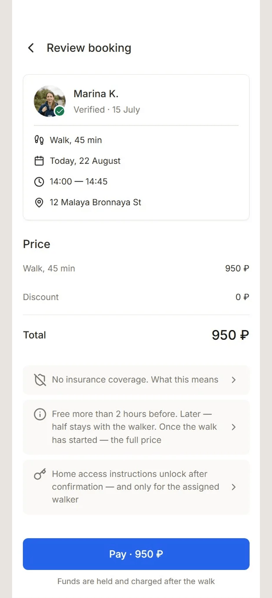

Файл:

```
02.png
```

Description:

```
Review booking: the full price with its total, and under it what the platform does not insure and what a late cancellation costs.
```

---

### Блок 6 · Текст

Heading:

```
Coverage is checked from the pet's address, before any profile work.
```

Тело:

```
The common case is booking from work for the address at home, so device geolocation answers the wrong question. Competitor audits showed the most expensive dead end in this market: twenty minutes of profile and payment work before learning that the area is not served. Pawly separates "temporarily no compatible walker" from "this area has not opened yet" and says which one happened. What it cost: the launch cannot pretend to cover three whole cities. Each city starts with two to four districts, a service area opens only when local supply is dense enough, and outside it the honest result is a wait-list rather than a pin nobody can accept.
```

---

### Блок 7 · Изображение

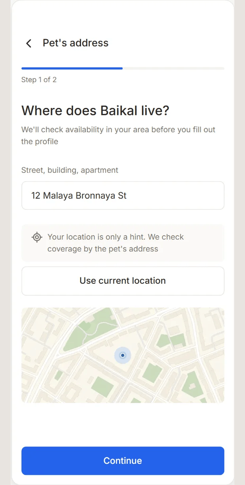

Файл:

```
03.png
```

Description:

```
Step one of two: the pet's address. Current location is offered as a hint; coverage is checked against the address where the dog lives.
```

---

### Блок 8 · Текст

Heading:

```
Verification is seven named stages with dates, not one verified badge.
```

Тело:

```
Owners need to know what the platform did, not how confidently it coloured the checkmark, so every stage carries the date it was last checked and the date it is next due. The same evidence also explains why this walker suits this dog: the pet's required safety fields become hard matching constraints, and an empty result names the constraint instead of offering to clear it. What it cost: verification is operationally expensive. Only four stages are self-served in the first version - interview, trial walk and reference stay with an operator. The product stays fast for the owner by accepting manual work behind the interface rather than automating a check it cannot perform credibly.
```

---

### Блок 9 · Изображение

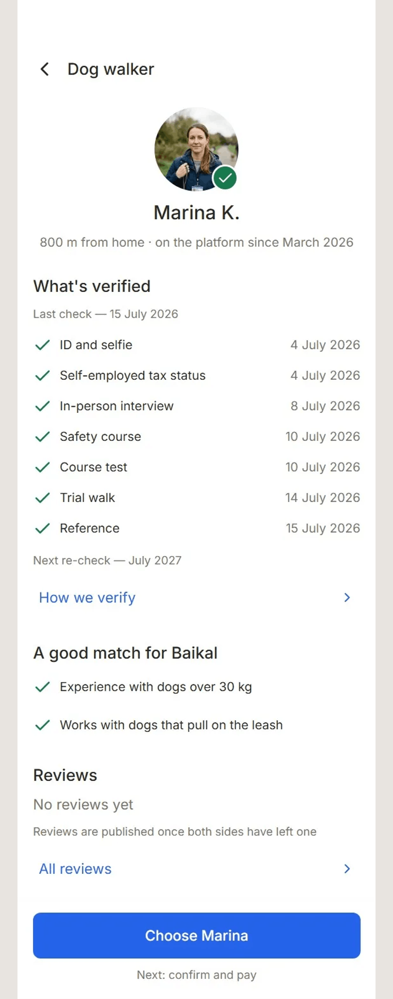

Файл:

```
04.png
```

Description:

```
Seven verification stages, each with the date it was checked and when it is next due, then why this walker matches this dog.
```

---

### Блок 10 · Текст

Heading:

```
Pickup and drop-off photos outrank the live map, and the walk ends only when the pet is home.
```

Тело:

```
A route can disappear with the network and come back later. The handover says who received the dog; the return says the service actually ended. So the capture screen names three quality criteria - the whole dog and not just the head, leash and collar visible, taken in daylight - and a photo that fails them can be retaken before it finishes the walk. What it cost: the walker does more than tap "done", and the service cannot complete until usable proof exists. Pawly also refuses the word "insured": insurance is not in the MVP, so its absence is disclosed before payment instead of being covered with safety copy.
```

---

### Блок 11 · Изображение

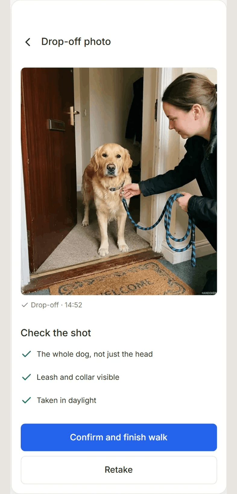

Файл:

```
05.png
```

Description:

```
Drop-off proof against three criteria - the whole dog, leash and collar visible, daylight - with retake standing beside confirm.
```

---

### Блок 12 · Изображение

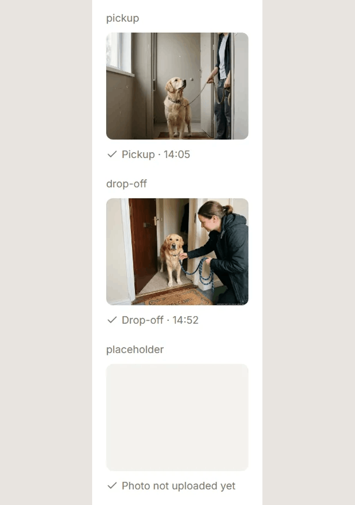

Файл:

```
06.png
```

Description:

```
PhotoProof in three states: pickup, drop-off, and not uploaded yet. The placeholder says which photo is still missing.
```

---

### Блок 13 · Текст

Heading:

```
A cancelled walker is not an exception to the promise. It is the moment the promise is tested.
```

Тело:

```
So the replacement is a primary flow, not an apology screen: same time, same price, one tap, and a countdown. The substitute is matched against the same risk profile and the same booking conditions, so the owner does not rebuild the order under pressure; if they do not answer in time, the compatible reserve is assigned so the walk still happens. What it cost: the feature consumes real supply. The operation has to keep a reserve available and absorb the price difference, and when no compatible reserve exists the interface has to say so immediately. There is no generic "we are looking" state that buys reliability with time.
```

---

### Блок 14 · Изображение

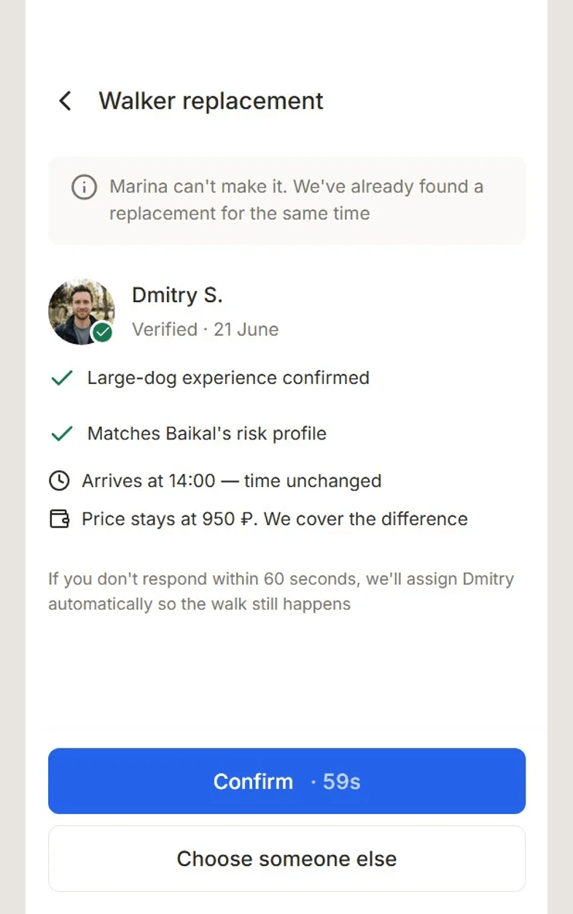

Файл:

```
07.png
```

Description:

```
The replacement offer: a verified substitute at the same time and price, a confirm button counting down, and the alternative under it.
```

---

### Блок 15 · Текст

Heading:

```
I designed the service boundary before I designed the screens.
```

Тело:

```
Secondary research, five competitors and a focused audit of the closest analogue. The primary-persona interview was simulated, not recruited, and used only to challenge the first hypothesis. It did: the two handover photos mattered more than watching the whole route, and "the pet is home" mattered more than a perfect GPS line. Both remain hypotheses for live interviews - they were strong enough to change what the prototype had to make testable, and not strong enough to count as demand. Then scope: 42 Must-haves out of 65 requirements, a 95-screen product map with 81 core nodes and seven flows. I deliberately did not turn every node into a frame. Eighty-one were designed at flow and group level; sixteen decision-heavy screens were assembled into seventeen routed frames, plus the landing. That kept the built layer on the questions worth testing - compatibility, verification, handover proof, replacement, two-sided money - instead of on routine settings screens.
```

---

### Блок 16 · Изображение

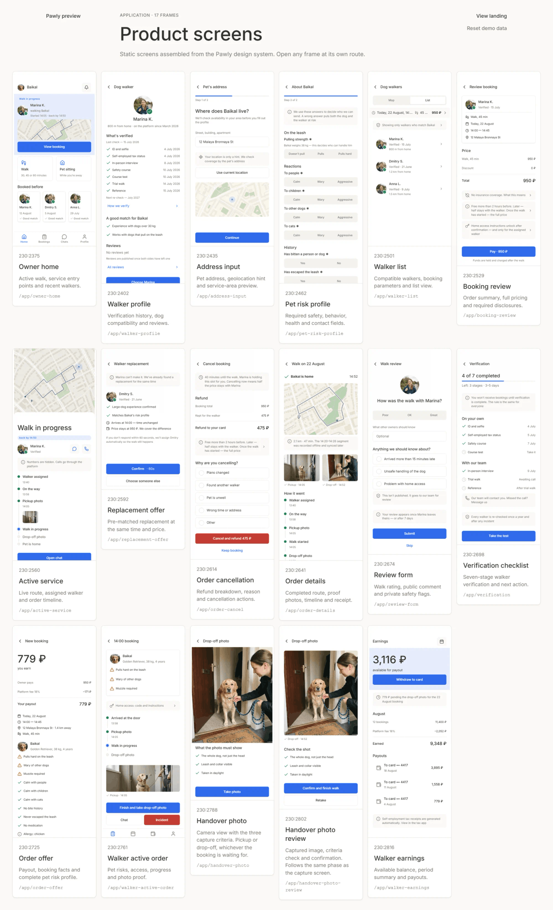

Файл:

```
08.png
```

Description:

```
Seventeen routed frames as one index. Eighty-one core nodes were designed; these sixteen decision-heavy screens were assembled.
```

---

### Блок 17 · Изображение

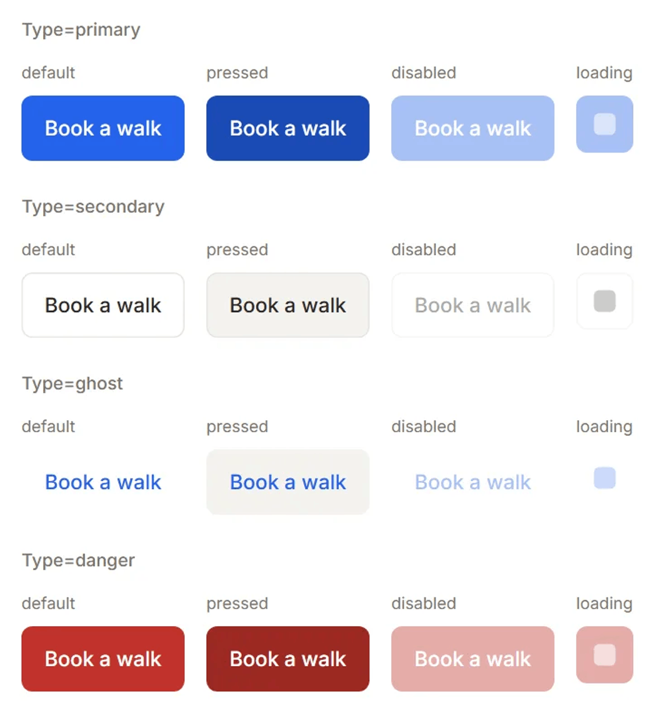

Файл:

```
09.png
```

Description:

```
One component across type and state: primary, secondary, ghost and danger x default, pressed, disabled, loading.
```

---

### Блок 18 · Текст

Heading:

```
The inventory was complete. The service logic was not.
```

Тело:

```
The first full review found a contradiction in the product's strongest claim. The landing promised a price with the platform fee included, the booking screen added a separate service fee, and the walker payout was calculated from a third model: two different businesses on one page that asked users to trust one number. The fix began with a single price table in the decision log, and every surface now reads from it - the owner sees a price with the 18% commission inside it, and the walker sees the payout before accepting. The prototype also remembered too much: cancelling one synthetic booking wrote the state to local storage, and the next visitor could arrive to an empty home screen with no way to reset it. Both defects passed a frame review because neither exists in a frame. Seventy-three findings were examined, seventy-one resolved and two dismissed as false positives; the final pass covered seventeen routes and the landing with 91 screenshots, nine reports and no console errors. None of those numbers is user validation.
```

---

### Блок 19 · Текст

Heading:

```
Thirty-three components, with states treated as product decisions.
```

Тело:

```
63 primitive and 30 semantic tokens, fourteen text styles, 33 React components. Component code never reaches for a raw colour, radius or type size, and the same semantic layer mirrors the Figma library and the screen specifications. Storybook renders every declared combination from the actual component, so the catalogue cannot quietly become a second implementation. A full Figma audit covered 448 instances and found zero broken instances, zero text nodes without a design-system style, zero unbound fills or strokes and zero spacing values outside the scale. The matrices below matter because this service lives outside the default state: the network drops, proof is missing, a disclosure opens, a timeline is waiting, an action becomes unavailable. Those are not edge decorations around the interface. They are the interface at the moment trust is at risk.
```

---

### Блок 20 · Изображение

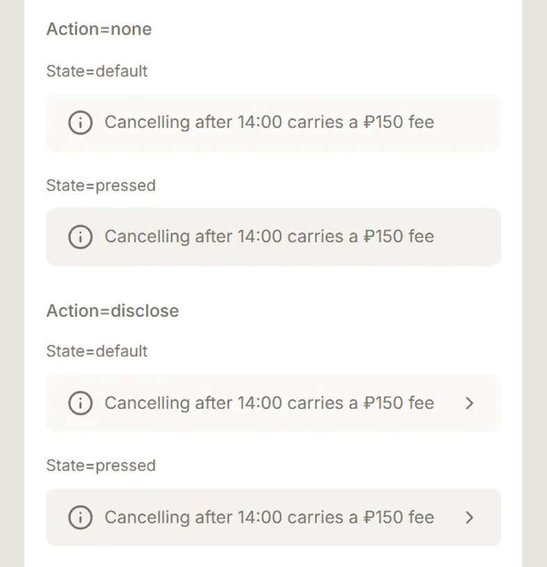

Файл:

```
10.png
```

Description:

```
InfoNote plain and expandable, each default and pressed - a disclosure looks different from a statement before it is opened.
```

---

### Блок 21 · Изображение

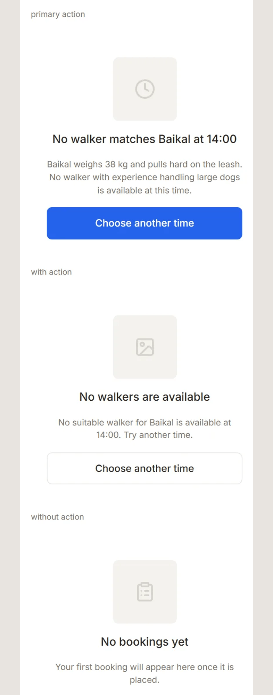

Файл:

```
11.png
```

Description:

```
EmptyState with a secondary action, a primary action and none. The empty result names the constraint that produced it.
```

---

### Блок 22 · Изображение

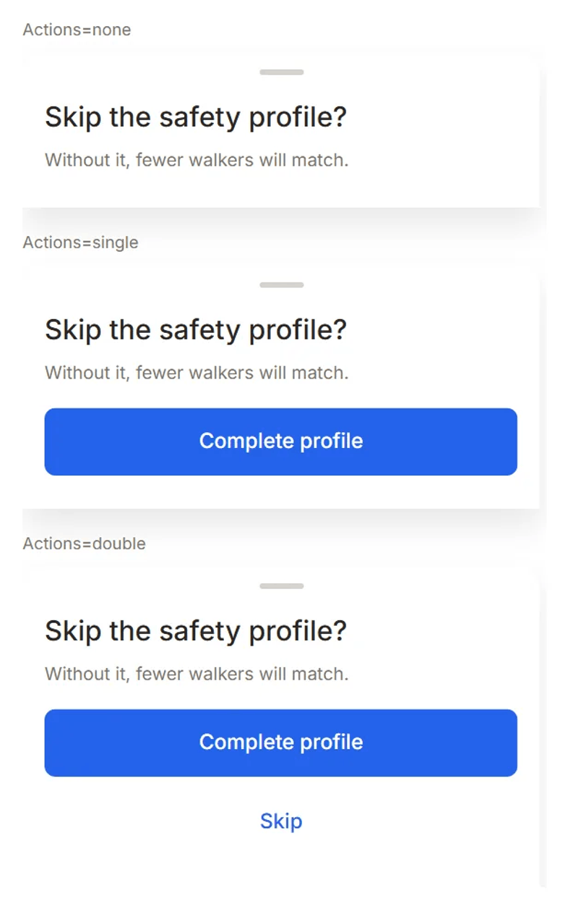

Файл:

```
12.png
```

Description:

```
BottomSheet in three forms - no action, one, two - all asking the same question: skip the safety profile?
```

---

### Блок 23 · Изображение

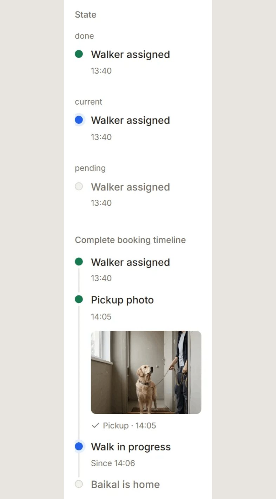

Файл:

```
13.png
```

Description:

```
TimelineRow done, current and pending, and one holding a proof photo: the timeline that runs while the walk is happening.
```

---

### Блок 24 · Текст

Heading:

```
What it cost, and what this is not.
```

Тело:

```
Sacrificed: reach, and the promises that would have sold it faster - no insurance, no guaranteed replacement, no claim about a walker the platform has not verified itself. Coverage came before a complete safety profile at launch, and several operations run by hand behind the interface.

Sole designer, every step of the pipeline: product framing, research synthesis, IA, UX/UI, the design system, the prototype, QA and deploy.

This is an interactive product concept, not a launched marketplace. The company is not registered, nothing on the prototype can be booked or paid for, and there are no bookings, users, revenue, conversion or retention figures. No human interviews or usability sessions were completed: the persona interview was simulated and the agent runs measure the prototype's behaviour, not demand. Every name, route, date and payment on the screens is invented.
```

---

### Блок 25 · Ссылка — кейс на сайте

```
https://kanarev.com/work/pawly
```

---

## 4. Обложка — `00-thumbnail-preview.png`

Файл в этой папке, **2000×1600**, PNG, 256 КБ. Загружается в диалоге
`Thumbnail preview` кнопкой `+` слева от полосы кадров.

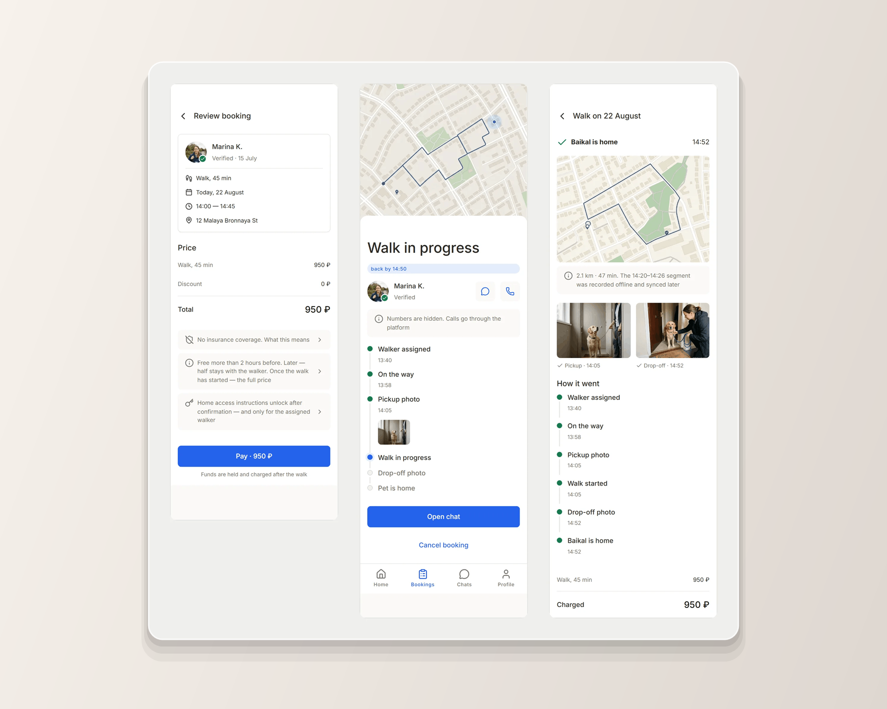

```
node scripts/build-upwork-card.mjs pawly --cover-only
```

Без флага тот же прогон пересобирает и все кадры пакета.

**Что на обложке.** Веер из четырёх телефонных кадров: `walker-profile` спереди,
за ним `address-input`, `handover-photo-review` и `clip-booking-disclosures-poster`. Внизу плашка `--accent-500` с ярлыком `MOBILE CASE + DESIGN SYSTEM`.

**Единственная обложка из восьми, чьи кадры не берутся из `cover/`.** Там лежат
десктопные композиты 2000×1250, снятые под страницу сайта: галерея экранов и
две сцены в браузерной ширине. Мобильный продукт, показанный ими, читается
веб-приложением — то есть врёт.

Четыре телефонных кадра взяты не произвольно: профиль выгульщика, адрес
питомца, приёмка фото и сверка брони — четыре разных типа экрана (профиль,
форма, съёмка, чек), и каждый узнаётся с миниатюры. `replacement-offer` в веер
не идёт: кадр 564×987 — лист поверх экрана без шапки, и в пропорции 375:812
его пришлось бы растянуть. `clip-verification-poster` не идёт тоже: это тот же
экран профиля, что и `walker-profile`.

**Почему веер, а не лестница.** Веер — единственная раскладка модуля, отличная
от лестницы, и заведена она ровно под этот кейс: мобильный продукт, показанный
лестницей десктопных кадров, врёт о продукте. Расходится веер с лестницей в
одном — идёт просветом, а не перекрытием. На десктопном кадре левые 40 px это
край сайдбара, и сосед закрывает пустоту; у телефона слева стоит контент, и те
же 40 px срезают начало каждой строки.

**Геометрия — в `scripts/lib/upwork-cover.mjs`**, общем модуле на все восемь
карточек. Полная спецификация 5:4 и замеры плитки — в
`upwork/projects/agent-ops-console/README.md` §4, здесь не дублируются.

**Стопка снята 2026-09-01.** Обложка собиралась по геометрии `ScreenStack` —
три кадра со сдвигом на шаг. На странице сайта это работает, в плитке биржи
шириной ~430 px кромки дальних слоёв превращаются в две полоски у правого
края, и обложка читается одним экраном с дефектом. `CASE-20` при этом
соблюдается по-прежнему: ни поворота, ни перспективы, ни тени.

**Предел честности.** На 200 px обложка читается как «плотный интерфейс» и не
более. Это предел любого скриншота, а не этой композиции, и он одинаков у всех
восьми карточек.

---

## 5. Кадры — что откуда и что с ними сделано

Тринадцать кадров собраны скриптом из `public/media/case-pawly/`.

| # | Файл | Размер | Источник | Масштаб |
|---|---|---|---|---|
| — | `00-thumbnail-preview.png` | 2000×1600 | четыре телефонных кадра | собрана |
| 1 | `01.png` | 2000×1959 | `range-evidence-chain.webp` | ×1.01 |
| 2 | `02.png` | 786×1725 | `clip-booking-disclosures-poster.webp` | ×1.27 + поле |
| 3 | `03.png` | 786×1553 | `address-input.webp` | ×1.27 + поле |
| 4 | `04.png` | 786×1996 | `clip-verification-poster.webp` | ×1.27 + поле |
| 5 | `05.png` | 786×1632 | `handover-photo-review.webp` | ×1.27 + поле |
| 6 | `06.png` | 786×1118 | `system-photo-proof.webp` | ×1.27 + поле |
| 7 | `07.png` | 786×1252 | `clip-replacement-poster.webp` | ×1.27 + поле |
| 8 | `08.png` | 1216×2000 | `screen-index.webp` | ×0.61 |
| 9 | `09.png` | 1048×1140 | `storybook-matrix.webp` | ×1.45 |
| 10 | `10.png` | 786×814 | `system-info-note.webp` | ×1.27 + поле |
| 11 | `11.png` | 786×2000 | `system-empty-state.webp` | ×1.27 + поле |
| 12 | `12.png` | 786×1256 | `system-bottom-sheet.webp` | ×1.27 |
| 13 | `13.png` | 786×1417 | `system-timeline-row.webp` | ×1.27 + поле |

Весь пакет — 14 файлов, 2.5 МБ, 62–513 КБ на файл.

### Правило мобильного пакета — заведено этой карточкой

**Чего не хватало.** У трёх десктопных карточек кадр приходит шириной 2000 и
масштабируется сам по себе. Здесь кадры сняты с телефона 375 px, и среди них
два рода: полный экран — 564 px в исходнике — и образец компонента, вырезка
внутри того же экрана, 296–618 px. Если гнать каждый к длинной стороне 2000
поодиночке, масштаб гуляет от ×1.27 до ×1.45, а ширина от 429 до 896 px:
образец компонента оказывается **крупнее экрана, внутри которого он живёт**, и
карточка врёт о пропорциях продукта.

**Что сделано.** Десять кадров, снятых с телефона, собраны **одним масштабом
на весь пакет**: самый высокий из них упирается в 2000 по высоте, остальные
считаются от того же числа — ×1.27. Затем каждый кладётся на подложку **одной
ширины, 786 px**, поле по бокам заливается цветом обложки. Следствие: `06.png`
(PhotoProof) стоит ровно той ширины, какую этот компонент занимает на экране
телефона, а не растянут до ширины экрана.

Три кадра в это правило не входят и идут общим: `01.png` — композит диапазона,
снятый втрое шире; `08.png` — галерея из семнадцати экранов; `09.png` —
каталог из Storybook. Все три сняты не в 375 px.

### Что в карточку не пошло

| Кадр | Почему |
|---|---|
| `system-icon-button.webp` | 302×147; до длинной стороны 2000 это ×6.6, вчетверо выше потолка ×1.45. Правило растягивания снимает его так же, как сняло `cart-change-review-crop` в пакете DSSL. Мысль о состояниях иконочной кнопки проговорена телом блока 19 |
| `clip-*.mp4` / `.webm` | Видео не используется — решение владельца 2026-09-01: блок видео принимает ссылку на YouTube, не файл, а кликабельный прототип в блоке 1 отдаёт взаимодействие целиком. Постеры трёх клипов при этом стоят в карточке обычными кадрами: `02`, `04`, `07` |

**Что теряется вместе с видео и где это компенсировано.** На сайте `04` и `07`
показаны роликами не ради движения: на профиле выгульщика шторка «как мы
проверяем» открывается только нажатием, а на экране замены по-настоящему идёт
обратный отсчёт. В карточке отсчёт виден статикой — на кнопке стоит
`Confirm · 59s`, — а шторка не видна вовсе. Это и есть цена отказа от видео, и
она оплачена блоком 1: то же самое открывается в прототипе за два тапа.

**🔴 Дефект исходников, найденный при сборке 2026-09-01.** В
`public/media/case-pawly/` лежат `walker-profile.webp` и
`replacement-offer.webp` — статические снимки тех же двух экранов, что и
постеры клипов. По `ds/screens/case-pawly.md` они были сняты 31.08 и **должны
были быть удалены** вместе с записями в `scripts/shoot-pawly-frames.mjs`, когда
их заменили ролики; записи убраны, файлы остались и в git не заведены.
Содержимое почти совпадает с постерами — средняя разница 7 из 255 по яркости,
замер 2026-09-01. В карточку взяты постеры: они канонические, лежат в
репозитории и совпадают с тем, что стоит на сайте. **Дефект этим не закрыт** —
он в медиа кейса и чинится удалением двух файлов, а не здесь.

**Пересборка.** Если кадр в `public/media/case-pawly/` пересняли — прогнать
скрипт заново и перезалить только изменившиеся номера. Порядок и подписи живут
здесь, а не в форме.

---

## 6. Лимиты — те же, что у карточек 1–3

| Лимит | Значение |
|---|---|
| Всего блоков в проекте | **25 items** |
| `Project title` | **70 знаков** |
| `Your role` | **100 знаков** |
| `Project description` | **600 знаков** |
| `Description` изображения | **140 знаков** |
| Тело текстового блока | видимого лимита нет; здесь максимум 1037 знаков (блок 18) |

Двадцать пять выбираются ровно в ноль: 2 ссылки, 10 текстов, 13 изображений.
Все тринадцать подписей уложены в 105–138 знаков.

Разделение ролей полей — то же, что в карточках 1–3: **Heading** несёт
утверждение, тело — почему решение такое и чего оно стоило, **Description**
изображения — что буквально на экране. Description никогда не повторяет
заголовок над собой.

---

## 7. Логика порядка

| Блоки | Часть | Что делает |
|---|---|---|
| 1 | Проверка | Кликабельный прототип до первого слова |
| 2–3 | Задача с цифрой | Пятнадцать минут на решение, одна–три брони в неделю вместо ежедневной привычки. Следом — вся цепочка одним кадром |
| 4–5 | Переворот | Доверие как цепочка доказательств, а не значок. Главная мысль кейса |
| 6–7 | Покрытие | Адрес питомца до анкеты, и разница между «нет выгульщика» и «район не открыт» |
| 8–9 | Проверка выгульщика | Семь этапов с датами и совместимость как жёсткое условие |
| 10–12 | Доказательство | Две фотографии передачи, три критерия качества и компонент, который их несёт |
| 13–14 | Отказ | Замена как основной поток, с отсчётом и ценой в поставке |
| 15–17 | Процесс | Граница сервиса до экранов, 81 спроектированный узел против 16 собранных, каталог |
| 18–19 | Ошибка и система | Три модели цены на одной странице, состояние, дожившее до следующего посетителя, и 33 компонента |
| 20–23 | Состояния | Четыре матрицы: раскрытие, пустой результат, шторка, таймлайн |
| 24–25 | Цена, роль, концепт, выход | Границы честности и переход в полный кейс |

**Почему блок 18 не спрятан.** Признание собственной ошибки стоит в карточке —
то же решение, что на сайте и в карточках 2 и 3. Ни у одного профиля из сверки
(`competitive-analysis.md` §8) в карточках нет ни одного признания ошибки. При
нулевой истории на Upwork проверяемое признание работает доказательством, что
остальному можно верить.

**Почему ссылка стоит и первой, и последней, и это не дубль.** Первая — для
того, кто проверяет: он открывает прототип и возвращается или не возвращается.
Последняя ведёт в полный кейс на `kanarev.com`. Адреса разные, и это надо
проверить на превью.

**Если понадобится слот под что-то новое** — резать `10.png` (InfoNote) или
`12.png` (BottomSheet): их мысль проговорена телом блока 19. Кадры `01`, `04`,
`05` и `07` не резать ни при каких обстоятельствах: на них держится вся
цепочка доказательств, ради которой кейс и существует.

---

## 8. Проверка на превью

1. Обложка карточки — коллаж из `00-thumbnail-preview.png`, не первый
   попавшийся кадр.
2. `Project title` принят формой. Если отвергнут — считать знаки, лимит 70.
3. Тег `Mobile App Design` принят. Если нет — лестница из раздела 2.
4. Первые две строки описания читаются целиком, без обрыва на середине факта.
5. Первый блок правой колонки — кликабельная ссылка на прототип, и она
   открывается: `https://pawly-fawn.vercel.app/app`.
6. Ни один кадр не встал выше своего текста. Группы подряд: `05`+`06`,
   `08`+`09`, `10`+`11`+`12`+`13`. Блоки 18 и 19 — два текста подряд, и это не
   пропущенный кадр: у блока 18 кадра нет по решению, дефект цены и утечка
   состояния не существуют в виде экрана.
7. У всех тринадцати кадров подпись на месте и не повторяет заголовок.
8. Ни в одном тексте нет прямой речи пользователя. Если она где-то появилась —
   это ошибка, а не стиль: правило 3 шапки.
9. Ссылки в блоках 1 и 25 — **разные**.
10. Счётчик блоков — `25 / 25`.
11. Мобильные кадры стоят одной ширины и одного масштаба — если один выбился,
    его собрали мимо правила раздела 5.

Затем публикация, и в списке Portfolio — карточку на четвёртое место
(`profile.md` §5). `highlighted` не ставится: отметок две, они закреплены за
карточками 1 и 2.

---

## 9. Что осталось открытым

- **Поле подписи у блока ссылки** по скриншотам не видно. Если его нет —
  ссылки вставляются голыми URL. **[проверить на шаге 3]**
- **`Mobile App Design` в справочнике карточек** не проверен: термин известен
  по профильным скиллам, а справочник карточек, как выяснилось на карточке 1,
  другой. **[проверить на шаге 1]**
- **Порядок «ссылка первым блоком»** принят в пакете Agent Ops и повторён в
  пакетах 2–4. В `profile.md` §5.3–5.8 он всё ещё не отражён: если он верный,
  то верный для всех восьми карточек, и правку туда надо внести один раз
  целиком.
- **Два лишних файла в медиа кейса** — раздел 5, красный блок. Чинится в
  `public/media/case-pawly/`, не здесь.
- **Четыре продуктовые карточки собраны, четыре Webflow — нет.** §5.5–5.8
  (`SCRIB3`, `SYNK`, `Bloomlex`, `Common`) остаются несобранными, и приоритет у
  них ниже: три из них уже опубликованы на Upwork и требуют переписывания
  описаний, а не сборки пакета с нуля.
