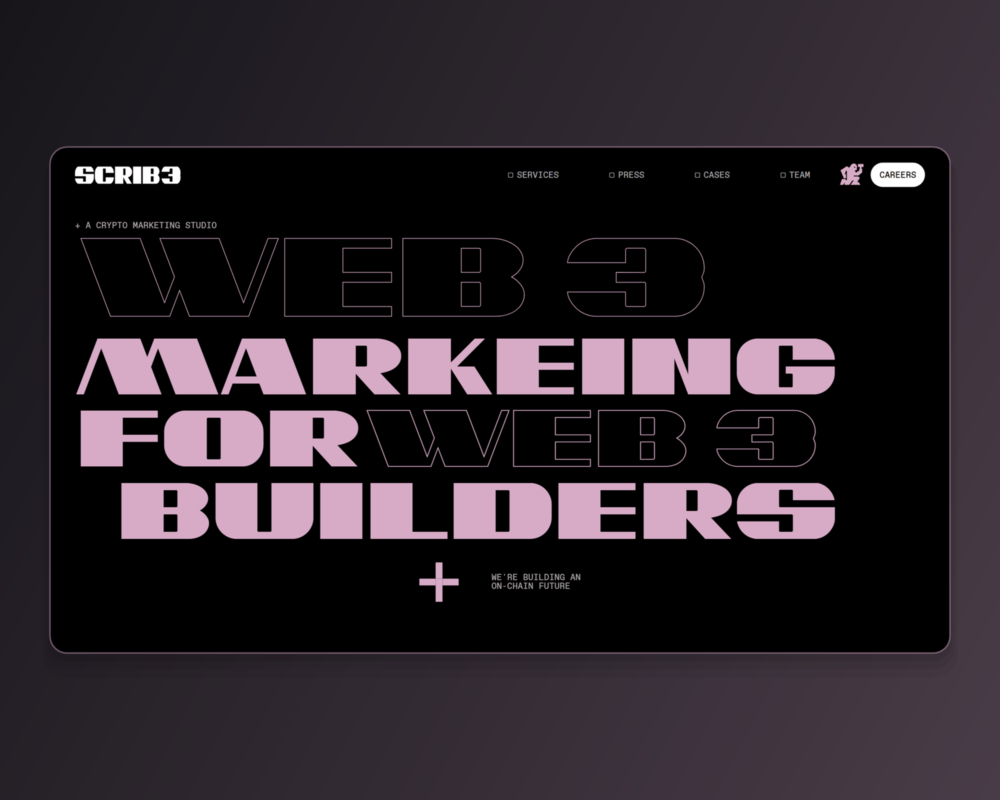

# SCRIB3 — сайт крипто-маркетинговой студии на Webflow с GSAP

**Ключевые слова для поиска:** Webflow, Figma to Webflow, GSAP, ScrollTrigger,
SplitText, marquee, sticky section, Client-First, animated website, web3,
crypto marketing, responsive, custom code, Lottie.

Пакет карточки №5 по плану `upwork/profile.md` §5.5. Собран 2026-09-01
скриптом `scripts/build-webflow-card.mjs scrib3`, кадры сняты с живого прода.

**Как читать.** Раздел 1 — поля слева, раздел 2 — блоки правой колонки сверху
вниз. Всё, что в кода-рамке, копируется как есть. Разделы 3–4 — справка.

**Живой сайт:** <https://scrib3-prod.webflow.io/>

---

## 1. Поля слева

### Project title * (лимит 70)

```
Figma to Webflow | GSAP | Animated Web3 Website - SCRIB3
```

55 из 70. Взят из плана §5.5 без изменений — он рабочий по ключевым словам.

### Your role (лимит 100)

```
Design and Webflow build, end to end - UI design, Client-First, GSAP motion, custom code
```

87 из 100. Роль закрыта владельцем 2026-08-31 (`profile.md` §5.8, «Роль в
Webflow-сборках»): дизайн сборки его, это не сборка по чужому файлу.

### Project description * (лимит 600) — вставить целиком

```
Task: a presentation site for a crypto marketing studio - services, work, team and careers on one scroll, loud by brief and readable at every width.

Solution: Figma to Webflow, end to end - UI design, Client-First structure, responsive build, GSAP motion with a sticky intro scene, custom code.

Result: live in production, one scroll that carries a visitor to the careers block. Estimated inquiry conversion: 2-4%.

Duration: 64 working hours.

I designed this site and built it.
```

481 из 600. **Формат сменён 2026-09-01 решением владельца** —
описание разложено на `Task / Solution / Result / Duration`. Причина: карточку на бирже читают как
смету, а не как эссе. Клиент должен увидеть четыре вещи подряд — что было
задачей, из чего состояла работа, чем она кончилась и сколько заняла, — и
увидеть их до того, как решит читать дальше. Формат единый для всех восьми
карточек. Первая строка `Task:` обязана пережить обрезку в плитке — она и
несёт то, что раньше несла первая фраза нарратива.

**Прежняя редакция описания — снята 2026-09-01.** Нарративная версия и её
обоснование сохранены здесь: у неё другая работа — она годится там, где лимит
поля не 600, и по ней восстанавливается формулировка, если формат когда-нибудь
откатят.

<details>
<summary>Нарративная версия</summary>

```
Design and Webflow build, end to end. A presentation site for a crypto marketing studio: display type at full width, marquees, and services, work, team and careers all on one scroll.

Loud was the brief; keeping it readable at every width was the job. The intro holds as a sticky scene while the type resolves - open the site to see it move.

I designed this site and built it. Live in production.
```

397 из 600. **Лимит не выбирается намеренно** — разбор в пакете Common: за
обрезку в плитке уходит только первый абзац, и длинный текст читателя не
добавляет. Про движение сказано одной строкой с приглашением открыть сайт.

</details>

### Skills and deliverables * (5 слотов)

```
Webflow · GSAP · Animation · Web Design · Responsive Design
```

Против опубликованной сейчас карточки сняты два тега. `Figma` — он уже стоит в
профильных скиллах (`profile.md` §4) и внутри карточки не отличает её от
соседней. `Adaptive Web Design` почти дублирует `Responsive Design`, который
взят: освободившийся слот отдан `Animation`, а его доказывают кадры 02 и 03.

`CMS Development` **не брать**: коллекций у сборки нет вовсе — ноль узлов
`w-dyn-list`, проверено 2026-09-01. Тег стоит только в карточке Bloomlex.

---

## 2. Правая колонка — 10 блоков подряд

| № | Тип | Что |
|---|---|---|
| 1 | Ссылка | `https://scrib3-prod.webflow.io/` · надпись `Open the live site` |
| 2 | Текст | заголовок и строка ниже |
| 3 | Изображение | `01.png` |
| 4 | Изображение | `02.png` |
| 5 | Изображение | `03.png` |
| 6 | Текст | заголовок и строка ниже |
| 7 | Изображение | `04.png` |
| 8 | Изображение | `05.png` |
| 9 | Изображение | `06.png` |
| 10 | Ссылка | `https://kanarev.com/` · надпись `More work` |

### Блок 2 · Текст

Heading:

```
Loud was the brief, readable was the job
```

Тело:

```
A studio selling marketing to web3 builders cannot open quietly. Display type runs the full width, and outlined and filled cuts of the same headline sit inside one line - none of it decoration, all of it the brand, and the build had to carry it without losing a line to overflow.
```

### Блок 3 · `01.png` — подпись (лимит 140)

```
Home, first screen: the headline set in outlined and filled display type on black, with the studio's one-line positioning above it.
```

### Блок 4 · `02.png` — подпись

```
The work marquee: a running line of client names between two sections, moving continuously rather than sitting as a static logo row.
```

### Блок 5 · `03.png` — подпись

```
Services, mid-reveal: the section is built as a scroll scene, so its items arrive in order rather than all at once.
```

### Блок 6 · Текст

Heading:

```
One scroll, four jobs
```

Тело:

```
Services, work, team and careers are not four pages - they are four stops on one scroll, each with its own visual register and its own anchor in the navigation. Display type this large is also where responsive builds break, so every block has its own sizes per width.
```

### Блок 7 · `04.png` — подпись

```
Cases: the work section, with the studio's claim about impact set as a headline over the case list.
```

### Блок 8 · `05.png` — подпись

```
The second register: a sticky scene in full-bleed blue with a running illustration, mid-travel - the same page, a different voice.
```

### Блок 9 · `06.png` — подпись

```
390px: the same opening headline, re-set for the width - not the desktop block scaled down.
```

---

## 3. Обложка — `00-cover.png`

**2000×1600**, ровно 5:4 — пропорция плитки в сетке Portfolio. Собирается тем
же прогоном, что и кадры; пересобрать одну обложку — `--cover-only`.



**Что на ней.** Лестница из трёх первых снятых сцен: `01.png` героем слева,
`02.png` и `03.png` спутниками справа столбиком, перекрытие 40 px. Внизу
плашка `--accent-500` с ярлыком `WEBFLOW · GSAP · ANIMATED`. Холст — диагональный градиент
из тона `rgb(54,46,52)`: это фон первого экрана сборки, сдвинутый на тон, и оба
стопа выводятся из него подмешиванием белого и чёрного.

Вся геометрия и её обоснование — в `scripts/lib/upwork-cover.mjs`, общем
модуле с пакетами продуктовых кейсов. Здесь числа не дублируются намеренно:
до 2026-09-01 обложки кейсов и сборок жили двумя разными спецификациями, и
они разошлись — кейсы шли 1.25, сборки 1.333, и в одной сетке восемь работ
кропились двумя разными способами.

**Промо-рендера с монитором на подиуме здесь нет и не будет.** Прежняя обложка
этой сборки на бирже была именно им; это нарушает `CASE-20`
(`src/copy/home.ts` §development) — «ни рамок устройства, ни перспективы, ни
теней; сайт показывается как сайт», — и рядом с обложками продуктовых кейсов
читалась как работа другого автора. Коллаж это правило не ослабляет: глубину
держат перекрытие, волосяная обводка и приглушение спутника, наклона нет.

**Почему не 1448×1086 и не 1733×909.** Первая редакция была 1.91, под LinkedIn
Featured, и на бирже не встала: диалог `Thumbnail preview` заполняет рамку по
высоте, поэтому кадр 1.91 при любом положении ползунка терял бока — у Scrib3
срезало логотип до «CRIB3». Вторая, 4:3, входила в диалог целиком, но
расходилась с плиткой и с пакетами кейсов. Обе сменены владельцем 2026-09-01.

Вес — 84 КБ, палитра в 256 цветов без дизеринга — то же, что у сборщика
продуктовых кейсов.

## 4. Границы честности

- **Клипа движения в пакете нет** — решение владельца 2026-09-01. Анимацию
  показывает сам сайт, ссылка на него стоит первым блоком.
- **CMS не заявляется** — коллекций нет, ноль `w-dyn-list` (2026-09-01).
- **Форм на сборке нет** — ни одной, проверено там же. `Forms` в тегах и
  тексте не появляется.
- **Часы в карточке есть — и только в карточке.** `Duration: 64 working
  hours` — цифра с опубликованной версии, возвращена решением владельца
  2026-09-01: на бирже объём работы это то, из чего клиент считает бюджет.
  На сайте часов по-прежнему нет — там позиционирование product-first, и язык
  часов работает против него. Расхождение площадок осознанное.
- **`Estimated inquiry conversion: 2-4%` — оценка, а не замер.** Вилка
  отраслевая, аналитики с этой сборки нет. Слово `Estimated` обязательное.
- **`Target Lighthouse Performance: 90+` снято.** Это цель, а не замер:
  формулировка «target» в портфолио читается как результат. Пока замера с
  живого прода нет, цифры в карточке нет.
- **Даты нет.** «Published on Jul 6, 2026» — дата публикации карточки, не дата
  работы.
- **Секции команды в пакете нет.** Она на сайте есть, но портреты там почти
  чёрные по замыслу, и в кадре 16:9 это читается как ошибка рендера, а не как
  решение; наведение их не проявляет (проверено 2026-09-01). Кадр 05 отдан
  липкой сцене — второму визуальному регистру страницы.
