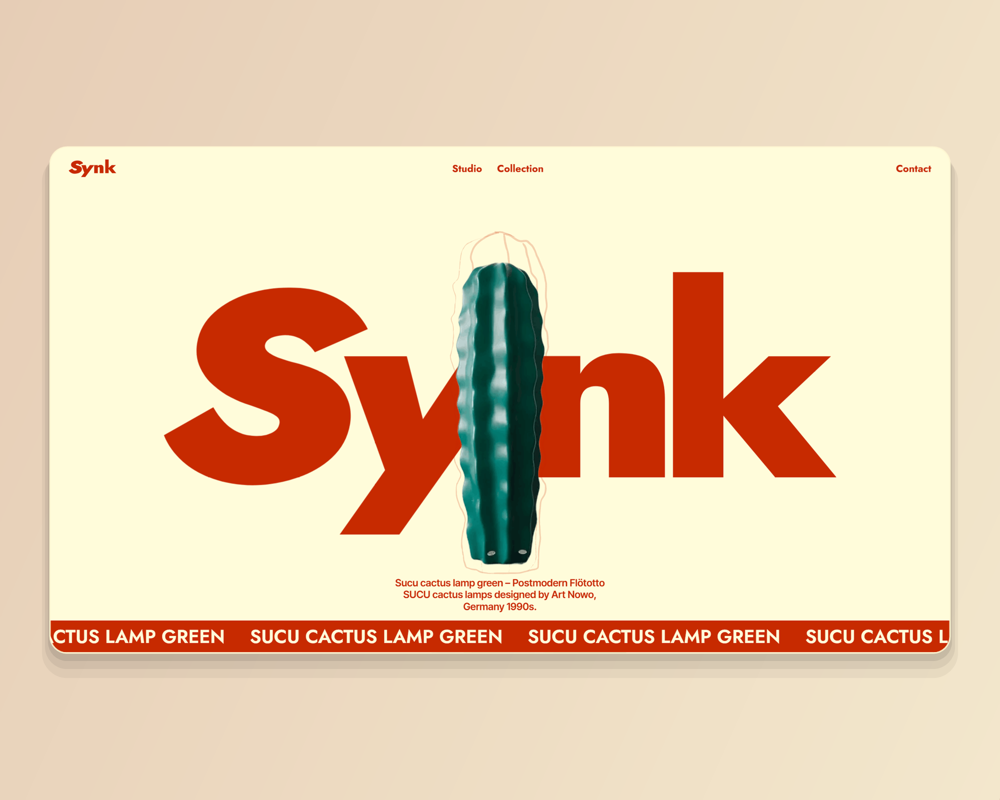

# SYNK — сайт мебельной студии на Webflow: каталог и предзаказ

**Ключевые слова для поиска:** Webflow, Figma to Webflow, GSAP, Webflow
Interactions, IX2, marquee, Client-First, product catalog, pre-order flow,
lead capture, responsive, e-commerce landing, retro furniture.

Пакет карточки №6 по плану `upwork/profile.md` §5.6. Собран 2026-09-01
скриптом `scripts/build-webflow-card.mjs synk`, кадры сняты с живого прода.

> 🔴 **План §5.6 правится этим пакетом.** И заголовок, и описание в плане
> обещают CMS: «Webflow CMS driving the dynamic sections». Коллекций у сборки
> нет — **ноль узлов `w-dyn-list` и на главной, и на `/catalog`**, замерено
> 2026-09-01. Ту же ошибку уже поймал сайт: `src/copy/home.ts` §development,
> «Карточка Synk обещает CMS setup, а в проде коллекций нет; CMS есть только у
> Bloomlex». Тег `CMS` снят из заголовка, строка про коллекции — из описания.
> Заявлять CMS там, где её нет, — это выдуманная функциональность, и первая же
> проверка ссылкой её вскрывает.

**Живой сайт:** <https://synk-battle-prod.webflow.io/>
**Каталог:** <https://synk-battle-prod.webflow.io/catalog>

---

## 1. Поля слева

### Project title * (лимит 70)

```
Figma to Webflow | GSAP | Catalog & Pre-order Website - SYNK
```

59 из 70. В плане §5.6 стоит `Figma to Webflow | CMS | GSAP | Website
Development - SYNK`; `CMS` снят по разбору выше, освободившееся место отдано
тому, что у сборки действительно есть, — каталогу и предзаказу.

### Your role (лимит 100)

```
Design and Webflow build, end to end - UI design, Client-First, motion, catalog and forms
```

88 из 100.

### Project description * (лимит 600) — вставить целиком

```
Task: a site for a studio selling postmodern furniture - one piece per screen, a catalog, and pre-orders taken before the collection ships.

Solution: Figma to Webflow, end to end - UI design, Client-First structure, responsive build, product catalog, Webflow Interactions, pre-order form flow.

Result: live in production, with structured product discovery and pre-order capture. Estimated inquiry conversion: 2-4%.

Duration: 64 working hours.

I designed this site and built it.
```

481 из 600. **Формат сменён 2026-09-01 решением владельца** —
описание разложено на `Task / Solution / Result / Duration`. Причина: карточку на бирже читают как
смету, а не как эссе. Клиент должен увидеть четыре вещи подряд — что было
задачей, из чего состояла работа, чем она кончилась и сколько заняла, — и
увидеть их до того, как решит читать дальше. Формат единый для всех восьми
карточек. Первая строка `Task:` обязана пережить обрезку в плитке — она и
несёт то, что раньше несла первая фраза нарратива.

**Прежняя редакция описания — снята 2026-09-01.** Нарративная версия и её
обоснование сохранены здесь: у неё другая работа — она годится там, где лимит
поля не 600, и по ней восстанавливается формулировка, если формат когда-нибудь
откатят.

<details>
<summary>Нарративная версия</summary>

```
Design and Webflow build, end to end. A site for a studio selling postmodern furniture: one piece per screen, a catalog, and pre-orders taken before the collection ships.

Motion is built with Webflow's own interactions rather than bolted on, so the studio can keep editing it after handoff - open the site to see it move.

I designed this site and built it. Live in production.
```

378 из 600. **Лимит не выбирается намеренно** — разбор в пакете Common: за
обрезку в плитке уходит только первый абзац. Про движение сказано одной строкой
с приглашением открыть сайт.

</details>

### Skills and deliverables * (5 слотов)

```
Webflow · Web Design · Animation · Responsive Design · Landing Page
```

`CMS Development` **не брать** — обоснование в рамке наверху.

`GSAP` в тегах карточки **не стоит**, хотя библиотека на странице загружена:
ни одного экземпляра `ScrollTrigger` в проде нет, движение ведут нативные
Webflow-интеракции (IX2) и одна бегущая строка. Ставить `GSAP` тегом значило бы
продавать не то, что сделано. Это отличие от Scrib3 и Common, где GSAP
действительно несёт сцены, — и в описании оно названо плюсом: движение на
родных интеракциях клиент может править сам.

---

## 2. Правая колонка — 10 блоков подряд

| № | Тип | Что |
|---|---|---|
| 1 | Ссылка | `https://synk-battle-prod.webflow.io/` · надпись `Open the live site` |
| 2 | Текст | заголовок и строка ниже |
| 3 | Изображение | `01.png` |
| 4 | Изображение | `02.png` |
| 5 | Изображение | `03.png` |
| 6 | Текст | заголовок и строка ниже |
| 7 | Изображение | `04.png` |
| 8 | Изображение | `05.png` |
| 9 | Изображение | `06.png` |
| 10 | Ссылка | `https://kanarev.com/` · надпись `More work` |

### Блок 2 · Текст

Heading:

```
The object talks, the layout stays quiet
```

Тело:

```
Postmodern furniture is bought by looking. So the page gives one piece a screen of its own, puts its provenance in a caption underneath - maker, country, decade - and keeps everything else out of the way.
```

### Блок 3 · `01.png` — подпись (лимит 140)

```
Home, first screen: the wordmark with a green cactus lamp standing inside it, the piece named in the caption, a running line underneath.
```

### Блок 4 · `02.png` — подпись

```
The Studio section: who makes the collection and why these pieces, set against the catalog rather than in front of it.
```

### Блок 5 · `03.png` — подпись

```
Collection on the home page: pieces laid out one per row, each with its own caption line, leading into the full catalog.
```

### Блок 6 · Текст

Heading:

```
Pre-order, not checkout
```

Тело:

```
The collection had not shipped yet, so a cart would have been a lie. The site captures intent instead: a pre-order form, an email capture for the next drop, and a catalog that reads as a lookbook a buyer can send on.
```

### Блок 7 · `04.png` — подпись

```
The catalog page: the full grid of pieces, each with its provenance line, on the same rules as the home collection.
```

### Блок 8 · `05.png` — подпись

```
Pre-orders open soon: the capture block, followed by the questions a buyer asks before leaving an email.
```

### Блок 9 · `06.png` — подпись

```
390px: the same one-piece-per-screen rule in one column, caption still attached to the object it names.
```

---

## 3. Обложка — `00-cover.png`

**2000×1600**, ровно 5:4 — пропорция плитки в сетке Portfolio. Собирается тем
же прогоном, что и кадры; пересобрать одну обложку — `--cover-only`.



**Что на ней.** Лестница из трёх первых снятых сцен: `01.png` героем слева,
`02.png` и `03.png` спутниками справа столбиком, перекрытие 40 px. Внизу
плашка `--accent-500` с ярлыком `WEBFLOW · GSAP · PRE-ORDER`. Холст — диагональный градиент
из тона `rgb(218,188,157)`: это фон первого экрана сборки, сдвинутый на тон, и оба
стопа выводятся из него подмешиванием белого и чёрного.

Вся геометрия и её обоснование — в `scripts/lib/upwork-cover.mjs`, общем
модуле с пакетами продуктовых кейсов. Здесь числа не дублируются намеренно:
до 2026-09-01 обложки кейсов и сборок жили двумя разными спецификациями, и
они разошлись — кейсы шли 1.25, сборки 1.333, и в одной сетке восемь работ
кропились двумя разными способами.

**Промо-рендера с монитором на подиуме здесь нет и не будет.** Прежняя обложка
этой сборки на бирже была именно им; это нарушает `CASE-20`
(`src/copy/home.ts` §development) — «ни рамок устройства, ни перспективы, ни
теней; сайт показывается как сайт», — и рядом с обложками продуктовых кейсов
читалась как работа другого автора. Коллаж это правило не ослабляет: глубину
держат перекрытие, волосяная обводка и приглушение спутника, наклона нет.

**Почему не 1448×1086 и не 1733×909.** Первая редакция была 1.91, под LinkedIn
Featured, и на бирже не встала: диалог `Thumbnail preview` заполняет рамку по
высоте, поэтому кадр 1.91 при любом положении ползунка терял бока — у Scrib3
срезало логотип до «CRIB3». Вторая, 4:3, входила в диалог целиком, но
расходилась с плиткой и с пакетами кейсов. Обе сменены владельцем 2026-09-01.

Вес — 203 КБ, палитра в 256 цветов без дизеринга — то же, что у сборщика
продуктовых кейсов.

## 4. Границы честности

- **CMS не заявляется** — разбор в рамке наверху. Это главная правка пакета.
- **`GSAP` не заявляется тегом** — библиотека загружена, но сцен на ней нет.
- **Клипа движения в пакете нет** — решение владельца 2026-09-01. Анимацию
  показывает сам сайт, ссылка на него стоит первым блоком.
- **Аналитика не заявляется.** План §5.6 обещал «analytics wired up before
  launch»; подтвердить это с прода нельзя, и строка снята.
- **Часы в карточке есть, даты нет.** `Duration: 64 working hours` — цифра с
  опубликованной карточки, относится к работе и стоит в описании (решение
  владельца 2026-09-01). «Published on Jul 6, 2026» — дата публикации
  карточки, а не дата работы, и её в тексте нет.
- **`Estimated inquiry conversion: 2-4%` возвращено — как оценка.** Решение
  владельца 2026-09-01, оно отменяет прежний снос этой строки. Плейбук §3
  запрещает выдуманные метрики, и строка держится ровно на двух условиях:
  слово `Estimated` не снимается никогда, и вилка остаётся отраслевой, а не
  выдаётся за замер этой сборки — аналитики у неё нет. Если условие нарушено,
  строка снимается обратно.
