# Upwork · карточка 3 — Vet Clinic OS

Проект в форме Upwork: **Add a new portfolio project**.
Источник фактуры — `src/copy/cases/vet-clinic.ts` и `upwork/profile.md` §5.3.

**Как читать этот файл.** Разделы 1–3 — рабочие: идёшь сверху вниз и копируешь
каждый блок в кода-рамке как есть. Ничего искать в других местах документа не
нужно: у каждого кадра рядом стоит и сам кадр, и его имя файла, и его подпись.
Разделы 4–9 — справка: обложка, кадры, лимиты, логика порядка, проверка,
открытые вопросы. В работе они не нужны.

> **Заведён 2026-09-01** по образцу пакетов `agent-ops-console` и
> `b2b-partner-portal`. Структура повторена целиком: те же три шага, тот же
> порядок «ссылка первым блоком», те же три поля слева, тот же лимит 25.
>
> Отличие жанровое: **это 0→1**, и карточка открывается задачей с цифрой —
> тридцать секунд между двумя приёмами, — а не парой before/after. «До» у
> этого кейса нет: продукт делался с нуля, сравнивать не с чем, и подделывать
> сравнение нечем.

Граница, которую нельзя двигать (правила кейса, `vet-clinic.ts`):
ни одной бизнес-метрики — клиника под NDA и baseline у проекта нет; ни одного
реального названия и реквизита, включая саму клинику: `Lesnaya Clinic` на
кадрах — декорация прототипа, а не заказчик; работа дошла до дизайна, ДС и
прототипа и **в производство не пошла**, и это сказано словами в блоке 24.

**Что добавил формат `Task / Solution / Result / Duration` (2026-09-01).**
Строка `Duration` — **оценка объёма работы, а не таймшит**: точного учёта часов
по этому проекту нет, цифра восстановлена по составу отгруженного и сроку.
Названа она часами потому, что на бирже это единица, в которой клиент считает
бюджет. Граница выше от этого не сдвинулась: ни одной новой бизнес-метрики в
описании не появилось — в строке `Result` стоят те же цифры, что уже были в
кейсе, и в том же статусе.

---

## 1. Три шага, строго в этом порядке

**Сначала левые поля, потом снос, потом сборка** — пока лимит 25 выбран, форма
не даст добавить ни одного блока.

**Шаг 1 — левые поля.** Раздел 2. Карточки в портфолио ещё нет, поэтому все
четыре поля заполняются с нуля: `Project title`, `Your role`,
`Project description`, `Skills and deliverables`.

**Шаг 2 — правая колонка пустая**, сносить нечего. Счётчик показывает `0 / 25`.
Обложка грузится отдельно, в диалоге `Thumbnail preview` — раздел 4.

**Шаг 3 — собрать 25 блоков.** Раздел 3, сверху вниз, без пропусков.
Четырнадцать PNG лежат в этой папке и грузятся по именам подряд: номер файла
совпадает с порядком, в котором кадры идут в карточке.

---

## 2. Поля слева

### Project title *  (лимит 70)

```
Web App Design + Design System | Clinic Operations SaaS - 2 Weeks
```

65 из 70. Взят из `profile.md` §5.3 без изменений — в лимит проходит.

### Your role  (лимит 100)

```
Sole Product Designer - research, IA, UX/UI, design system, React prototype and QA
```

82 из 100. То же место карточки, что и у карточки 1: единственная строка,
которая говорит, что рядом никого не было. Про врача здесь не сказано
намеренно — доменный вход это не член команды, и его место в блоке 24, где он
стоит рядом с границей проверки.

### Project description *  (лимит 600) — **вставить целиком**

```
Task: a clinic operations system - schedule, medical record, invoicing - for a veterinary practice, built around the thirty seconds a vet has between two patients.

Solution: research, a design system, screens and a deployed prototype for desktop, tablet and phone. A thirty-second trace - weight, drug, dose - is made in the room and reaches colleagues at once.

Result: brief to deployed prototype in two weeks - a visit recorded in thirty seconds in the room, the full record following later.

Duration: ~150 working hours.

Clinic under NDA. All data is invented.
```

567 из 600. **Формат сменён 2026-09-01 решением владельца** —
описание разложено на `Task / Solution / Result / Duration`. Причина: карточку на бирже читают как
смету, а не как эссе. Клиент должен увидеть четыре вещи подряд — что было
задачей, из чего состояла работа, чем она кончилась и сколько заняла, — и
увидеть их до того, как решит читать дальше. Формат единый для всех восьми
карточек. Первая строка `Task:` обязана пережить обрезку в плитке — она и
несёт то, что раньше несла первая фраза нарратива.

**Три расхождения с `profile.md` §5.3, все три те же, что в пакетах 1 и 2.**

| Что | Почему здесь иначе |
|---|---|
| Текст короче: 597 против 1120 знаков | Формула кейса рассчитана на 1000–1200, поле формы отдаёт 600 **[факт, замер 2026-08-31]**. Резались связки, не факты: тридцать секунд, две недели, состав отгруженного и обе оговорки на месте |
| Нет строки `Open it yourself: <URL>` | Ссылка — первый блок правой колонки, кликабельный. В описании она стоила бы 62 знака из 600, которых нет |
| Нет блока `Role:` | У формы для этого отдельное поле, и оно уже заполнено |

**Что ушло при сжатии и где оно теперь стоит.** «Responsive across desktop, a
tablet in the consulting room and the owner's phone» сжато до «for desktop,
tablet and phone»: полная формулировка живёт в подписи кадра `01.png`, где она
не заявление, а описание того, что видно. Строка «sole designer, with domain
input from a practising veterinarian» перенесена в блок 24 целиком.

**Прежняя редакция описания — снята 2026-09-01.** Нарративная версия и её
обоснование сохранены здесь: у неё другая работа — она годится там, где лимит
поля не 600, и по ней восстанавливается формулировка, если формат когда-нибудь
откатят.

<details>
<summary>Нарративная версия</summary>

```
A clinic operations system - schedule, medical record, invoicing - for a veterinary practice. Brief to deployed prototype in two weeks: research, a design system, screens, a build for desktop, tablet and phone.

The design problem was a thirty-second window - all a vet has between two patients, and the only one in which a visit is recorded or stops existing, leaving whoever sees the animal next blind.

A thirty-second trace - weight, drug, dose - is made in the room and reaches colleagues at once; the full record follows later without overwriting it.

Clinic under NDA. All data is invented.
```

597 из 600. Первый абзац — 210 знаков — обязан пережить обрезку в карточке.

</details>

### Skills and deliverables *  (5 слотов)

```
Product Design · UX & UI Design · App Design · Responsive Design · Prototyping
```

В `profile.md` §5.3 стоят семь тегов, слотов пять. Что выпало и почему:

| Тег из плана | Решение |
|---|---|
| `Design System` | **термина в справочнике карточек нет вовсе** — установлено на карточке 1, 2026-09-01. Слот отдан другому |
| `Figma` | не берётся с карточки 2: тег уже стоит в профильных скиллах (`profile.md` §4) и внутри карточки не отличает её от соседней |
| `User Experience Design` | почти дублирует `UX & UI Design`, который взят |

Что взято вместо них и чем это доказано **в этой карточке**:

- **`Responsive Design`** — кадр `01.png`: один день на 1440, 768 и 390 px, и
  это единственный кейс портфолио, где планшет назван платформой в шапке, а не
  добавлен из вежливости.
- **`Prototyping`** — блок 1 открывает живой прототип, `07.png` показывает все
  тринадцать его маршрутов индексом. Из четырёх продуктовых карточек эта —
  самая быстрая: две недели от брифа до задеплоенной сборки.

**Лестница на случай, если `App Design` в подсказке не найдётся** — идти до
первого принятого: `App Design` → `Web Design` → `UX Research`. `Dashboard` не
брать: он закреплён за карточкой 1, где дашборд и есть продукт.

**`Usability Testing` не брать.** Живого юзабилити-теста здесь не было:
доменный вход — это несколько разговоров с практикующим врачом, а прогоны по
прототипу синтетические. Тег обещал бы сессии с людьми, которых не было.

---

## 3. Правая колонка — 25 блоков подряд

Порядок операций внутри блока: тип блока → содержимое → следующий.
Текстовый блок: тумблер **Plain text**, не Markdown.
Блок изображения: файл из этой папки, `Description` — в поле подписи (лимит 140).

---

### Блок 1 · Ссылка — прототип

```
https://veterinary-clinic-gules.vercel.app/
```

---

### Блок 2 · Текст

Heading:

```
Between Thursday and Saturday, the visit did not exist.
```

Тело:

```
A vet in a small practice sees ten to twenty patients a day. The clinic's software is opened before the appointment and after it, never during: while the patient is on the table, the record lives in a paper notebook. The first reason for that is not privacy, it is physics - she writes with one hand, standing, because the other one is holding the cat. One appointment crosses seven tools, and the weight is entered twice: into the system, then by hand into a dose calculator on a phone. That is where her one real near-miss came from - a decimal point moved by hand, caught by her and by nothing else. Thursday's appointment was never entered at all, so on Saturday a colleague sees the same cat, finds a last entry a year old, examines from scratch and nearly prescribes a second anti-inflammatory on top of the first. What stopped it was a phone call answered on a day off. The system was no part of that safeguard, because it did not know the visit had happened.
```

---

### Блок 3 · Изображение

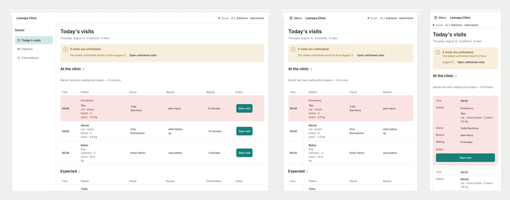

Файл:

```
01.png
```

Description:

```
The same day at 1440, 768 and 390 px: columns drop on the tablet, and on the phone each visit becomes a card ending in Start visit.
```

---

### Блок 4 · Текст

Heading:

```
The unit of work was never the visit. It was the trace.
```

Тело:

```
The brief asked for faster closing of visits, measured by the share closed in the system on the day. The person it was written for took one sentence to show that was wrong: "The previous patient hasn't left yet and the next one is already in the room. I have a choice: sit down and enter it, or smile at the next one. I always smile at the next one. Twelve times a day." A product that asks for the whole record inside that window does not get half a record. It gets postponed whole - which is exactly what the incumbent does. So the object the system holds became the trace: the smallest record worth having, made in seconds, visible to a colleague immediately, completed later without being overwritten. The measure moves with it - not completeness by the end of the shift, but whether a trace exists by the time the vet leaves the room.
```

---

### Блок 5 · Изображение

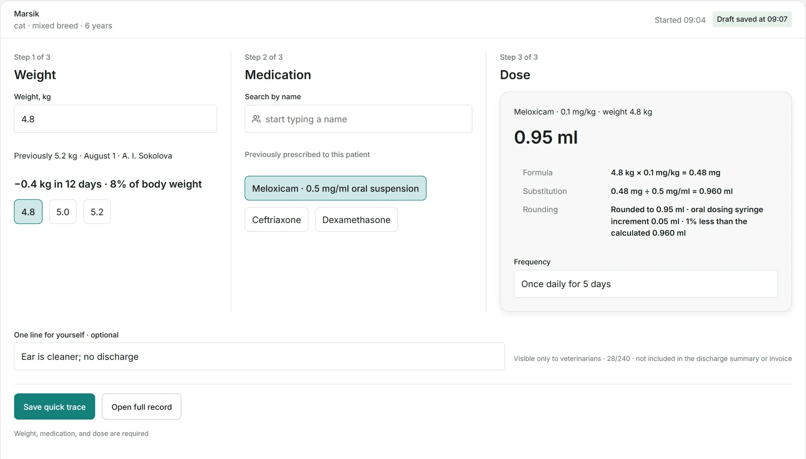

Файл:

```
02.png
```

Description:

```
The thirty-second trace: weight, medication and dose as three adjacent steps, one private line, and saving kept apart from the full record.
```

---

### Блок 6 · Текст

Heading:

```
The dose is calculated from the weight already in the system, and the arithmetic is shown.
```

Тело:

```
The near-miss was not a gap in knowledge, it was a decimal point moved by hand on the way to a phone calculator. Removing that transfer needs no drug reference at all: the weight is already in the card, and a number the doctor cannot re-type is one she cannot mistype. Formula, substitution and rounding are all on screen, so the result is checkable rather than trusted. What it cost: no species contraindication warnings in the first version. The risk that worries the clinic and its lawyer stays uncovered and became a separate go/no-go decision, because a warning table we cannot license or verify is a promise the interface cannot keep.
```

---

### Блок 7 · Изображение

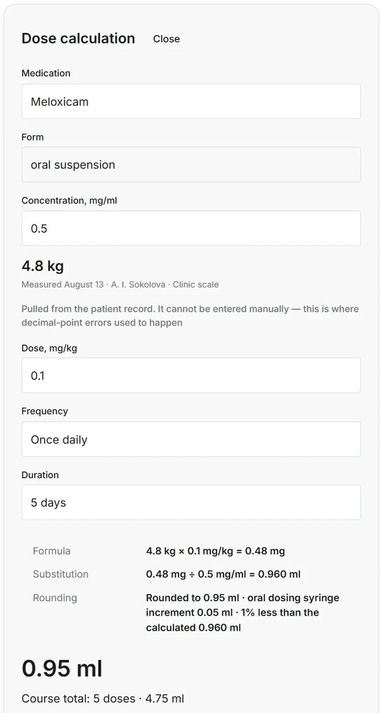

Файл:

```
03.png
```

Description:

```
Dose calculation beside the record: the weight comes from the card and cannot be typed here; formula, substitution and rounding are shown.
```

---

### Блок 8 · Текст

Heading:

```
The veterinarian's private zone gets its own colour in the palette, not a label.
```

Тело:

```
"I don't like the look of this" is a class of clinical information that currently lives nowhere: it goes into a notebook that is thrown away, and it is gone by the time the patient comes back. Bringing it into the system only works if the boundary - the owner will not see this - is impossible to miss and impossible to erase. A label survives a rebrand only if someone remembers it; a reserved hue survives it by construction. What it cost: one tone of the palette is spent for good and cannot be reused for anything else, on a product that otherwise runs on a single accent.
```

---

### Блок 9 · Изображение

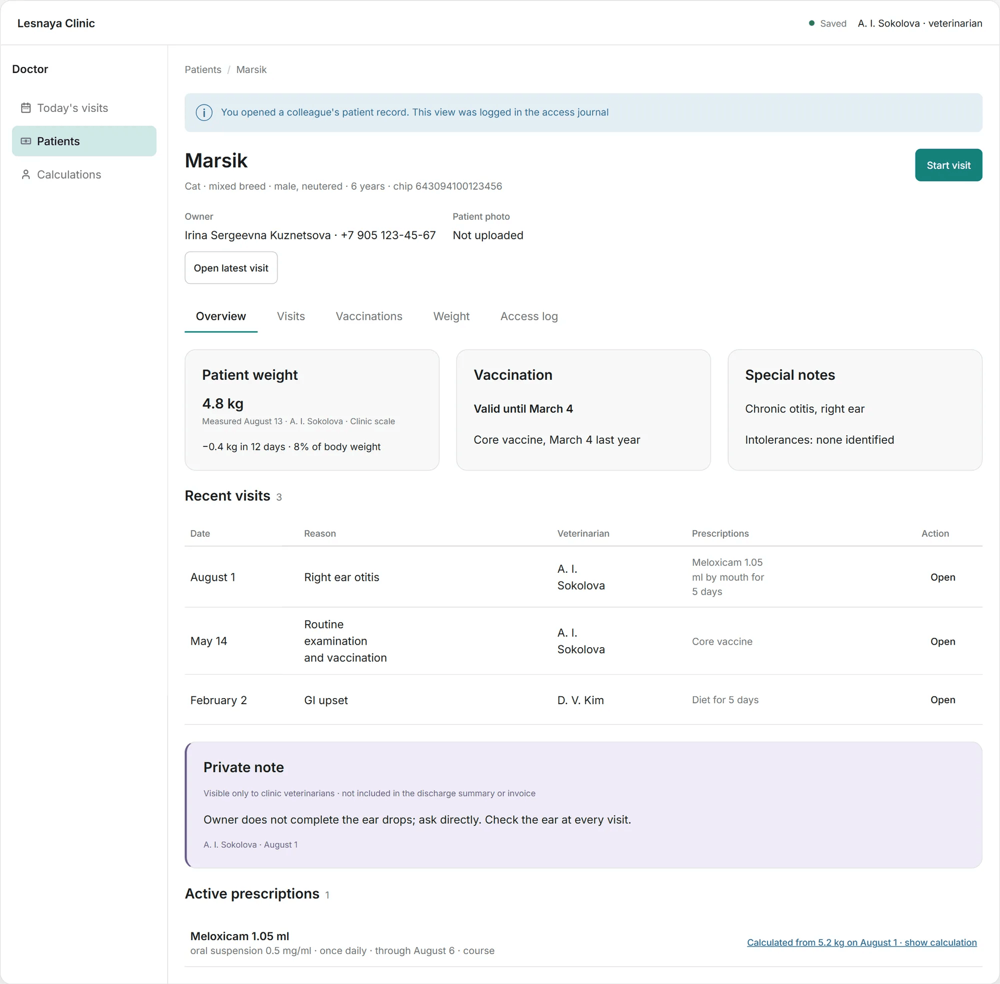

Файл:

```
04.png
```

Description:

```
The card a colleague opens: weight, vaccination, intolerances, the last three visits, and the private note in its own hue.
```

---

### Блок 10 · Изображение

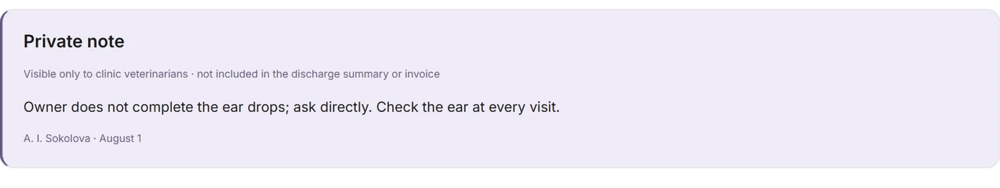

Файл:

```
05.png
```

Description:

```
The private note up close - clinic vets only, in no discharge summary and on no invoice, with its author and date on it.
```

---

### Блок 11 · Текст

Heading:

```
Publishing to the owner is an explicit act, with a preview from the owner's side.
```

Тело:

```
Premature publication of a draft is irreversible in a way a bug is not, and the response to that risk is rational: she will write only what she is ready to read aloud - and then the card is empty, the invoice is guesswork and the discharge summary says nothing. The preview is not hygiene here. It is the condition under which anything gets written at all. What it cost: an extra step on every visit, and a discharge summary that cannot be automated even when the record is complete and nothing in it is sensitive.
```

---

### Блок 12 · Изображение

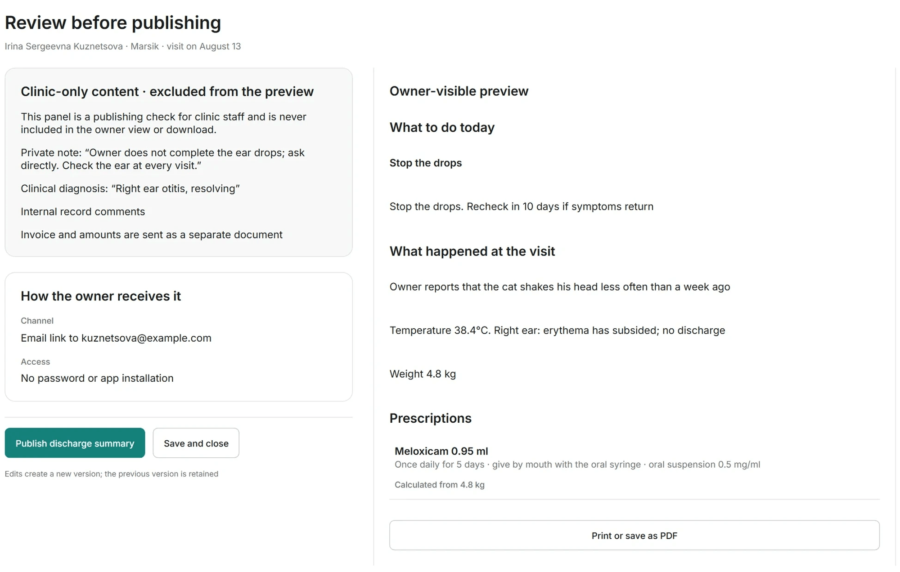

Файл:

```
06.png
```

Description:

```
The publishing check: clinic-only content on the left, the exact document the owner will receive on the right.
```

---

### Блок 13 · Текст

Heading:

```
I audited the incumbent before I drew anything, and wrote down what I could not check.
```

Тело:

```
A practice this size already runs specialised software, so the product had to beat an incumbent rather than replace a filing cabinet - which makes that incumbent the only hard evidence there is. I audited it screen by screen against heuristics, with a severity scale that keeps "blocks the work" apart from "looks untidy", and with a limit written into the report: the vet's own visit screen, the schedule and the owner cabinet were not in the material I had, and no conclusions were drawn about them. Three market numbers could not be traced to a primary source, so they were marked unverified and kept out of the PRD rather than rounded into it. Then scope: 31 Must-haves out of 62 requirements, with the core of the appointment declared indivisible - seven parts that ship together or not at all. Then a 44-screen sitemap, three flows, twelve low-fidelity frames, the design system, and twelve hi-fi frames carrying one story from the day queue to the discharge summary on the owner's phone, with 31 edge cases built as hidden states instead of described in prose.
```

---

### Блок 14 · Изображение

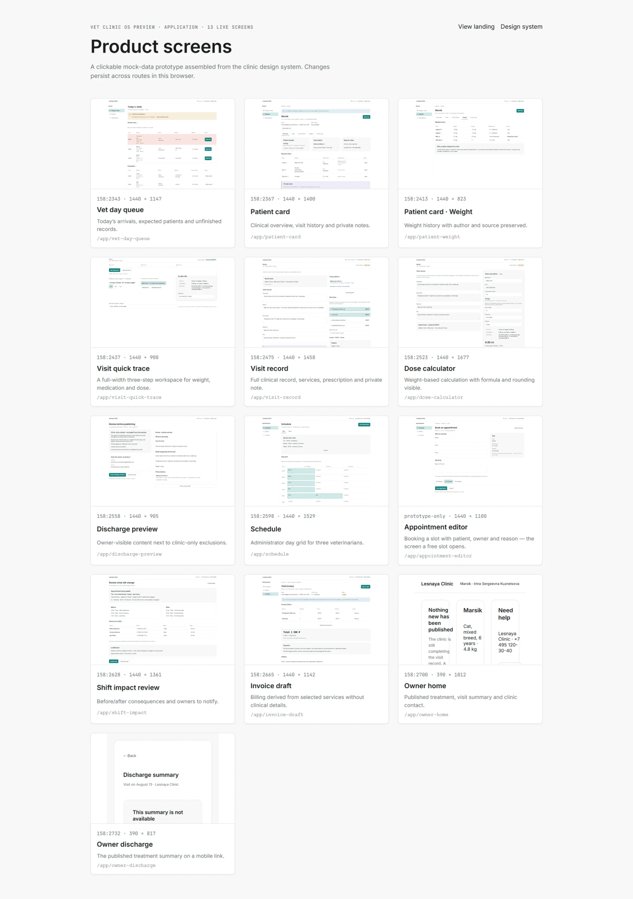

Файл:

```
07.png
```

Description:

```
Thirteen prototype screens as one index, each with the frame it came from.
```

---

### Блок 15 · Изображение

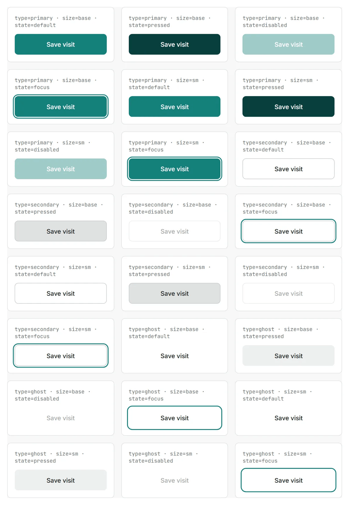

Файл:

```
08.png
```

Description:

```
One component, every variant it is allowed to have - twenty-four for the button alone, shot from the catalogue.
```

---

### Блок 16 · Текст

Heading:

```
The screens passed my own audit. The prototype did not.
```

Тело:

```
Booking: a free slot in the schedule created a visit with no patient, no owner and no reason - a record that exists and says nothing, in a product whose whole argument is that a record must be worth having. The scenario was in the sitemap; the screen for it was in neither the design file nor the specification, and it had to be registered as prototype-only. Saving: the workspace showed the save status twice, once in the header and once in the side rail. On a product whose one dealbreaker is a lost draft, two indicators of the same fact is the defect you can least afford - the first time they disagree, neither is believed again. The fix was not to make them agree, it was to delete one. And the deletion was not finished when the thing was gone: the rule pinning the status to the bottom of the rail stayed behind, took the navigation as its new last child, and slid every menu item down into an empty column. The screens passed, the build passed, nobody saw it. I found it weeks later, shooting these frames.
```

---

### Блок 17 · Изображение

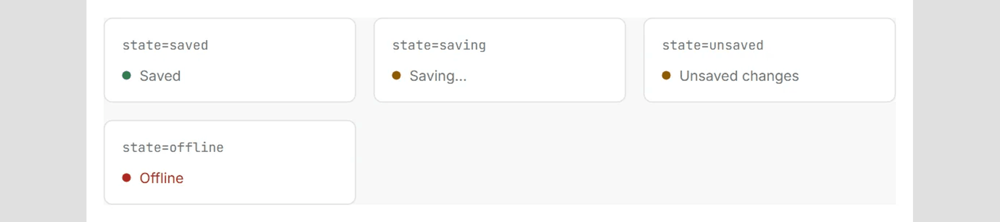

Файл:

```
09.png
```

Description:

```
SaveStatus, the indicator that survived the deletion: saved, saving, unsaved changes, offline. It is now the only one on screen.
```

---

### Блок 18 · Текст

Heading:

```
Thirty-one components, and one I deleted.
```

Тело:

```
Eighty-five variables - 54 primitive, 31 semantic - 21 text styles and 136 variants. Every fill and stroke resolves through a semantic variable, every text node through a named style. A full read-only scan, not a sample, found no hardcoded colours, no unstyled text nodes and no detached instances; the thirty geometry values still unbound are listed as debt, not hidden behind a claim of parity. The one I deleted is the card container: three variants, zero instances anywhere in the product. A component carries exactly the anatomy it was created with, and this one had a title and a single row, while the real blocks here need two to five elements, several of them nested instances. Keeping it "for later" would have meant every screen quietly working around it, which is worse than not having it.
```

---

### Блок 19 · Изображение

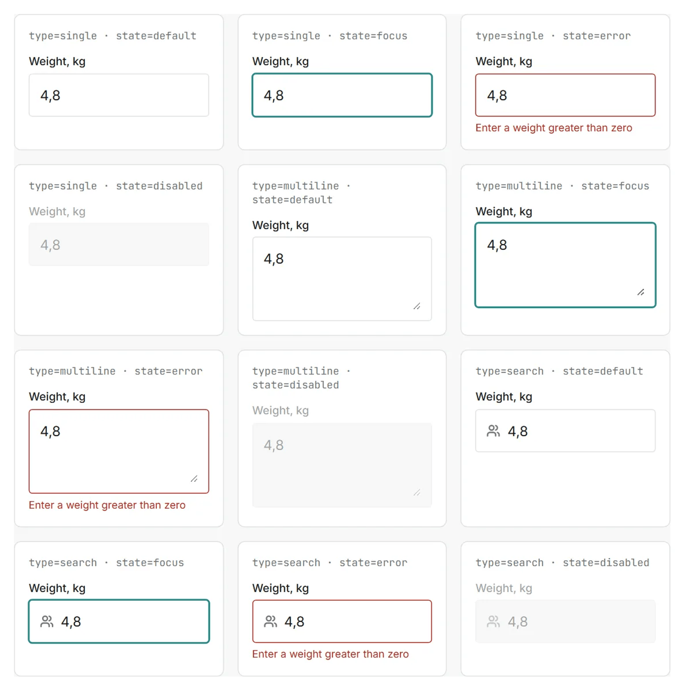

Файл:

```
10.png
```

Description:

```
Input in three types and four states - single, multiline, search x default, focus, error, disabled - the error naming its reason.
```

---

### Блок 20 · Изображение

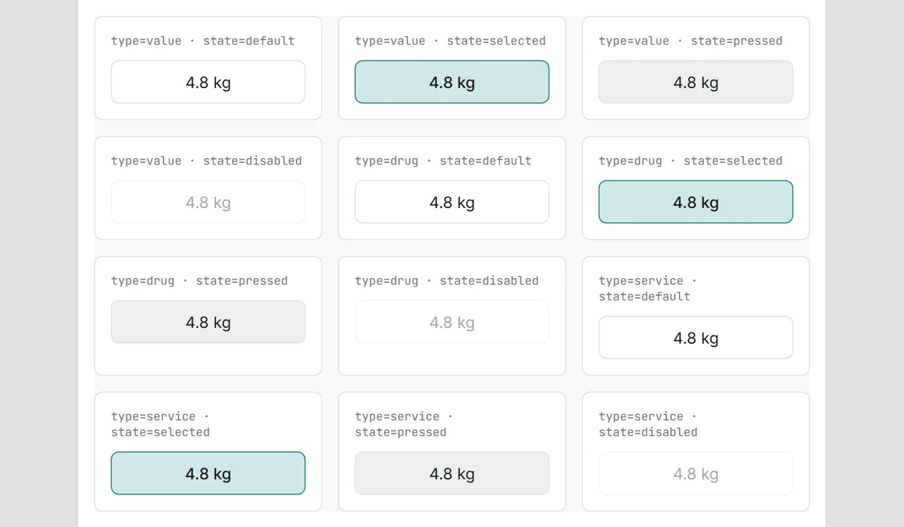

Файл:

```
11.png
```

Description:

```
ChoiceChip for a value, a drug and a service, each default, selected, pressed and disabled.
```

---

### Блок 21 · Изображение

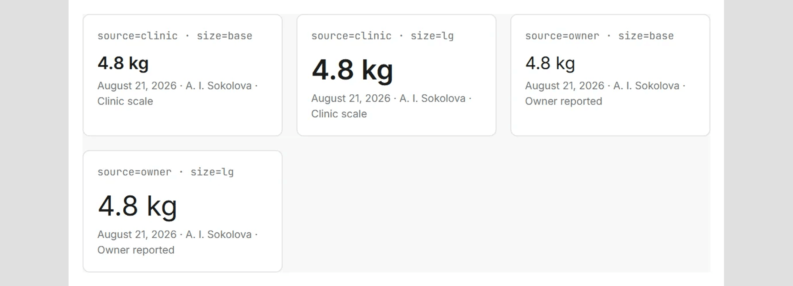

Файл:

```
12.png
```

Description:

```
WeightReading in two sources and two sizes: measured on the clinic scale, or reported by the owner. The source is never dropped.
```

---

### Блок 22 · Изображение

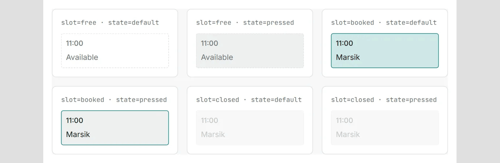

Файл:

```
13.png
```

Description:

```
TimeSlot free, booked and closed, each default and pressed. A booked slot carries the patient's name; a closed one keeps the time.
```

---

### Блок 23 · Изображение

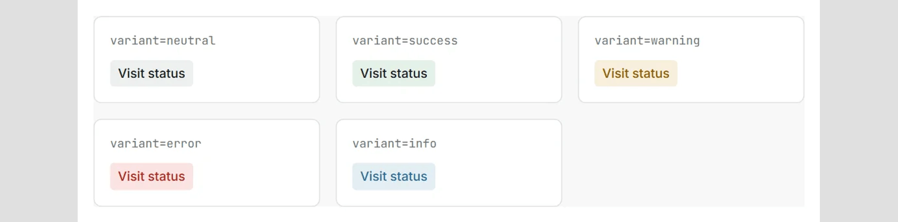

Файл:

```
14.png
```

Description:

```
StatusTag in five variants: neutral, success, warning, error, info.
```

---

### Блок 24 · Текст

Heading:

```
What it cost, who paid for it, and what this is not.
```

Тело:

```
Cut deliberately and written down as cuts: species contraindication warnings, drug accounting and labelling, and taking payments. Each refusal covers something the product cannot guarantee on its own - a licensed source of dosing rules, a regulator's accounting machine, someone else's money. A system that promises any of them breaks on the first real shift and takes the doctor's trust with it, and that is the one thing here that does not come back.

Sole designer: research, scope, IA, the design system, the screens and the prototype. Domain input came from one practising veterinarian; there was no research team.

Validated: workflow and vocabulary, with that one vet. Not validated: whether either generalises across clinics, roles or regulation. The clinic is real and under NDA - not named, no figures published - and there is no baseline to publish them against. The work went as far as research, a design system and a working prototype, and was not taken into production. Every screen runs on invented data, and the practice on them is a fixture, not the client.
```

---

### Блок 25 · Ссылка — кейс на сайте

```
https://kanarev.com/work/vet-clinic
```

---

## 4. Обложка — `00-thumbnail-preview.png`

Файл в этой папке, **2000×1600**, PNG, 96 КБ. Загружается в диалоге
`Thumbnail preview` кнопкой `+` слева от полосы кадров.

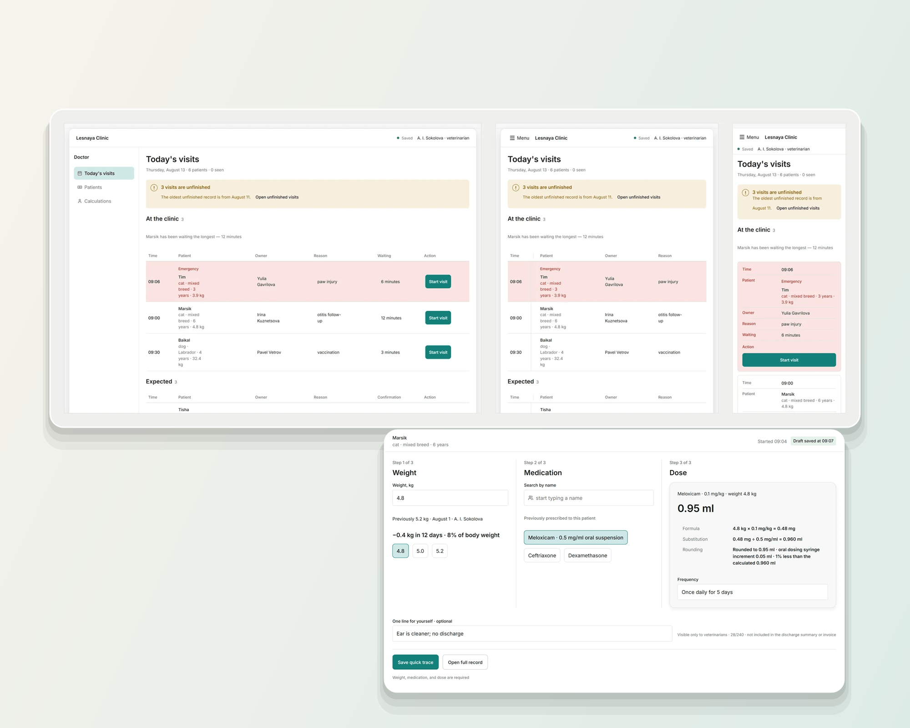

```
node scripts/build-upwork-card.mjs vet-clinic --cover-only
```

Без флага тот же прогон пересобирает и все кадры пакета.

**Что на обложке.** Лестница из трёх кадров: `vet-day-queue` героем слева,
`patient-card` и `schedule` спутниками справа столбиком. Тот же состав, что у обложки кейса на
сайте. Внизу плашка `--accent-500` с ярлыком `CASE STUDY + DESIGN SYSTEM`.

Передней идёт очередь дня: экран, на котором видно и расписание, и состояние
приёма, — то есть предмет кейса до первой строки текста.

**Геометрия — в `scripts/lib/upwork-cover.mjs`**, общем модуле на все восемь
карточек. Полная спецификация 5:4 и замеры плитки — в
`upwork/projects/agent-ops-console/README.md` §4, здесь не дублируются.

**Стопка снята 2026-09-01.** Обложка собиралась по геометрии `ScreenStack` —
три кадра со сдвигом на шаг. На странице сайта это работает, в плитке биржи
шириной ~430 px кромки дальних слоёв превращаются в две полоски у правого
края, и обложка читается одним экраном с дефектом. `CASE-20` при этом
соблюдается по-прежнему: ни поворота, ни перспективы, ни тени.

**Предел честности.** На 200 px обложка читается как «плотный интерфейс» и не
более. Это предел любого скриншота, а не этой композиции, и он одинаков у всех
восьми карточек.

---

## 5. Кадры — что откуда и что с ними сделано

Все четырнадцать собраны скриптом из `public/media/case-vet/`. Правило размера
то же, что в пакетах 1 и 2: **длинная сторона не больше 2000**, PNG с палитрой,
31–294 КБ на кадр, весь пакет 2.2 МБ.

| # | Файл | Размер | Источник | Масштаб |
|---|---|---|---|---|
| — | `00-thumbnail-preview.png` | 2000×1600 | `cover/*` | собрана |
| 1 | `01.png` | 2000×785 | `range-vet-day-queue.webp` | ×1.00 |
| 2 | `02.png` | 2000×1140 | `visit-quick-trace-crop.webp` | ×1.00 |
| 3 | `03.png` | 1068×2000 | `dose-calculator-crop.webp` | ×1.43 |
| 4 | `04.png` | 2000×1969 | `patient-card-private.webp` | ×1.00 |
| 5 | `05.png` | 2000×376 | `patient-card-private-crop.webp` | ×1.25 |
| 6 | `06.png` | 2000×1272 | `discharge-preview-crop.webp` | ×1.03 |
| 7 | `07.png` | 1408×2000 | `screen-index.webp` | ×0.70 |
| 8 | `08.png` | 1385×2000 | `storybook-matrix.webp` | ×1.17 |
| 9 | `09.png` | 2000×444 | `system-save-status.webp` | ×1.45 + поле |
| 10 | `10.png` | 1723×1740 | `system-input.webp` | ×1.45 |
| 11 | `11.png` | 2000×1166 | `system-choice-chip.webp` | ×1.45 + поле |
| 12 | `12.png` | 2000×722 | `system-weight-reading.webp` | ×1.45 + поле |
| 13 | `13.png` | 2000×653 | `system-time-slot.webp` | ×1.45 + поле |
| 14 | `14.png` | 2000×494 | `system-status-tag.webp` | ×1.45 + поле |

**Правило растягивания.** Потолок — ×1.45. Выше скрипт не растягивает вовсе:
недостающая ширина добирается **полем цвета обложки по бокам**, как у пяти
кадров каталога. Снимки образцов сняты мелко — 1140 px в ширину, — и растянуть
их до 2000 значило бы соврать о качестве работы ровно там, где карточка эту
работу и доказывает.

**Четыре кадра кейса в карточку не пошли, и все четыре — сознательно.**

| Кадр | Почему |
|---|---|
| `clip-widths-quick-trace-poster.webp` | Постер клипа перестроения ширин. На нём тот же экран быстрого следа в десктопной ширине, что и на `02.png`: в карточке это был бы повтор. Адаптив здесь доказывает `01.png` |
| `visit-quick-trace.webp` | Полный экран того же следа. На сайте он живёт под зумом по клику; на Upwork зума нет, и кроп читается лучше |
| `dose-calculator.webp` | То же: полный экран с записью визита рядом. В карточке важна сама арифметика, и она в кропе |
| `discharge-preview.webp` | То же основание, что и у двух предыдущих |

**Пара `04` + `05` — единственный в пакете случай, когда один экран стоит
дважды.** Сначала карточка пациента целиком: то, что видит коллега в субботу.
Потом полоска приватной заметки крупно. Порядок не менять — деталь без
контекста читается как отдельный экран, которого в продукте нет.

**Пересборка.** Если кадр в `public/media/case-vet/` пересняли — прогнать
скрипт заново и перезалить только изменившиеся номера. Порядок и подписи
живут здесь, а не в форме, поэтому пересъёмка не требует переписывать карточку.

---

## 6. Лимиты — те же, что у карточек 1 и 2

| Лимит | Значение |
|---|---|
| Всего блоков в проекте | **25 items** |
| `Project title` | **70 знаков** |
| `Your role` | **100 знаков** |
| `Project description` | **600 знаков** |
| `Description` изображения | **140 знаков** |
| Тело текстового блока | видимого лимита нет; здесь максимум 1074 знака (блок 24) |

Двадцать пять выбираются ровно в ноль: 2 ссылки, 9 текстов, 14 изображений —
та же раскладка, что у карточки 2. Все четырнадцать подписей уложены в 67–139
знаков.

Разделение ролей полей — то же, что в карточках 1 и 2: **Heading** несёт
утверждение, тело — почему решение такое и чего оно стоило, **Description**
изображения — что буквально на экране. Description никогда не повторяет
заголовок над собой.

---

## 7. Логика порядка

| Блоки | Часть | Что делает |
|---|---|---|
| 1 | Проверка | Кликабельный прототип до первого слова |
| 2–3 | Задача с цифрой | Тридцать секунд, семь инструментов, вес дважды вручную, четверг против субботы. Жанр 0→1 требует цифры, а не пары before/after |
| 4–5 | Переворот | Объект системы — не закрытый визит, а след. Главная мысль кейса |
| 6–7 | Цена решения | Доза считается из веса; противопоказаний в первой версии нет |
| 8–10 | Граница видимости | Приватная зона цветом, и она же в карточке пациента целиком |
| 11–12 | Публикация | Явный акт и превью со стороны владельца |
| 13–15 | Процесс | Аудит предшественника, границы проверки, scope, тринадцать маршрутов и каталог |
| 16–17 | Собственная ошибка | Экран, которого не было в макете; два индикатора сохранения и хвост удалённого правила |
| 18–23 | Система | Тридцать один компонент, один удалённый, и пять матриц состояний |
| 24–25 | Цена, роль, NDA, выход | Границы честности и переход в полный кейс |

**Почему блоки 16–17 не спрятаны.** Раздел про собственную ошибку стоит ближе
к концу, но стоит — то же решение, что на сайте и в карточке 2. Ни у одного
профиля из сверки (`competitive-analysis.md` §8) в карточках нет ни одного
признания ошибки: там только то, что получилось. При нулевой истории на Upwork
проверяемое признание работает доказательством, что остальному можно верить;
отзывов, которые сделали бы эту работу за нас, у нас нет.

**Почему ссылка стоит и первой, и последней, и это не дубль.** Первая — для
того, кто проверяет: он открывает прототип и возвращается или не возвращается.
Последняя ведёт не туда же, а в полный кейс на `kanarev.com`. Адреса разные, и
это надо проверить на превью.

**Если понадобится слот под что-то новое** — резать `14.png` (StatusTag) или
`11.png` (ChoiceChip): из пяти матриц они самые общие, и их мысль проговорена
телом блока 18. Пару `04` + `05`, кадр `01` и кадр `02` не резать ни при каких
обстоятельствах: на них держится и задача, и её решение.

---

## 8. Проверка на превью

1. Обложка карточки — коллаж из `00-thumbnail-preview.png`, не первый
   попавшийся кадр.
2. `Project title` принят формой. Если отвергнут — считать знаки, лимит 70.
3. Первые две строки описания читаются целиком, без обрыва на середине факта.
4. Первый блок правой колонки — кликабельная ссылка на прототип, и она
   открывается: `https://veterinary-clinic-gules.vercel.app/`.
5. Ни один кадр не встал выше своего текста. Группы подряд: `04`+`05`,
   `07`+`08`, `10`+`11`+`12`+`13`+`14`.
6. У всех четырнадцати кадров подпись на месте и не повторяет заголовок.
7. `05.png` стоит **после** `04.png`, не перед ним: деталь после контекста.
8. Ссылки в блоках 1 и 25 — **разные**.
9. Счётчик блоков — `25 / 25`.
10. Ни на одном кадре нет ничего, кроме выдуманных данных: имена, клиника,
    телефоны, чипы и суммы — декорация прототипа.

Затем публикация, и в списке Portfolio — карточку на третье место
(`profile.md` §5). `highlighted` этой карточке не ставится: отметок две, и они
закреплены за карточками 1 и 2.

---

## 9. Что осталось открытым

- **Видео не используется — решение владельца 2026-09-01.** У кейса есть клип
  `clip-widths-quick-trace`; блок видео принимает ссылку на YouTube, не файл, а
  кликабельный прототип в блоке 1 делает ту же работу лучше. Постер клипа сюда
  не пошёл по другой причине — он дублирует `02.png`, см. раздел 5.
- **Поле подписи у блока ссылки** по скриншотам не видно. Если его нет —
  ссылки вставляются голыми URL. **[проверить на шаге 3]**
- **`App Design` в справочнике карточек** проверен только на карточке 1, где он
  и остался. Если для этой карточки подсказка отдаст термин ближе к
  веб-приложению — брать его. **[проверить на шаге 1]**
- **Порядок «ссылка первым блоком»** принят в пакете Agent Ops и повторён в
  пакетах 2 и 3. В `profile.md` §5.3–5.8 он всё ещё не отражён: если он верный,
  то верный для всех восьми карточек, и правку туда надо внести один раз
  целиком.
- **🔴 Расхождение фактуры с исходным проектом кейса — не закрыто.** Проект
  `d:\Claude-projects\Veterinary-clinic` в трёх местах (`CLAUDE.md`,
  `outputs/brief.md`, `outputs/interview_primary_persona.md`) заявляет, что
  живого заказчика не было, а интервью было симуляцией. Владелец 2026-08-25
  подтвердил обратное: клиника реальная, под NDA, доменный вход — несколько
  живых разговоров с практикующим врачом. Версия владельца канонична и стоит и
  на сайте, и в этой карточке; исходный репозиторий при этом до сих пор говорит
  другое. Риск не в карточке: разрыв вскрывается уточняющим вопросом, если
  собеседник дойдёт до артефактов проекта. Чинится правкой того репозитория, а
  не этого файла.
